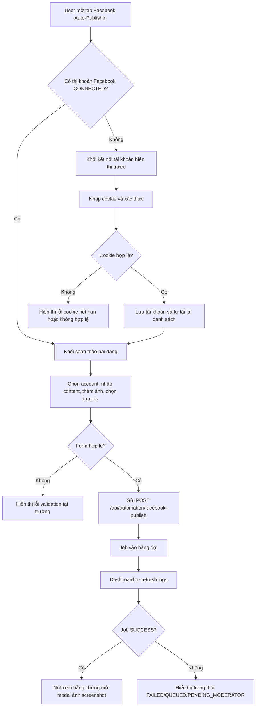

# Facebook Auto-Publisher - UX/UI Spec

Tài liệu này đặc tả giao diện, trạng thái hiển thị và component contract cho tab `facebook-publish` trong màn hình admin `/admin/zalouser?tab=fb_publisher`.

## UX Flow

## Screens

### 1. Facebook Accounts
- Screen: Khối quản lý tài khoản ở cột trái của tab `fb_publisher`.
- Actor: Shop Owner / Admin.
- Primary action: Dán cookie Facebook và xác thực kết nối.
- Secondary action: Xóa liên kết tài khoản.
- Empty state: Không có tài khoản nào được liên kết, hiển thị lời nhắc kết nối trước khi đăng bài.
- Loading state: Nút submit đổi sang trạng thái loading khi xác thực cookie; danh sách tài khoản có thể đang được tải lại sau thành công.
- Error state: Lỗi cookie không hợp lệ, lỗi mạng, lỗi hệ thống.
- Permission state: Nếu chưa có quyền hoặc dữ liệu trả về rỗng, chỉ hiển thị khối giải thích và không cho submit.

### 2. Facebook Composer
- Screen: Khối soạn thảo ở cột phải của tab `fb_publisher`.
- Actor: Shop Owner / Admin.
- Primary action: Tạo job đăng bài với account, content, images, targets.
- Secondary action: Thêm target tùy chọn, reset form sau khi tạo job.
- Empty state: Chưa có account CONNECTED thì dropdown bị khóa và nút submit bị disable.
- Loading state: Nút submit hiển thị spinner khi gửi job; form không được gửi lặp.
- Error state: Thiếu content, thiếu account, thiếu target, lỗi tạo job từ API.
- Permission state: Chỉ cho submit khi có ít nhất 1 account CONNECTED và ít nhất 1 target được chọn.

### 3. Facebook Publish Logs
- Screen: Bảng lịch sử đăng bài ở phần dưới toàn trang.
- Actor: Shop Owner / Admin.
- Primary action: Refresh logs và xem evidence của job SUCCESS.
- Secondary action: Đóng modal evidence.
- Empty state: Chưa có job nào, hiển thị placeholder trống.
- Loading state: Nút tải lại logs có spinner; bảng không bị nhảy layout khi polling.
- Error state: Lỗi tải logs, lỗi ảnh evidence không tải được, job FAILED hiển thị message.
- Permission state: Không có job SUCCESS thì ẩn nút xem bằng chứng thay vì disable mơ hồ.

## Component Contract

| Component | Props/Data | Validation | States | Notes |
| --- | --- | --- | --- | --- |
| `FacebookAccounts` | `accounts: FacebookAccount[]`, `cookieText: string`, `isVerifying: boolean`, `error: string \| null`, `successMsg: string \| null` | Cookie không rỗng; nếu API trả lỗi thì hiển thị message thân thiện | `empty`, `loading`, `error`, `success`, `connected list` | Mặc định dùng `textarea` dán cookie thô; nút xóa cần confirm rõ ràng |
| `FacebookAccount` | `{ id, displayName, avatarUrl?, status }` | `status` chỉ render an toàn theo `CONNECTED | DISCONNECTED | EXPIRED` | Avatar fallback bằng chữ cái đầu; badge trạng thái | Khi status khác `CONNECTED`, badge chuyển sang trạng thái lỗi/không hoạt động |
| `FacebookComposer` | `onPublishSuccess: () => void`, local state `selectedAccountId`, `content`, `imageUrlText`, `selectedTargets`, `customTargetUrl`, `customTargetType`, `customTargetName`, `customTargets`, `isSubmitting`, `error`, `success` | Bắt buộc có account, content, target; ảnh là danh sách URL phân tách bằng dấu phẩy | `idle`, `disabled`, `loading`, `error`, `success`, `no account` | UI hiện tại là URL input cho ảnh; nếu sau này có product media picker thì giữ nguyên contract publish, chỉ thay source input |
| `TargetOption` | `{ id, name, type: "PAGE" \| "GROUP" \| "PROFILE" }` | `type` map đúng sang API payload | Checkbox list, custom target list | `PROFILE` luôn là đích mặc định “Dòng thời gian trang cá nhân” |
| `PublishJob` | `{ id, content, targetType, targetId, targetName, status, evidenceImage?, errorMessage?, runAt?, createdAt, account }` | `status` chỉ render theo whitelist | `queued`, `processing`, `success`, `failed`, `pending_moderator` | Trạng thái hiển thị phải đồng nhất với badge màu và message lỗi |
| `FacebookPublisherDashboard` | `jobs: PublishJob[]`, `selectedEvidence: string \| null`, `isLoadingLogs: boolean` | Nếu `evidenceImage` trống thì ẩn action xem bằng chứng | `loading`, `empty`, `table`, `modal-open` | Dashboard tự refresh mỗi 8 giây để phản ánh job đang chạy |

## Visual System

- Layout: 3 vùng rõ ràng, cột trái quản lý tài khoản, cột phải soạn bài, bên dưới là logs full-width. Trên desktop dùng grid 1/3 - 2/3; trên mobile xếp dọc từng khối.
- Color tokens: Tiếp tục dùng token hiện có của admin shell như `--surface-soft`, `--surface-glass`, `--line`, `--brand`, `--foreground-strong`, `--muted`. Badge trạng thái dùng xanh lá cho `SUCCESS` hoặc `CONNECTED`, đỏ cho `FAILED` hoặc `DISCONNECTED`, vàng/cam cho `QUEUED`, tím/xanh dương cho `PENDING_MODERATOR` hoặc `PROCESSING`.
- Typography: Tiêu đề 14-16px đậm, body 12-13px, helper text 10-11px. Microcopy ngắn, rõ, tiếng Việt tự nhiên.
- Spacing: 16px là nhịp chính, card padding 20px, table cell 12-16px, tap target tối thiểu 44-48px.
- Accessibility: Có label rõ cho mọi input, focus ring nhìn thấy được, modal evidence có nút đóng rõ, button loading không mất context, bảng logs dùng `title` cho nội dung bị truncate.

## Engineering Handoff

- API dependencies:
  - `GET /api/automation/facebook-accounts` để load account list.
  - `POST /api/automation/facebook-accounts` để verify cookie và tạo account.
  - `DELETE /api/automation/facebook-accounts?id=...` để unlink account.
  - `GET /api/automation/facebook-publish` để load logs.
  - `POST /api/automation/facebook-publish` để tạo job đăng bài.
- Events:
  - `handleConnect` submit cookie.
  - `fetchAccounts` reload account list sau khi connect/delete.
  - `handleSubmit` tạo publish job.
  - `onPublishSuccess` refresh logs ngay sau khi tạo job.
  - `fetchLogs` polling mỗi 8 giây và manual refresh từ nút tải lại.
- Analytics/audit needs:
  - Audit tối thiểu cho connect, publish submit, delete account và open evidence modal.
  - Không log cookie thô, token hay dữ liệu nhạy cảm.
- Figma source:
  - Chưa có.
- Figma node/frame:
  - Chưa có.

## Notes For Implementation

- Tab `fb_publisher` phải hiển thị rõ ràng trong admin shell, không gộp chung với tab Automation.
- Nếu chưa có media picker từ kho sản phẩm, giữ input URL như hiện tại nhưng ghi rõ đây là placeholder để không phá contract publish.
- Evidence chỉ xuất hiện khi job `SUCCESS` và có `evidenceImage`.
- Copy lỗi phải nhất quán và ngắn, ví dụ: `Cookie không hợp lệ hoặc đã hết hạn`, `Bạn cần chọn ít nhất một đích đăng bài`, `Đã đưa bài viết vào hàng đợi đăng.`
