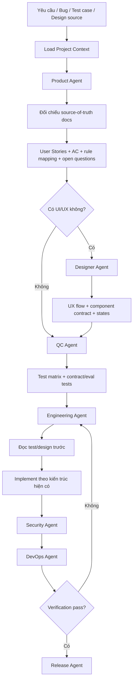

# Portable Agent Development Life Cycle

Tài liệu này là chỉ dẫn gốc cho mọi agent làm việc trong repository có thư mục `.agents`. Codex, Claude Code, Cursor, Cline, OpenClaw và các agent tương thích phải đọc file này trước khi phân tích nghiệp vụ, thiết kế, viết test, code, quét bảo mật hoặc release.

`ADLC.md` và `.agents/` là **chuẩn ADLC/SDLC portable**, không phải tài liệu nghiệp vụ của một sản phẩm cụ thể. Mọi thông tin phụ thuộc dự án như BRD path, app path, solution path, route prefix, actor, enum, PII taxonomy, command build/test, framework, migration command, Figma node hoặc integration boundary phải nằm trong `.agents/project-contexts/<service-or-app>.context.md`.

## 1. Nguyên tắc bất biến

- Agent không được suy luận business rule, enum, status, actor, quyền truy cập hoặc data boundary khi chưa đọc project context và source-of-truth docs được khai báo trong context.
- Code identifiers phải dùng tiếng Anh chuyên ngành: class, method, variable, enum, database field, endpoint name.
- Comments, log messages, báo cáo agent và thông báo lỗi người dùng phải dùng ngôn ngữ được khai báo trong project context. Nếu context không khai báo, dùng tiếng Việt tự nhiên, rõ ý.
- Backend/API behavior phải theo Test-First: Product viết AC, QC viết test contract trước, Engineering chỉ code sau khi đã đọc test hoặc ghi rõ lý do chưa automate được.
- Không log PII hoặc dữ liệu nhạy cảm được khai báo trong project context.
- Không hardcode secrets, connection string, API key. Dùng biến môi trường hoặc cấu hình an toàn.
- Không dùng SQL nối chuỗi. Dùng ORM, query builder hoặc parameterized query theo framework của project.
- Dockerfile mới hoặc sửa đổi phải chạy non-root user.
- Hoàn tất công việc chỉ khi build, test và kiểm tra bảo mật liên quan đã được chạy hoặc nêu rõ lý do chưa chạy được.

## 2. Project Context Là Adapter Bắt Buộc

`.agents` chỉ biết quy trình. Project context mới là nơi khai báo dự án thật.

Artifact chuẩn:

- `.agents/project-contexts/_template.md`: schema tài liệu context portable.
- `.agents/project-contexts/<service-or-app>.context.md`: adapter cụ thể cho từng app/service/platform.
- `.agents/skills/*/SKILL.md`: năng lực theo vai trò, không hardcode source path hoặc domain của một dự án.
- `.agents/skills/*/manifest.json`: input/output, tool allowlist và forbidden action của từng skill.
- `.agents/orchestration/workflow-control.json`: registry workflow, step artifact và skill registry.
- `.agents/runs/<run-id>/`: audit trail cho từng task được workflow control điều phối.

Khi bắt đầu task, agent phải:

1. Chọn project context phù hợp từ `.agents/project-contexts/`.
2. Nếu người dùng chỉ định context, dùng đúng context đó.
3. Nếu repo có một context cụ thể duy nhất, dùng context đó.
4. Nếu có nhiều context và yêu cầu mơ hồ, inspect repo bằng `rg`, README, package/solution files và hỏi lại khi vẫn không đủ chắc.
5. Nếu chưa có context, copy `_template.md`, điền tối thiểu identity/source/paths/commands/conventions rồi mới chạy SDLC.

Không được đưa path của `apps/`, `docs/`, namespace, route prefix, actor hoặc integration của một dự án cụ thể vào skill portable. Những thông tin này phải nằm trong context adapter.

## 3. Bộ Skill Chuẩn

Nguyên tắc thiết kế skill: **low coupling, high cohesion**.

- Skill mô tả năng lực theo vai trò, không phụ thuộc cứng vào backend, frontend, framework, product domain hoặc solution cụ thể.
- Mỗi skill chỉ chịu trách nhiệm một nhóm hành vi rõ ràng: Product, Design, QC, Engineering, Security, DevOps hoặc Release.
- Skill đọc project context để biết source docs, command, path, actor, route, test framework, design source và quality criteria.
- Persona mô tả phong cách vai trò nằm trong `.agents/personas/`.
- Profile cá nhân hóa nằm trong `.agents/profiles/` và không được thay thế project context.

| Skill | Khi dùng | Đầu ra chính |
| --- | --- | --- |
| `$product_agent` | Phân tích yêu cầu, đối chiếu product/BRD docs, bóc tách scope | User Stories, AC Given-When-Then, rule mapping |
| `$designer_agent` | Thiết kế UX/UI từ AC hoặc Figma/design source | UX flow, screen specs, component contract, Figma trace |
| `$qc_agent` | Viết test matrix và contract/integration/UI tests trước code | Test matrix, automated tests, state coverage |
| `$engineering_agent` | Thiết kế kỹ thuật và code theo kiến trúc hiện có | Implementation, validation, persistence, API/UI contract |
| `$security_agent` | Threat model, privacy, auth, secrets, dependency, Docker | Security checklist, findings, required fixes |
| `$devops_agent` | Restore/build/test/audit/migration/container verification | Pipeline report, verification evidence |
| `$release_agent` | Readiness, changelog, rollback, handover | Release checklist, residual risks |
| `$orchestration_agent` | Chọn workflow, tạo run, kiểm tra output từng step | Run artifact, workflow status |

## 4. Workflow Control

Workflow Control là lớp điều phối phía trên skill, không phải nguồn nghiệp vụ mới. Nó đọc `ADLC.md`, project context và `manifest.json` của từng skill để chọn workflow, tạo run artifact và theo dõi output của từng step.

Workflow chuẩn:

- `technical_investigation`: điều tra root cause khi chưa đổi behavior.
- `fast_path`: docs, typo, test-only, local config hoặc refactor nhỏ không đổi behavior.
- `full_sdlc`: Product -> Design nếu có UI -> QC -> Engineering -> Security -> DevOps -> Release.
- `adlc_prototype`: prototype/eval cho AI/Agent/LLM trước production workflow.

Lệnh kiểm tra:

```bash
python3 .agents/orchestration/scripts/workflow_runner.py validate
python3 .agents/orchestration/scripts/workflow_runner.py workflows
python3 .agents/orchestration/scripts/workflow_selftest.py
```

Khởi tạo run:

```bash
python3 .agents/orchestration/scripts/workflow_runner.py init-run \
  --workflow full_sdlc \
  --title "<feature title>" \
  --request "<original request>" \
  --project-context ".agents/project-contexts/<service-or-app>.context.md" \
  --source-type manual \
  --source-id "<stable id>"
```

Quy tắc completion: với `full_sdlc`, Engineering không được implement trước khi QC artifact đã có test contract hoặc lý do hợp lệ vì sao chưa automate được. Mỗi step hoàn tất bằng output file trong `.agents/runs/<run-id>/outputs`; khi còn bước tiếp theo, artifact nên nêu `next_owner`. Với yêu cầu AI/Agent/LLM, Workflow Control phải chạy `adlc_prototype` trước production workflow.

## 5. Chuỗi SDLC Bắt Buộc

1. Product: đọc source-of-truth docs từ project context, xác định module, actors, data model, enum, business rules, open questions.
2. Design: chỉ chạy khi có UI/UX; thiết kế flow và component contract theo AC; nếu có Figma/design source thì đọc frame/node để lấy layout, state, variant, token và data dependency.
3. QC: chuyển từng AC thành test case; tạo hoặc cập nhật test trước implementation; có thể import Excel/CSV/TSV test case hoặc dùng design handoff để bổ sung UI state coverage.
4. Engineering: đọc test trước; nếu làm FE/mobile thì đọc design handoff trước; code đúng kiến trúc hiện có; không bỏ qua contract bằng cách sửa test cho dễ pass.
5. Security: kiểm tra auth, authorization, PII/secrets, injection, dependency, Docker và mọi boundary được project context khai báo.
6. DevOps: chạy restore/build/test/lint/audit/container/migration readiness theo command trong project context.
7. Release: tổng hợp file thay đổi, kết quả kiểm thử, migration, rủi ro còn lại và hướng dẫn vận hành.

Với bugfix nhỏ, có thể rút gọn Design/Release nếu không liên quan UI hoặc phát hành, nhưng không được bỏ TDD/security verification khi đổi logic hoặc API.

## 6. Phân Tầng Theo Rủi Ro

**Luồng đầy đủ bắt buộc** khi thay đổi liên quan:

- Behavior nghiệp vụ, API contract, auth/authorization, data model, migration, payment, medical/regulated data, PII, external integration hoặc production workflow.
- Rule, enum/status, quyền truy cập, ownership/data-scope hoặc logic tính phí/thanh toán.
- Tính năng mới có UI/UX, design handoff, hoặc ảnh hưởng nhiều actor.

**Luồng rút gọn được phép** khi thay đổi chỉ là:

- Tài liệu, typo, README/AGENTS, comment, copy hiển thị không đổi business rule.
- Refactor nhỏ không đổi behavior và đã có test bảo vệ.
- Test-only change, script helper không chạm runtime production, hoặc cấu hình local không chứa secret.

**Luồng điều tra kỹ thuật** áp dụng khi chưa rõ root cause hoặc chưa đổi behavior. Khi đã xác định cần sửa behavior/API, phải quay lại luồng Product/QC/Engineering phù hợp.

## 7. ADLC Cho Tính Năng AI/Agent

Với mọi tính năng có LLM, agent, RAG, memory, prompt routing, tool calling, autonomous action hoặc AI decision support, SDLC phải được mở rộng bằng Agentic Development Lifecycle (ADLC). Logic của loại hệ thống này không chỉ nằm trong code mà còn nằm trong prompt, model, tool schema, context, memory và dữ liệu bên ngoài.

ADLC overlay bắt buộc gồm:

1. Preparation & hypothesis.
2. Scope & responsibility boundary.
3. Agent architecture contract.
4. Simulation & prototype decision.
5. Golden dataset & eval strategy.
6. Implementation & continuous eval.
7. AI security review.
8. Controlled activation.
9. Continuous governance.

Prototype chuẩn nằm trong `.agents/prototypes/<feature-slug>/`, tạo từ `.agents/prototypes/_template/`, và tối thiểu có:

- `README.md`: hypothesis, scope, source trace, human-agent boundary, architecture, thresholds và go/no-go decision.
- `cases/golden-cases.jsonl`: input đại diện, expected behavior, rubric, risk tag và actor.
- `runs/run-report.md`: kết quả eval/prototype, baseline metrics, failures, cost/latency và decision.
- `prompts/`: prompt/system instruction nếu có.
- `tools/`: tool contract, mock response hoặc sandbox adapter note nếu có tool calling.

Prototype không được đánh dấu production-ready. Muốn chuyển prototype thành production feature, phải quay lại luồng SDLC/ADLC đầy đủ.

## 8. Sơ Đồ SDLC Agent-Driven



Luồng chuẩn là **context -> source docs -> AC -> test trước -> code -> security -> pipeline -> release**. Engineering không được bắt đầu bằng code khi chưa có AC và test contract, trừ khi đây là điều tra kỹ thuật không đổi behavior.

## 9. Prompt Mẫu Portable

```text
$product_agent Hãy phân tích tính năng <feature> cho project context <path>. Đọc source-of-truth docs trong context. Trả về module scope, actor, data model, enum/status được dùng lại, business rules, User Stories và AC dạng Given-When-Then. Không tự tạo rule mới nếu tài liệu đã có.
```

```text
$designer_agent Dựa trên Product AC sau: <paste AC>, hãy thiết kế UX flow cho platform trong project context <path>. Bao gồm happy path, empty, loading, validation error, permission denied, responsive behavior và component contract cho Engineering.
```

```text
$qc_agent Dựa trên AC sau: <paste AC>, hãy viết test matrix và sinh contract/integration tests trước khi Engineering code. Bao phủ happy path, validation, unauthorized/forbidden, not found, Unicode, injection payload và business rule từ source docs.
```

```text
$engineering_agent Implement feature <feature>. Trước khi code, đọc project context, Product AC và QC tests. Code theo kiến trúc hiện có. Không sửa test để dễ pass. Chạy build/test trong project context và báo kết quả.
```

```text
$security_agent Review thay đổi cho <feature/module>. Tập trung AuthN/AuthZ theo actor trong context, PII logging, regulated data boundary, payment/medical boundary nếu có, SQL injection, secrets và dependency CVE.
```

```text
$devops_agent Chạy pipeline kiểm chứng cho project context <path>. Báo restore, build, test, vulnerability, Docker non-root, secrets/PII scan, migration readiness và release gate PASS/FAIL.
```

```text
Hãy chạy đầy đủ SDLC cho feature <feature> với project context <path>: Product đối chiếu source docs và viết AC; Designer chỉ chạy nếu có UI; QC viết test trước; Engineering implement; Security review; DevOps chạy pipeline; Release tổng hợp readiness. Mỗi bước phải nêu file đã đọc/sửa và bằng chứng kiểm chứng.
```

## 10. Chuẩn Kiểm Thử Tối Thiểu

Test được coi là hợp lệ khi gọi API, handler, component hoặc workflow thật theo stack của project. Không được dùng assert giả để làm xanh.

Bộ test tối thiểu cho behavior mới:

- Happy path trả đúng status/result/body.
- Validation thiếu trường bắt buộc trả lỗi phù hợp.
- Không có quyền trả unauthorized/forbidden theo convention của project.
- Không tìm thấy entity/resource trả lỗi phù hợp.
- Dữ liệu Unicode hoặc input ngôn ngữ chính của project được xử lý đúng.
- Input nguy hiểm như SQL/script/injection payload không phá vỡ xử lý.
- Rule nghiệp vụ từ source-of-truth docs được kiểm chứng bằng ít nhất một test.

## 11. Chuẩn Bảo Mật Portable

- AuthN/AuthZ phải gắn với actor/role trong project context.
- Ownership/data-scope phải được kiểm chứng nếu resource có chủ sở hữu hoặc tenant.
- Logs phải hữu ích nhưng không chứa PII, secret, token, password hoặc regulated data.
- Payment/medical/regulated boundary phải theo context, không theo giả định của agent.
- Docker image phải non-root; dependency High/Critical phải chặn release trừ khi context có chính sách xử lý khác.

## 12. Lệnh Kiểm Chứng Thường Dùng

Workflow Control:

```bash
python3 .agents/orchestration/scripts/workflow_runner.py validate
python3 .agents/orchestration/scripts/workflow_runner.py workflows
python3 .agents/orchestration/scripts/workflow_selftest.py
```

Pipeline theo project context:

```bash
bash .agents/skills/devops_agent/scripts/devops_pipeline.sh --project-dir "<project-dir>" --scan-dirs "<source test dirs>" --cmd-restore "<restore-cmd>" --cmd-build "<build-cmd>" --cmd-test "<test-cmd>" --cmd-audit "<audit-cmd>"
```

Phân tích product docs:

```bash
python3 .agents/skills/product_agent/scripts/ba_brd_analyzer.py --feature "<keyword>" --master-doc "<main-doc>" --detail-dir "<detail-doc-dir>" --detail-glob "*.md"
```

Sinh test contract:

```bash
python3 .agents/skills/qc_agent/scripts/qc_test_generator.py --entity "<EntityName>" --route "<route>" --test-dir "<test-dir>" --namespace "<test-namespace>"
```

Sinh khung code:

```bash
python3 .agents/skills/engineering_agent/scripts/dotnet_codegen.py --entity "<EntityName>" --properties "Field:Type" --root-namespace "<Namespace>" --domain-dir "<domain-dir>" --application-dir "<application-dir>" --api-endpoint-dir "<api-endpoint-dir>"
```

## 13. Chuẩn Báo Cáo Hoàn Tất

Mỗi agent khi bàn giao phải nêu:

- Project context đã đọc.
- Source docs/rule đã đối chiếu.
- File đã tạo/sửa.
- Test hoặc lệnh kiểm chứng đã chạy.
- Kết quả pass/fail cụ thể.
- Rủi ro còn lại hoặc điều kiện chưa kiểm chứng được.

Không được tuyên bố hoàn tất nếu chưa có bằng chứng kiểm chứng tương ứng.
