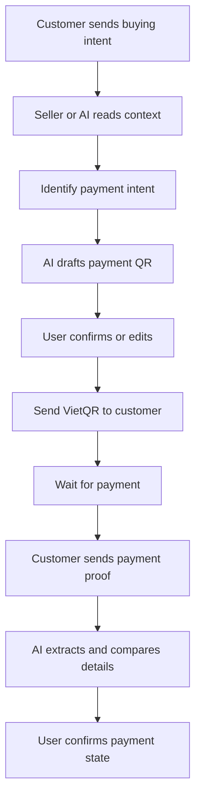
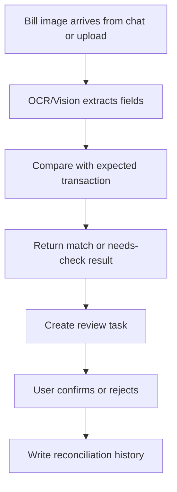
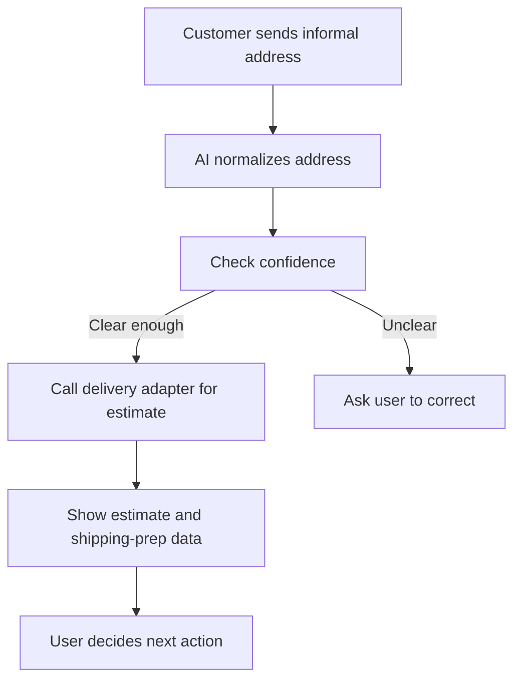
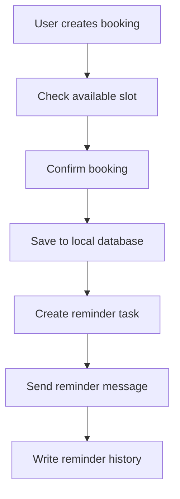
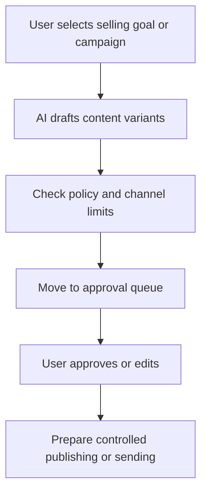
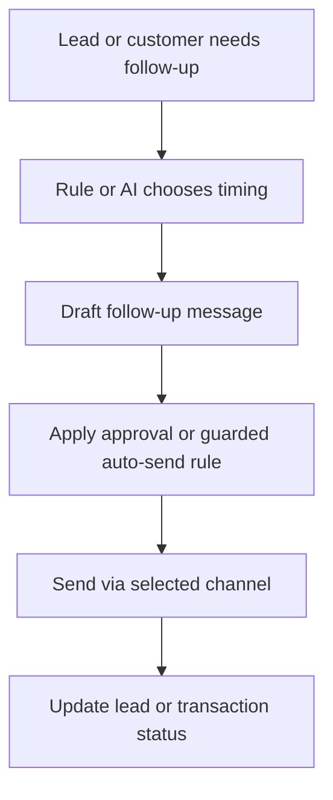
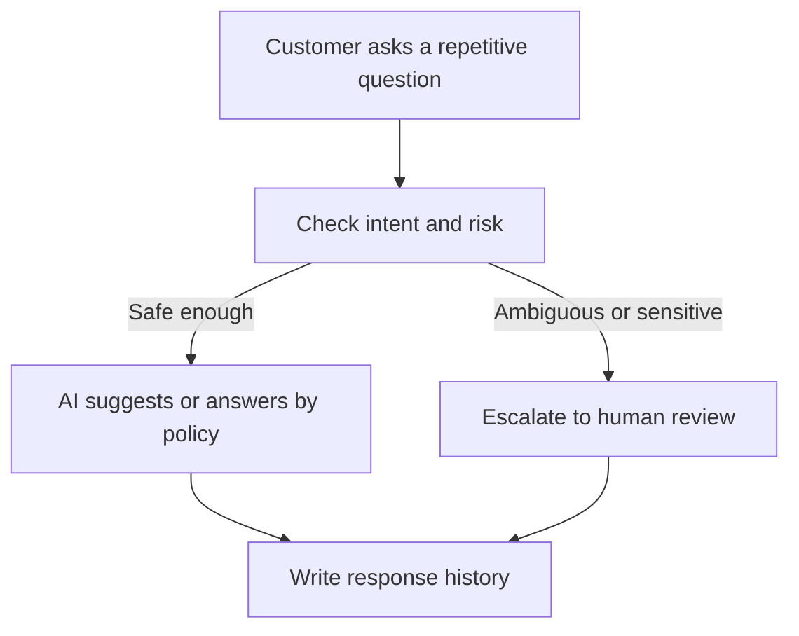
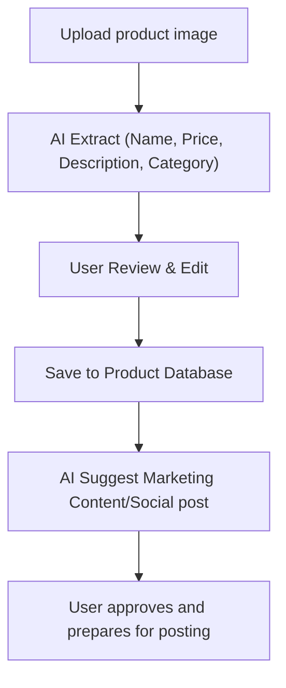

# PRODUCT REQUIREMENTS DOCUMENT (PRD)
## PROJECT: VClaw - Local-first Growth and Operations Assistant for Small Businesses in Vietnam

---

## 1. PRODUCT SUMMARY

VClaw is a `local-first online seller growth + operations assistant` for small business households and individual sellers in Vietnam. The product is designed to help users not only handle revenue-critical operational work such as responding to customers, generating VietQR, checking transfer proofs, normalizing shipping information, and managing basic bookings, but also become more proactive in growth through selling content drafts, promotion assistance, lead follow-up, contextual consultation assistance, and multi-channel selling coordination.

VClaw is not positioned as:

1. A technical DevOps mission-control dashboard.
2. A full POS / OMS / ERP suite.
3. A legal e-invoicing or accounting-compliance product.

VClaw is positioned as:

1. An independent **Business Dashboard** serving as the "Business Operating System" (Business OS) for the shop owner.
2. An AI assistant layer (OpenClaw Core) running in the background, helping non-technical sellers grow revenue and operate daily tasks faster via MCP.
3. A product integrated according to the "Sidecar" model, leveraging the OpenClaw core runtime but possessing its own business database (Prisma + SQLite).

The goal of this PRD is to create a product-level `source of truth` for the VClaw MVP and pilot, ensuring product, design, and engineering align on a unified narrative.

### 1.1 Operational Interface Principles (especially for Personal Zalo / OpenClaw channels)

1. Sellers on the admin interface should only see business operations: **login / logout Zalo**, **chat list**, **read and send messages** — no terminal commands, environment variables, or technician instructions should be shown in the same workflow.
2. Technical mechanisms (OpenClaw CLI, QR file paths, gateway configurations, risks of unofficial Zalo integration, debugging) belong to **internal operational documents / runbooks** and provider documentation (OpenClaw), and should **not** replace or be duplicated in the UI for shop owners.
3. The "Start Zalo Login" button on the web can trigger channel login via the gateway or a pre-configured server API; end-users **do not need to know** the specific command running in the background.

---

## 2. PRODUCT VISION AND POSITIONING

### 2.1 Product vision

VClaw exists to help a small seller or owner-operator both attract and nurture customers, consult and close orders, and manage follow-up operational work such as payments, shipping, and reminders without learning technical tools, manual filtering of chats, or jumping between too many disconnected apps.

### 2.2 Product positioning

For the current stage, positioning is defined as follows:

1. `Core MVP`: local-first operations and sales assistant for Vietnamese SMBs, focusing on QR, assisted bill verification, address/shipping support, booking/reminders, and task inbox.
2. `Near-term growth layer`: adds proactive but guarded capabilities such as content assistance, campaign drafting, approved auto-consultation, lead follow-up, sales channel awareness, and marketplace-aware selling.
3. `Future-state`: a more unified commerce console with deeper automation, deeper multi-channel coordination, and increased connectivity with marketplaces, fulfillment, or external commerce systems when there is proven demand.

### 2.3 Core differentiation

1. `Local-first`: operational data and configuration are primarily kept on the user's machine.
2. `Human-in-the-loop`: AI suggests, humans decide on sensitive actions.
3. `SMB-native UX`: business-facing language and workflows instead of developer-facing tools.
4. `Revenue-adjacent workflows`: focus on problems close to money and daily repetitive tasks instead of broad scope.
5. `Proactive but controlled`: the product may draft, remind, and semi-automate in structured contexts, but must never drift into uncontrolled autopilot.

---

## 3. TARGET USERS AND JTBD

### 3.1 Primary personas

**Persona A - Online shop owner-operator**

1. Runs a small shop with 1-3 operators.
2. Receives customers mainly from Zalo, Messenger, or Telegram.
3. Often has to reply to customers, check payments, and quote shipping simultaneously.
4. Does not want to learn terminals, tokens, or technical concepts.

**Persona B - Small service business owner**

1. Example: nails, salon, spa, appointment-based service business.
2. Strong need for confirming schedules, reminders, customer history, and follow-up.
3. Still needs payment handling and service-completion tracking.

### 3.2 Non-priority users

1. Medium to large enterprises with complex accounting, CRM, and permission processes.
2. Industries requiring full ERP, deep debt management, or full VAT e-invoicing.
3. Specialized verticals such as real estate, complex multi-tier KOL/KOC resellers.

### 3.3 Jobs-to-be-done

**JTBD 1 - Close payment quickly**

When a customer is ready to buy, I want to generate and send payment information in a few steps to reduce waiting time and increase the chance of closing.

**JTBD 2 - Check bills without wasting time**

When customers send transfer screenshots, I want the system to extract and suggest reconciliation results so I do not have to read every receipt manually.

**JTBD 3 - Quote shipping quickly and reduce address errors**

When customers send informal addresses, I want the system to normalize them and return a reasonable shipping estimate to push orders out faster.

**JTBD 4 - Avoid missing urgent work**

When there are bookings, payment proofs, or pending order actions, I want them collected in one place so nothing gets lost.

**JTBD 5 - Track customers and order states without a heavy CRM**

When customers return or need follow-up, I want to see order state, basic history, and the next action in a simple workspace.

**JTBD 6 - Create selling content faster**

When I need to post or run a selling campaign, I want the system to suggest captions, content variants, and publishing timing so I do not start from zero every time.

**JTBD 7 - Nurture leads consistently**

When customers asked before but did not buy, I want the system to remind me at the right time and prepare a follow-up draft so I can improve conversion without spammy manual work.

**JTBD 8 - Consult repeatedly asked questions with control**

When customers ask repetitive questions about price, availability, booking times, or basic policies, I want the system to suggest or semi-automate responses with clear rules and approvals to save time while controlling risks.

---

## 4. PROBLEM STATEMENT

### 4.1 Current pains

1. Customer communication is fragmented across channels.
2. Sellers repeatedly recreate the same payment, confirmation, and reminder content.
3. Bill checking and transaction-state tracking are still manual.
4. Shipping addresses are inconsistent and error-prone.
5. Non-technical users reject products with difficult setup.
6. Sellers lack lightweight tools for proactive growth such as content drafting, consistent posting, and lead re-engagement.
7. Repetitive customer consultation still consumes manual effort.

### 4.2 Business consequences

1. Slow replies reduce conversion.
2. Incorrect payment or shipping details increase operating cost.
3. Missed reminders or follow-up reduce repeat revenue.
4. Weak onboarding causes early churn.
5. Missing outreach rhythm and content output reduces growth opportunities.

---

## 5. PRODUCT GOALS AND SUCCESS METRICS

### 5.1 Product goals for MVP

1. Help users complete revenue-adjacent sales and operational flows faster than manual work.
2. Prove that a local-first product can still feel simple enough for non-technical sellers.
3. Deliver a web admin that functions as a real business workspace, not just a technical shell.
4. Expand from a reactive assistant into a proactive selling assistant with control.

### 5.2 Success metrics

**Activation**

1. At least 70% of pilot users complete onboarding and connect the first communication channel.
2. Users complete at least one QR, task, or meaningful action within the first day.

**Time-to-value**

1. Time to generate and send payment information is reduced by at least 50% compared to manual work.
2. Time to review a common transfer proof is materially reduced compared to manual reading.

**Daily usage**

1. Each active account processes at least 3 real tasks per day through VClaw.
2. The Task Inbox is used as a central decision surface.

**Growth usage**

1. Users generate or approve at least one sales-content draft, campaign draft, or follow-up action during trial.
2. At least one proactive capability such as content drafting, lead follow-up, or guarded auto-consultation shows repeat usage.

**Retention**

1. 14-day retention reaches at least 30% in the pilot cohort.

### 5.3 Pilot go / no-go signals

**Go signals**

1. Users repeatedly return for real work.
2. Onboarding does not require heavy technical support.
3. At least two operational capabilities are used regularly.
4. Users begin using VClaw for proactive work, not only reactive tasks.

**No-go signals**

1. One-time use without repetition.
2. Low trust in OCR, shipping, or automated suggestions.
3. High setup friction.
4. Proactive features are perceived as spammy, unsafe, or low-value.

---

## 6. SCOPE

### 6.1 Must-have for MVP

1. Local runtime (OpenClaw Core Engine).
2. **VClaw Business Dashboard** (Next.js) as the default interface.
3. Dedicated business database (**Prisma + SQLite**) separated from the system DB.
4. One primary communication channel integrated end-to-end.
5. VietQR generation based on chat context or form.
6. Assisted bill verification with user confirmation.
7. Address normalization and shipping estimation.
8. Basic booking and reminders.
9. Customers & Conversations (Consolidated CRM-lite and Task Inbox).
10. **AI-Powered Product Management**: Information extraction from images and marketing content generation.

### 6.2 Near-term growth features

1. Content assistance for captions, post drafts, and selling scripts.
2. Lead follow-up with timing suggestions and message drafts.
3. Guarded auto-consultation for repetitive intents.
4. Campaign drafting and approval queues.
5. Sales channel awareness across social, website, and marketplace inputs.

### 6.3 Should-have if MVP is stable early

1. Contextual response templates.
2. Daily task reports.
3. Advanced payment or reminder alerts.
4. Controlled remote access.
5. A lighter commerce surface for customers, orders, and follow-up.

### 6.4 Out-of-scope for the MVP

1. VAT e-invoicing and accounting compliance.
2. Full ERP, POS, or enterprise CRM.
3. Default automatic shipment creation.
4. Deep multi-system sync everywhere from day one.
5. Full simultaneous multi-channel support.
6. Self-generating product features or self-updating business logic.
7. Full autopilot advertising or unrestricted outbound automation.

### 6.5 Interpretation of `invoice`

Within VClaw, `invoice` refers to an `invoice/order reconciliation` record for sales operations:

1. A transaction or order waiting to be processed.
2. Payment state with transfer proof and reconciliation notes.
3. Shipping or service completion state attached to the same record.

This does not mean VAT or legal e-invoicing.

### 6.6 Shopee and KiotViet

1. `Shopee`: a highly relevant sales channel for the near-term marketplace-aware narrative, but deep sync remains controlled and staged.
2. `KiotViet`: a reference point for understanding how mature SMB products organize orders, invoices, customers, inventory, and channels; not a direct integration promise.

---

## 7. EPIC AND FEATURE REQUIREMENTS

### 7.1 Epic A - Onboarding and Setup

**Goal**

Enable non-technical users to install, open, and configure the product without terminals.

**User value**

Users see value early and do not give up during setup.

**Scope**

1. First-time Setup Wizard.
2. Shop info, payment QR, and communication channel configuration.
3. Basic shipping and booking configuration if applicable.

**Non-goals**

1. Not a technical interface for entering environment variables.
2. Users do not need to understand OpenClaw or core runtime.

**Acceptance criteria**

1. Users can complete initial setup without CLI.
2. Business-facing language replaces technical terminology.
3. After setup, users know the next meaningful action immediately.

### 7.2 Epic B - VietQR and Payment Assist

**Goal**

Reduce the time required to send payment information.

**User value**

Sellers close payments faster and reduce manual entry errors.

**Scope**

1. QR can be generated from at least one clear input source.
2. Missing data triggers user clarification rather than silent guessing.
3. QR tasks are logged.

**Non-goals**

1. No automatic payment confirmation just from sending the QR.
2. No back-end accounting processing for transactions.

**Acceptance criteria**

1. QR can be generated from at least one clear input source.
2. Missing data triggers user clarification rather than silent guessing.
3. QR tasks are logged in history.

### 7.3 Epic C - Bill Verification and Reconciliation Support

**Goal**

Reduce manual bill checking and support transaction reconciliation.

**User value**

Sellers can confirm or reject a bill faster thanks to AI suggestions.

**Scope**

1. Upload or receive bill images.
2. OCR/Vision extraction of basic fields.
3. System returns support states such as `matched`, `mismatched`, or `needs-check`.
4. User makes the final decision.

**Non-goals**

1. No auto-approval of payments in MVP.
2. Not a replacement for full accounting reconciliation.

**Acceptance criteria**

1. Results are shown as suggestions, confidence, or support states.
2. Money-state changes always require confirmation.
3. Bill-review tasks surface clearly in the Task Inbox or equivalent UI.

### 7.4 Epic D - Shipping and Address Support

**Goal**

Help users quote shipping faster and reduce address errors.

**User value**

Reduces normalization time and reduces shipping errors.

**Scope**

1. Normalization of natural Vietnamese addresses.
2. Address splitting to call delivery adapters.
3. Returns shipping estimate or preparation data.

**Non-goals**

1. No mandatory automated shipment creation in MVP.
2. No lock-in to a single shipping provider.

**Acceptance criteria**

1. Clear addresses return useful estimates or next-step suggestions.
2. Ambiguous addresses trigger correction requests.
3. Adapter-based carrier examples such as GHN/GHTK do not hard-code the product to one provider.

### 7.5 Epic E - Booking and Reminder

**Goal**

Prevent small service businesses from missing appointments.

**User value**

Reduces missed appointments, double-bookings, or forgotten reminders.

**Scope**

1. Basic booking creation.
2. Time-slot availability check.
3. Booking status and template-based reminders.

**Non-goals**

1. No complex multi-branch or multi-staff booking in MVP.

**Acceptance criteria**

1. Users can create valid bookings.
2. Time-slot constraints are respected.
3. Reminder actions have logs.

### 7.6 Epic F - Operations Console & Task Inbox (Human-in-the-loop)

**Goal**

Create a central entry point for sensitive business decisions, integrated directly into the daily operational workspace.

**User value**

Users do not have to search through chat history for pending tasks; critical tasks are always present in the "Operations Console" or the "Customers" module.

**Scope**

1. Display approval-required tasks as lists or widgets directly on the Dashboard.
2. Integrate Task Inbox into the Customers module to handle conversations and approvals simultaneously.
3. Quick actions: approve, reject, view details.
4. Priority tasks: bill verification, address/shipping, bookings, workflow alerts.

**Non-goals**

1. Not a full enterprise ticketing system.

**Acceptance criteria**

1. Important tasks are clearly visible in the Dashboard and Customers module.
2. Users can distinguish AI suggestions from final human decisions.
3. Actions generate history or audit logs.

### 7.7 Epic G - Customers & Conversations (CRM-lite)

**Goal**

Provide a unified CRM-lite layer for tracking customers, managing omnichannel conversations, and handling tasks in a single place.

**User value**

Users get a complete view of their customers and handle everything arising from conversations without switching screens.

**Scope**

1. Customer list and profile view (Customer Manager).
2. Unified messaging (Thread Panel) and integrated Task Inbox.
3. Order-like entities for transactions.
4. Transaction state, notes, and payment proofs.
5. Lead source or sales channel attribution.

**Non-goals**

1. No full OMS.
2. No commitment to deep inventory or fulfillment sync in MVP.

**Acceptance criteria**

1. Users can view basic customer or transaction state.
2. Lead source or sales channel can be attached when data exists.
3. UI labels stay in business language such as `Customers`, `Orders`, `Payments`, and `Sales Channels`.

### 7.8 Epic H - Content Engine and Campaign Assistance

**Goal**

Help online sellers create selling content and campaign plans faster without starting from scratch.

**User value**

Users can maintain a consistent sales and promotion rhythm with minimal resources.

**Scope**

1. Caption, post, and channel-specific content variant drafting.
2. Posting schedule and campaign draft suggestions.
3. Approval queue before publishing or sending.

**Non-goals**

1. Not a full ads manager.
2. No uncontrolled mass auto-publishing in early stages.

**Acceptance criteria**

1. At least one content draft or campaign draft can be created from product or service context.
2. Content can enter an approval queue before publishing.
3. The system supports channel-specific adaptation.

### 7.9 Epic I - Lead Follow-up and Retention Automation

**Goal**

Help sellers avoid forgetting leads, unpaid customers, or re-engagement opportunities.

**User value**

Increases conversion and retention without requiring manual memory of every task.

**Scope**

1. Reminder for non-responsive leads.
2. Reminder for unpaid customers.
3. Post-sale or post-appointment follow-up.
4. Approval queue or policy for outbound messages.

**Non-goals**

1. No unlimited mass outreach.
2. No automatic sending without clear rules.

**Acceptance criteria**

1. Leads can be assigned next follow-up milestones.
2. The system can prepare follow-up drafts.
3. Outbound flows have frequency policies and approval points.

### 7.10 Epic J - Auto Consultation and Sales Channel Orchestration

**Goal**

Help VClaw speed up consultation on repetitive scenarios and coordinate customers/orders from multiple sales sources.

**User value**

Sellers save consultation time and have a more unified view across social, website, and marketplace.

**Scope**

1. Reply suggestions or semi-automated replies for clearly structured intents.
2. Identification of lead sources from social, website, landing page, and marketplace.
3. Attaching sales channels to lead or transaction records.

**Non-goals**

1. Not a full replacement for humans in ambiguous or sensitive situations.
2. Deep marketplace sync is not mandatory for initial orchestration.

**Acceptance criteria**

1. The system distinguishes between safe semi-automation, suggestion-only, and mandatory human review.
2. Lead or transaction source can be attached at a basic level.
3. Semi-automated consultation is always bound to policy or approval rules.

### 7.11 Epic K - AI-Powered Product Management

**Goal**

Help sellers digitize product catalogs quickly and automate creative content generation for marketing.

**User value**

Reduce manual data entry and provide professional marketing copy for every new product.

**Scope**

1. **AI Product Extraction**: Automatically extract Name, Price, Description, and category from product images.
2. **AI Marketing Assistant**: Generate product captions, social posts, and ad copy based on product attributes.
3. **Product Catalog Management**: Store and manage product listings locally (SQLite).
4. **Preview & Edit**: Allow users to review and refine AI-extracted data before saving.

**Non-goals**

1. Deep inventory or multi-warehouse management in this phase.
2. Automated marketplace posting without human approval.

**Acceptance criteria**

1. AI extracts at least 3 fields (Name, Price, Description) from common product images.
2. Generated marketing content fits the product context and seller's tone.
3. Users can save and view product listings in the Admin Dashboard.

### 7.12 Epic L - Global AI Chat Support

**Goal**

Provide a global chat interface that allows users to interact with the OpenClaw Core from anywhere in the Dashboard through the VClaw Assistant, for system control and instant assistance.

**User Value**

Gives users a "VClaw virtual assistant" that is always available to answer questions, perform navigation commands, or assist with data processing without leaving the current page.

**Scope**

1. **Floating Chat Panel**: A flexible chat window that can be toggled at the corner of the screen.
2. **Real-time AI Interaction**: Direct communication with OpenClaw Core via streaming API (SSE).
3. **Contextual Commands**: Ability to recognize and execute Dashboard control commands (navigation, lookups).
4. **History Persistence**: Store chat history within the current session.

**Non-goals**

1. Not a full replacement for specialized business forms.
2. No high-risk actions (e.g., bulk data deletion) without additional confirmation.

**Acceptance Criteria**

1. The chat window is consistently displayed across all Dashboard pages.
2. Smooth AI response speed using the streaming mechanism.
3. Support for both Vietnamese and English based on the system's current language.

---

## 8. CORE USER FLOWS

### 8.1 customerInquiryToPayment

### 8.2 billVerificationFlow

### 8.3 shippingQuoteFlow

### 8.4 bookingReminderFlow

### 8.5 campaignDraftToApproval

### 8.6 leadFollowupFlow

### 8.7 autoConsultationFlow

### 8.8 AI-Powered Product Creation Flow

### 8.9 Flow principles

1. AI may extract, suggest, draft, and normalize.
2. Humans must confirm actions affecting money, order states, shipping, or sensitive outreach.
3. When data quality or policy confidence is low, the product must fall back to assisted mode.
4. Outbound automation, content publishing, and guarded auto-consultation must follow `policy -> approval -> audit`.

---

## 9. ADMIN SURFACES AND UX PRINCIPLES

### 9.1 Surface hierarchy

1. `Local Web Admin / Operations Console` is the primary surface.
2. `Remote Web Access` is an optional extended mode.
3. `Chat-native admin surfaces` are quick-action shortcuts, not replacements for the dashboard.

### 9.2 Screen groups

1. `Onboarding`: shop, payment, channel, shipping, and booking setup.
2. `Dashboard`: Operations Console with KPI stats and task widgets.
3. `Customers & Conversations`: Unified CRM-lite, Thread Panel, and Task Inbox.
4. `Orders`: Kanban-style order/transaction management.
5. `VClaw Token & Automation`: Zalo connectivity, Bot status, and automation rules.
6. `Settings`: integrations, persona, shipping, and sales policies.

### 9.3 UX principles

1. Use business language instead of technical system language.
2. Make AI suggestions and human decisions visibly distinct.
3. Keep setup and daily usage lightweight.
4. Ensure users see value early in the first week.

---

## 10. INTEGRATION STRATEGY

### 10.1 Required for the MVP

1. One primary chat channel deployed end-to-end.
2. A QR/payment provider or VietQR generation mechanism.
3. An OCR/vision provider for bill support.
4. A delivery adapter for address normalization and fee estimation.

### 10.2 Delivery strategy

1. The MVP focuses on `fee estimate + shipping data preparation`.
2. GHN and GHTK are valid adapter examples.
3. Shipment creation, tracking, and fulfillment sync stay later.

### 10.3 Marketplace strategy

1. Near-term: identify `sales channel`, order source, and customer source.
2. Future-state: deeper marketplace sync such as Shopee only when there is real demand and a clear integration path.

### 10.4 Publishing and outbound strategy

1. Near-term: support drafting, approval queues, and guarded semi-automation.
2. Do not enable default full auto-posting or mass outbound behavior.
3. Every outbound workflow needs channel policies, frequency controls, and audit trails.

### 10.5 Reference patterns from mature SMB products

VClaw should study mature SMB products such as KiotViet to understand:

1. Common business objects such as `orders`, `invoices`, `customers`, `inventory`, and `sale channels`.
2. How an SMB product organizes admin surfaces and operational data.
3. Which product patterns SMB users are already familiar with.

### 10.6 Future-state implications

1. An `incremental sync + webhook` model will likely become important later.
2. The data model should be aware of `tenant/store/branch/channel`.
3. A policy engine, scheduler, approval queue, and audit design are necessary for outbound growth workflows.
4. Researching KiotViet must not be turned into an implied integration promise.

---

## 11. GUARDRAILS AND NON-FUNCTIONAL PRODUCT REQUIREMENTS

1. `Local-first`: operational data stays local by default.
2. `Privacy by default`: personal data and images require transparent access boundaries.
3. `Human approval`: sensitive money, order, shipping, and outreach actions require appropriate confirmation.
4. `Logging`: important actions must be traceable.
5. `Fallback behavior`: external or AI failures must degrade into reviewable assisted flows.
6. `No unsafe automation`: the product must not quietly drift into uncontrolled autopilot.
7. `Outbound compliance`: follow-up, promotion, and guarded auto-consultation must respect frequency limits, policies, and channel constraints.

---

## 12. RISKS, ASSUMPTIONS, AND DEPENDENCIES

### 12.1 Assumptions

1. Users are willing to install a local app if they see value within the first week.
2. A narrow pilot group can be used to learn quickly.
3. At least one stable chat channel and one delivery adapter can support the pilot.

### 12.2 Product-critical dependencies

1. Primary channel selection.
2. OCR/vision quality for real transfer screenshots.
3. Delivery partner stability for fee estimates.
4. Smooth onboarding without terminal use.

### 12.3 Main risks

1. Scope creep into full ERP, marketplace OMS, or all-in-one seller suite territory.
2. Onboarding friction.
3. Low trust in AI results.
4. Excessive divergence from upstream OpenClaw.

### 12.4 Mitigation

1. Lock the core MVP tightly.
2. Prefer plugin-first and adapter-first.
3. Use assisted mode before deep automation.
4. Measure pilot outcomes, not just implementation progress.

---

## 13. OUTCOME-BASED ROADMAP

### Phase 1 - Discovery and scope lock

**Desired outcome**

1. Finalize pilot persona, primary channel, and core workflows.
2. Finalize product narrative and MVP boundaries.

### Phase 2 - MVP foundation

**Desired outcome**

1. Users can set up the local app and access the web admin.
2. Primary channel starts sending/receiving data stably.
3. Task Inbox and workflow skeletons are operational.

### Phase 3 - Pilot release

**Desired outcome**

1. The four core operational capabilities run end-to-end with enough stability for real use.
2. Pilot users use VClaw for actual daily operations instead of just demo.

### Phase 4 - Post-pilot expansion

**Desired outcome**

1. Decide whether to open more channels, verticals, or deeper commerce integrations.
2. If signals are good, start expanding growth workflows such as campaign assistance, deeper auto consultation, and marketplace-aware commerce.

---

## 14. PRODUCT DECISIONS TO KEEP STABLE

1. MVP is not POS or ERP.
2. `Invoice` in the current narrative means reconciliation record, not VAT e-invoice.
3. One good channel is better than many partial channels.
4. Human-in-the-loop is not a side feature, but a trust pillar of the product.
5. Operations Console is the storefront product; OpenClaw runtime is the background foundation.
6. Growth automation is the near-term direction, but should not be understood as full autopilot or a full ads suite.

---

## 15. CONCLUSION

VClaw will only win if it solves a small number of very real, very frequent, and very revenue-adjacent problems for Vietnamese small sellers, while also helping them become more proactive in growth instead of only reacting to incoming tasks. This PRD therefore locks the direction as: `strong operations core, clear near-term growth layer, local-first, AI-enabled, but never at the expense of control`.

This document should serve as the primary entry point for the product. Supporting documents such as BRD, System Architecture, Commerce Use Cases, and UI Specs continue to provide deep-dives from specific perspectives.
