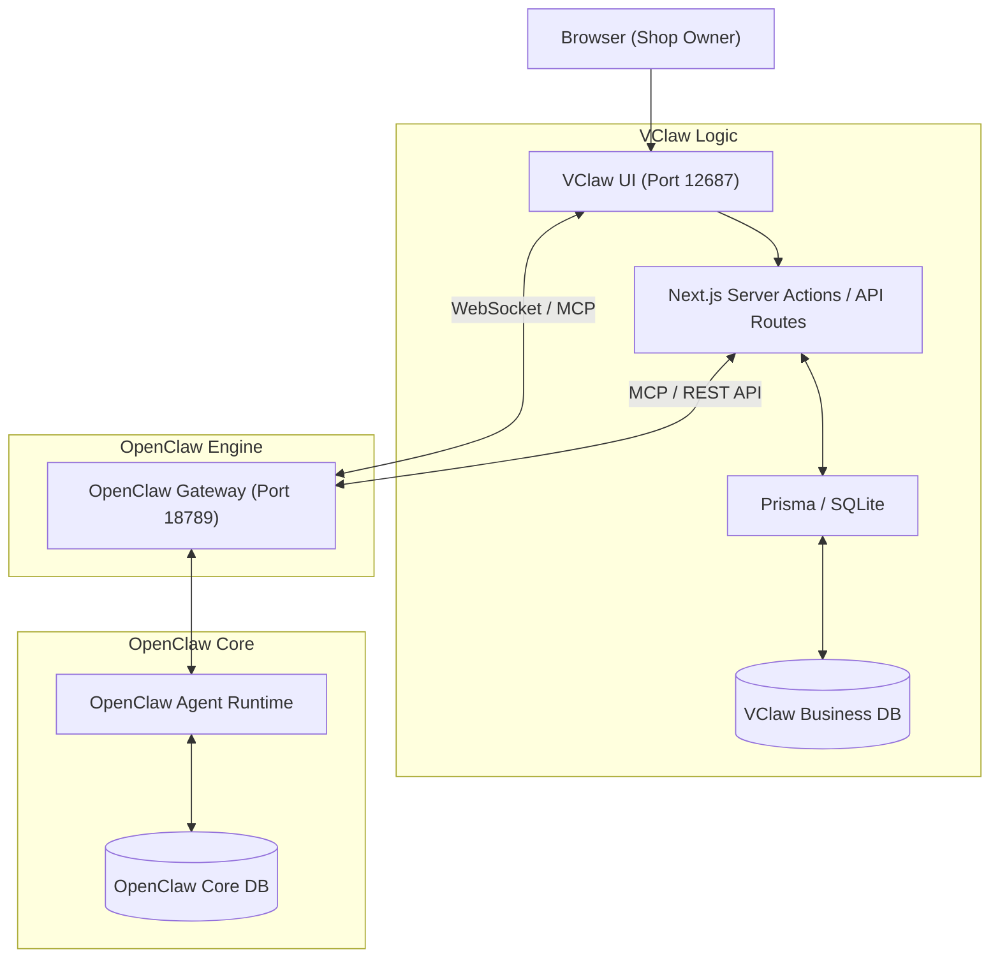

# VCLAW UI AND OPENCLAW CORE INTEGRATION STRATEGY

---

## 1. PURPOSE
This document provides a detailed analysis of the communication architecture between the **VClaw Admin (Operations Console - Next.js)** and the **OpenClaw Core**. It also outlines the database strategy to ensure the system maintains AI automation standards while remaining flexible for VClaw's specific business requirements.

---

## 2. COMMUNICATION PROTOCOLS ANALYSIS

The OpenClaw Core provides a powerful Gateway supporting multiple protocols. VClaw Admin lives primarily under **`vclaw-ui/app/[locale]/admin`** (next-intl); legacy duplicate routes under `vclaw-ui/app/admin` still exist during migration—prefer the locale-prefixed URLs (e.g. `/vi/admin`, `/en/admin`). The UI interacts with the core through a combination of three standards, depending on the business context:

### 2.1. Native WebSocket (Real-time Streaming & Events)
The OpenClaw Core and VClaw Admin rely on standard WebSockets for real-time status streaming and session management.
- **Application in VClaw**: Used for tasks requiring real-time updates.
  - **Task Inbox Manager**: When a bill is pending approval or a new event occurs, the notification is pushed via WebSocket `chat` or `agent` events.
  - **Agent Live Monitoring**: Real-time tracking of Agent activity (e.g., thinking phases, tool usage).
- **Current Status**: Implemented in [`vclaw-ui/lib/gateway/client.ts`](../vclaw-ui/lib/gateway/client.ts) (`GatewayWsManager`, exported as `gatewayWs`); WebSocket base URL comes from [`vclaw-ui/lib/gateway/ws-url.ts`](../vclaw-ui/lib/gateway/ws-url.ts) (`getGatewayWebSocketUrl`).

### 2.2. REST API / Proxy (CRUD & Command Execution)
The OpenClaw Gateway supports HTTP APIs. VClaw UI uses a Next.js Proxy to interact with these safely.
- **Application in VClaw**: Dedicated to synchronous and static actions.
  - Fetching/updating system configurations.
  - Basic Health Check and Model listing.
- **Current Status**: Proxied via `/api/gateway/*` in `vclaw-ui`.

### 2.3. MCP (Model Context Protocol) via JSON-RPC (Primary Controller)
OpenClaw operates according to the MCP standard. This is the primary protocol for the VClaw UI to command the OpenClaw Core.
- **Application in VClaw**: 
  - VClaw UI acts as an **MCP Client**.
  - It invokes tools via the `/mcp/v1/tools/call` endpoint.
  - Example: Calling `vclaw.bill_verifier` to analyze a payment receipt.
- **Current Status**: Supported via `gatewayClient.callTool` in [`vclaw-ui/lib/gateway/client.ts`](../vclaw-ui/lib/gateway/client.ts).

---

## 3. DATABASE MANAGEMENT STRATEGY

### 3.1 Status of OpenClaw DB
OpenClaw currently uses an internal database (SQLite or LevelDB engine) specialized for:
- **Agent State & Memory**: Conversation history, session data, context awareness.
- **Compaction Strategy**: Uses `safeguard` mode to automatically optimize and compress context memory, preventing Agents from becoming overwhelmed by data in long conversations.
- **System Config & Logs**: Gateway configurations, static API keys, Tool execution logs.

### 3.2 Should VClaw Add its Own Business Database?
**The answer is YES.** VClaw Admin must be equipped with its own **Separate Embedded Database** (SQLite with **Prisma / Drizzle ORM** is the recommended choice for a Next.js application).

### 3.3 Rationale for Separate Databases
Using the OpenClaw Core DB for business operations is a **significant architectural risk** for several reasons:

1. **Separation of Concerns:**
   - *OpenClaw DB*: Specialized for AI, Agent runtime, and pure conversation history.
   - *VClaw Business DB*: Manages strictly structured Business Entities such as `Order`, `Customer`, `Booking`, and `Invoice/Bill`. This data requires complex queries, multi-table JOINs, and financial reporting.

2. **Upgradability & Product-Fork Safety:**
   - OpenClaw is an upstream project with a high velocity of change. If they update the Core DB Schema and VClaw's sales data is stored there, the update could break the VClaw application.
   - Separate SQLite files allow us to easily rebase/update OpenClaw source code while keeping VClaw’s business data assets intact.

3. **Aligns with "Local-first" MVP Architecture:**
   - The 1-click installer will launch two servers simultaneously:
      - **VClaw UI Server**: Port **12687** (Next.js Standalone Server providing full Middleware/API Routes support).
      - **OpenClaw Core Engine**: Port **18789** (Node.js daemon orchestrating Agents and AI).
   - Business data (`business.sqlite`) remains local on the shop owner's machine, ensuring security and easy backups.

### 3.4 Data Interaction Diagram (Next.js App)

## 4. OPENCLAW ZERO TOKEN (OPTIONAL BACKEND)

[OpenClaw Zero Token](https://github.com/linuxhsj/openclaw-zero-token) is a fork that drives **web-provider logins** (browser / CDP) instead of paid LLM API keys, then exposes the same **OpenClaw-style gateway** (HTTP + WebSocket) on a port you configure (often not `18789`).

**VClaw integration:** this repo vendors the fork as submodule [`core/openclaw-zero-token`](../core/openclaw-zero-token); you can also run an independently cloned fork with the same env contract.

1. Run the fork on the same machine (or reachable host): Chrome debug → `./onboard.sh webauth` → `./server.sh` per upstream README (or `bash scripts/vclaw.sh` from the VClaw repo root).
2. Point VClaw at that process: `OPENCLAW_GATEWAY_URL`, `OPENCLAW_GATEWAY_TOKEN`, `NEXT_PUBLIC_OPENCLAW_GATEWAY_TOKEN` (same token as `gateway.auth.token` on the fork).
3. If the fork’s WebSocket port or path differs from the default, set **`NEXT_PUBLIC_OPENCLAW_GATEWAY_WS_URL`** (e.g. `ws://127.0.0.1:3001/ws`). REST continues to use `/api/gateway/*` with `X-Gateway-Token`.
4. On the fork, set `agents.defaults.model` to a configured web model id (e.g. `deepseek-web/deepseek-chat`). Packaged / reference preset for the desktop installer: [`vclaw-ui/resources/openclaw.zero-token.default.json`](../vclaw-ui/resources/openclaw.zero-token.default.json).

**Compatibility matrix, risks (ToS, session expiry), and verification:** [14-OpenClaw-Zero-Token-Compatibility](14-OpenClaw-Zero-Token-Compatibility.en.md).

---

## 5. SOCIAL CHANNELS INFRASTRUCTURE (ZALO, FACEBOOK)

VClaw fully leverages OpenClaw's Plugin and Channel system to connect with Vietnam's most popular social media platforms.

- **No-OA Mechanism**: Uses the `zalouser` plugin to connect personal Zalo accounts, ensuring SMBs are not dependent on Zalo Official Accounts.
- **Unified Message Orchestration**: All messages from Social Channels are standardized by the OpenClaw Gateway and pushed to the VClaw UI via WebSocket events.

**Solution Details**: [15-Social-Integration-Solution](15-Social-Integration-Solution.en.md).

---

## 6. CONCLUSION AND PROGRESS
1. **Database Deployment**: [DONE] `business.sqlite` is initialized with Prisma within `/vclaw-ui`.
2. **Real-time Channel Setup**: [DONE] Native WebSocket connection is established in [`vclaw-ui/lib/gateway/client.ts`](../vclaw-ui/lib/gateway/client.ts) and integrated into the Admin UI.
3. **Control via MCP**: [DONE] Tool calling interface implemented via REST proxy, allowing full agentic automation.
4. **Social Integration (Zalo/FB)**: [IN PROGRESS] Inheriting `zalouser` plugin from OpenClaw Core.
