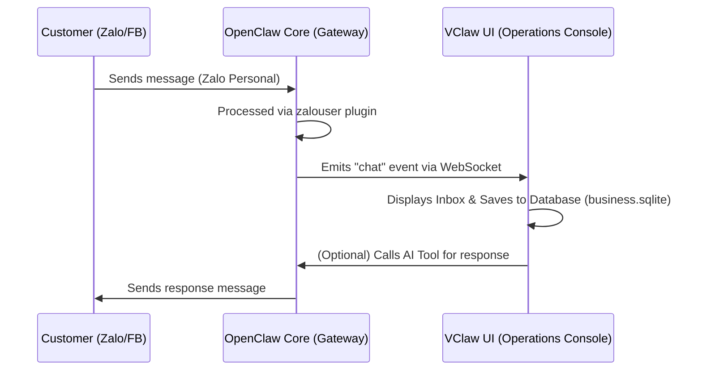

# SOCIAL CHANNELS INTEGRATION SOLUTION
## PROJECT: VClaw - Omni-channel Commerce Assistant

---

## 1. SOLUTION OVERVIEW

Most small and medium-sized businesses (SMBs) in Vietnam operate on Zalo Personal and Facebook Messenger. Requiring a Zalo Official Account (OA) often creates barriers in terms of costs and administrative procedures.

VClaw leverages the **OpenClaw** core and supporting plugins like **`zalouser`** to provide a social media integration solution following the **"No-OA Implementation"** model:
- **Zalo**: Connects directly to personal Zalo accounts.
- **Facebook**: Connects via Messenger / Fanpage API or CDP proxy.
- **Telegram**: Connects via the official Bot API.

---

## 2. INTEGRATION ARCHITECTURE (LEVERAGING OPENCLAW)

VClaw acts as the UI and business logic layer, while the OpenClaw Core handles connection maintenance and message orchestration.

### 2.1. Plugin & Channel: `zalouser`
`zalouser` is a central component in this solution, providing two capabilities:
1.  **Channel**: Registers personal Zalo as a source for sending/receiving messages within the system.
2.  **Plugin/Skill**: Provides tools (Skills) that the Agent can use to interact actively, such as:
    - `zalouser.send_message`: Sends text messages, images.
    - `zalouser.get_contacts`: Retrieves contact/friend list.
    - `zalouser.sync_history`: Synchronizes conversation history.

### 2.2. Message Processing Flow


---

## 3. BUSINESS USE CASES

### 3.1. Automated Lead Intake
When a new customer asks for prices or product information on Zalo/Facebook:
- The Agent automatically extracts the name and requirements.
- Creates a new **Lead** record in VClaw's `business.sqlite`.
- Notifies the seller via the Dashboard or Telegram Admin.

### 3.2. Assisted Selling & Closing
- The seller drafts content on the VClaw UI.
- The system calls the `zalouser.send_message` tool to send it directly to the customer on Zalo.
- Supports sending automatically generated **VietQR** images for immediate payment within the Zalo chat window.

### 3.3. Contact Sync & CRM-lite
- Synchronizes the customer list from Zalo to VClaw's **Customers** section.
- Attaches labels (Tags) to classify customers (VIP, New Customer, Debtors...).
- Automates sending birthday greetings or promotional notifications (subject to seller approval).

---

## 4. REFERENCE CONFIGURATION

To activate this feature, users need to configure the `openclaw.default.json` file (or via the Admin Settings interface):

```json
{
  "plugins": {
    "allow": [ "zalouser", "..." ],
    "entries": {
      "zalouser": { "enabled": true }
    },
    "installs": {
      "zalouser": {
        "source": "clawhub",
        "spec": "clawhub:@openclaw/zalouser@2026.3.22",
        "version": "2026.3.22"
      }
    }
  },
  "channels": {
    "zalouser": {
      "enabled": true
    }
  }
}
```

---

## 5. SAFETY & GUARDRAILS

1.  **User Priority**: Every automatic response by AI must be clearly marked. The seller has the right to intervene and edit the content before sending (Human-in-the-loop).
2.  **Rate Limiting**: Complies with Zalo/Facebook policies to avoid account blocking due to spamming behavior.
3.  **Local Data**: Sensitive conversation history is stored on the local machine (Local-first), ensuring privacy for both the shop and customers.

---

## 6. ADMIN UI NOTE (VCLAW REPO)

Personal Zalo controls (QR login, directory, send) are implemented on **`/[locale]/admin/zalouser`** (see [`vclaw-ui/app/[locale]/admin/zalouser/page.tsx`](../vclaw-ui/app/[locale]/admin/zalouser/page.tsx) and [`vclaw-ui/lib/zalouser/zalouser-gateway.ts`](../vclaw-ui/lib/zalouser/zalouser-gateway.ts)). A legacy route may still exist under `app/admin/openclaw-zalouser`; prefer the locale-prefixed page.

---

## 7. CONCLUSION
By leveraging the power of OpenClaw's `zalouser`, VClaw provides a true Omnichannel solution for Vietnamese SMBs – where personal Zalo remains "king." This gives the product an absolute competitive advantage over CRM/Chatbot systems that only support official OAs.
