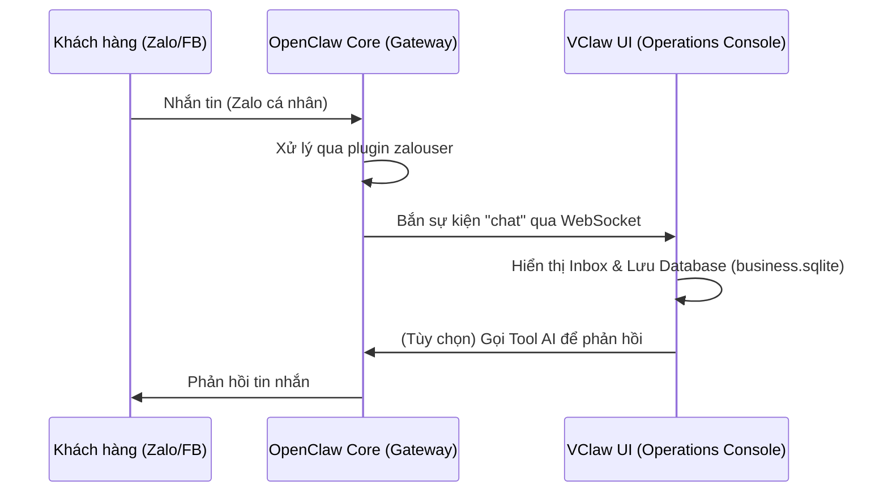

# GIẢI PHÁP TÍCH HỢP MẠNG XÃ HỘI (SOCIAL CHANNELS INTEGRATION)
## DỰ ÁN: VClaw - Omni-channel Commerce Assistant

---

## 1. TỔNG QUAN GIẢI PHÁP

Hầu hết các hộ kinh doanh nhỏ (SMBs) tại Việt Nam vận hành trên nền tảng Zalo cá nhân và Facebook Messenger. Việc bắt buộc sử dụng Zalo Official Account (OA) thường gây ra rào cản về chi phí và thủ tục hành chính.

VClaw tận dụng lõi **OpenClaw** và các plugin hỗ trợ như **`zalouser`** để cung cấp giải pháp tích hợp mạng xã hội theo mô hình **"No-OA Implementation"**:
- **Zalo**: Kết nối trực tiếp với tài khoản Zalo cá nhân.
- **Facebook**: Kết nối qua Messenger / Fanpage API hoặc CDP proxy.
- **Telegram**: Kết nối qua Bot API chính thức.

---

## 2. KIẾN TRÚC TÍCH HỢP (KẾ THỪA OPENCLAW)

VClaw đóng vai trò là lớp hiển thị và quản trị nghiệp vụ, trong khi OpenClaw Core xử lý việc duy trì kết nối và điều phối tin nhắn.

### 2.1. Plugin & Channel: `zalouser`
`zalouser` là một thành phần trọng tâm trong giải pháp này, cung cấp hai khả năng:
1.  **Channel**: Đăng ký Zalo cá nhân làm một nguồn nhận/gửi tin nhắn trong hệ thống.
2.  **Plugin/Skill**: Cung cấp các công cụ (Tools) để Agent có thể chủ động tương tác như:
    - `zalouser.send_message`: Gửi tin nhắn văn bản, hình ảnh.
    - `zalouser.get_contacts`: Lấy danh sách bạn bè/khách hàng.
    - `zalouser.sync_history`: Đồng bộ lịch sử hội thoại.

### 2.2. Luồng xử lý tin nhắn


---

## 3. CÁC KỊCH BẢN NGHIỆP VỤ (USE CASES)

### 3.1. Tiếp nhận lead tự động (Lead Intake)
Khi có khách lạ nhắn tin hỏi giá hoặc thông tin sản phẩm trên Zalo/Facebook:
- Agent tự động bóc tách tên, nhu cầu.
- Tạo một bản ghi **Lead** mới trong `business.sqlite` của VClaw.
- Thông báo cho người bán qua Dashboard hoặc Telegram Admin.

### 3.2. Phản hồi nhanh & Chốt đơn (Assisted Selling)
- Người bán soạn nội dung trên VClaw UI.
- Hệ thống gọi tool `zalouser.send_message` để gửi trực tiếp cho khách trên Zalo.
- Hỗ trợ gửi ảnh **VietQR** được tạo tự động để khách thanh toán ngay trong cửa sổ chat Zalo.

### 3.3. Đồng bộ danh bạ & Chăm sóc khách hàng (CRM-lite)
- Đồng bộ danh sách khách hàng từ Zalo về mục **Khách hàng** của VClaw.
- Gắn nhãn (Tag) phân loại khách (Víp, Khách mới, Khách nợ...).
- Tự động hóa việc gửi tin nhắn chúc mừng sinh nhật hoặc thông báo khuyến mãi (có sự phê duyệt của người bán).

---

## 4. CẤU HÌNH THAM CHIẾU

Để kích hoạt tính năng này, người dùng cần cấu hình trong file `openclaw.default.json` (hoặc qua giao diện Admin Settings):

```json
{
  "plugins": {
    "allow": [ "zalouser", "..." ],
    "entries": {
      "zalouser": { "enabled": true }
    },
    "installs": {
      "zalouser": {
        "source": "clawhub",
        "spec": "clawhub:@openclaw/zalouser@2026.3.22",
        "version": "2026.3.22"
      }
    }
  },
  "channels": {
    "zalouser": {
      "enabled": true
    }
  }
}
```

---

## 5. LƯU Ý VỀ AN TOÀN & BẢO MẬT (GUARDRAILS)

1.  **Quyền ưu tiên của người dùng**: Mọi tin nhắn trả lời tự động bởi AI đều phải được đánh dấu rõ ràng. Người bán có quyền can thiệp và sửa nội dung trước khi gửi (Human-in-the-loop).
2.  **Rate Limiting**: Tuân thủ chính sách của Zalo/Facebook để tránh bị khóa tài khoản do hành vi spam.
3.  **Local Data**: Lịch sử hội thoại nhạy cảm được lưu trữ tại máy cục bộ (Local-first), đảm bảo quyền riêng tư cho cả shop và khách hàng.

---

## 6. GHI CHÚ TRANG ADMIN (REPO VCLAW)

Điều khiển Zalo cá nhân (QR đăng nhập, danh bạ, gửi tin) nằm tại **`/[locale]/admin/zalouser`** (xem [`vclaw-ui/app/[locale]/admin/zalouser/page.tsx`](../vclaw-ui/app/[locale]/admin/zalouser/page.tsx) và [`vclaw-ui/lib/zalouser/zalouser-gateway.ts`](../vclaw-ui/lib/zalouser/zalouser-gateway.ts)). Có thể còn route cũ `app/admin/openclaw-zalouser`; nên dùng trang có locale.

---

## 7. KẾT LUẬN
Bằng việc tận dụng sức mạnh `zalouser` của OpenClaw, VClaw mang đến một giải pháp Omnichannel thực thụ cho SMB Việt Nam – nơi Zalo cá nhân vẫn là "vua". Điều này giúp sản phẩm có lợi thế cạnh tranh tuyệt đối so với các hệ thống CRM/Chatbot chỉ hỗ trợ OA chính thức.
