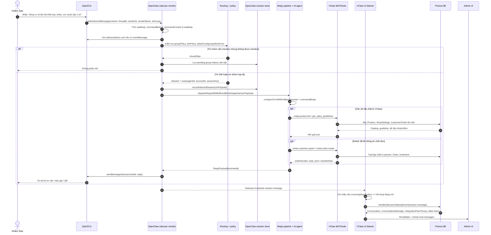

# Sequence xử lý tin nhắn Zalo hỏi thông tin sản phẩm

Tài liệu này mô tả luồng khi khách nhắn Zalo để hỏi hoặc quan tâm mua sản phẩm. Luồng hiện tại có hai nhánh chạy song song:

- **OpenClaw Zero Token / zalouser** nhận tin thật từ Zalo, kiểm tra quyền, dựng ngữ cảnh cho AI, gọi model/tool và gửi phản hồi lại Zalo.
- **VClaw UI** lắng nghe sự kiện `session.message` từ OpenClaw Gateway để đồng bộ hội thoại vào DB, gắn khách hàng, gắn nhãn ý định và hiển thị ở admin.

## Sequence diagram



## Giải thích từng bước

### 1. Zalo đưa tin vào OpenClaw

Extension `zalouser` nhận `ZaloInboundMessage`. Tin nhắn được lấy từ `message.content`, bỏ qua nếu rỗng, rồi tạo:

- `rawBody`: nội dung khách gửi.
- `commandBody`: `message.commandContent` nếu có, nếu không thì dùng `rawBody`.
- `chatId`: thread Zalo, có thể là user hoặc group.
- `senderId`, `senderName`: định danh khách.

Code liên quan: `core/openclaw-zero-token/extensions/zalouser/src/monitor.ts:260`.

### 2. Kiểm tra quyền và điều kiện trả lời

OpenClaw kiểm tra theo cấu hình:

- Tin nhóm: `groupPolicy`, group allowlist, group enabled/disabled.
- Tin cá nhân: `dmPolicy`, `allowFrom`, pairing store.
- Lệnh điều khiển: chỉ cho người được quyền chạy.
- Tin nhóm có `requireMention`: nếu không mention bot thì không trả lời, nhưng có thể lưu pending history để làm ngữ cảnh cho lượt sau.

Điểm quan trọng: tin cá nhân hợp lệ luôn được coi như đã mention; tin nhóm thì phải qua mention gate nếu cấu hình yêu cầu.

Code liên quan: `monitor.ts:305`, `monitor.ts:356`, `monitor.ts:477`.

### 3. Dựng session và context cho AI

Nếu tin được phép xử lý, hệ thống resolve route để biết agent nào trả lời và dùng session key nào. Với Zalo direct, session thường có dạng:

```text
agent:main:zalouser:direct:<senderId>
```

Với nhóm:

```text
agent:main:zalouser:group:<groupId>
```

Trong VClaw, helper `buildZalouserSessionKey()` cũng chuẩn hóa cùng ý nghĩa `direct` / `group` từ `user:`, `direct:`, `group:`, `g:`... Code liên quan: `vclaw-ui/lib/zalouser/zalouser-session-key.ts:31`.

OpenClaw tạo `ctxPayload` gồm:

- `Body`: nội dung đã bọc envelope, có thể gồm history nhóm.
- `BodyForAgent`: raw text khách gửi.
- `CommandBody` và `BodyForCommands`: phần command/model nhận trực tiếp.
- `Provider` / `Surface`: `zalouser`.
- `SenderId`, `SenderName`, `ChatType`, `ConversationLabel`.

Sau đó record inbound session để transcript và Gateway subscriber thấy được tin mới. Code liên quan: `monitor.ts:598`, `monitor.ts:633`.

### 4. AI xử lý câu hỏi sản phẩm

Reply pipeline gọi `dispatchReplyWithBufferedBlockDispatcher()`, sau đó agent runner nhận prompt chính là `commandBody`. Với CLI provider hoặc embedded provider, `prompt: params.commandBody` là điểm cuối đưa nội dung khách vào model.

Code liên quan:

- `monitor.ts:663`
- `core/openclaw-zero-token/src/auto-reply/reply/agent-runner-execution.ts:299`
- `core/openclaw-zero-token/src/auto-reply/reply/agent-runner-execution.ts:400`

Nếu cần dữ liệu thật, agent không nên bịa giá/tồn kho. Theo runtime workspace `~/.openclaw/workspace/AGENTS.md` và `TOOLS.md`, agent phải gọi tool nghiệp vụ VClaw qua MCP/HTTP:

- `vclaw.product.list`: lấy danh mục sản phẩm active.
- `vclaw.commerce.get_sales_guidelines`: lấy persona và luật bán hàng.
- `vclaw.customer.upsert`: tạo/cập nhật khách khi có định danh.
- `vclaw.order.create`: tạo order pending khi đủ dữ liệu chốt.
- `vclaw.payment.generate_qr`: sinh QR nếu cần.

Endpoint bridge là `POST /api/vclaw/agent-tools`, yêu cầu `Authorization: Bearer $VCLAW_AGENT_TOOLS_SECRET`. Code liên quan: `vclaw-ui/app/api/vclaw/agent-tools/route.ts:7`, `vclaw-ui/lib/agent/tools.ts:52`.

Ngoài tool bridge, VClaw còn có endpoint `POST /api/vclaw/enrich` để dựng prompt giàu ngữ cảnh từ DB. Endpoint này trả về `prompt` gồm shop settings, catalog, khách hiện tại, đơn gần nhất, luật QR... Nhưng việc prompt enrich có được đưa vào lượt auto-reply hay không phụ thuộc cấu hình/hook runtime; không nên mặc định rằng mọi tin Zalo đều đã qua enrich nếu chưa kiểm chứng cấu hình đang chạy.

Code liên quan: `vclaw-ui/app/api/vclaw/enrich/route.ts:6`, `vclaw-ui/lib/ai/enrichment.ts:70`.

### 5. Gửi trả lời về Zalo

AI trả về `ReplyPayload`. `deliverZalouserReply()` chuẩn bị text/media, xử lý markdown text style, chia chunk nếu vượt giới hạn, rồi gọi `sendMessageZalouser()`.

Nếu khách chỉ hỏi thông tin, phản hồi nên ngắn, có giá/lợi ích chính và bước tiếp theo. Nếu khách đã đủ thông tin mua hàng, tool `vclaw.order.create` phải chạy thành công trước khi nói đã tạo đơn hoặc gửi QR.

Code liên quan: `monitor.ts:699`, `core/openclaw-zero-token/extensions/zalouser/src/send.ts:26`.

### 6. VClaw UI đồng bộ hội thoại và admin

VClaw admin panel subscribe `session.message` qua Gateway. Khi nhận payload, UI chỉ xử lý nếu `incomingSessionKey` đúng hội thoại đang mở, rồi gọi `saveZalouserIncomingMessage()` -> `handleZalouserGatewayEvent()`.

DB sync làm các việc:

- Parse bubble và phân loại direction: `IN`, `OUT`, `STAFF`, `SYSTEM`.
- Chuẩn hóa `externalThreadId` thành `user:<id>` hoặc `group:<id>`.
- Upsert `IntegrationPeer` / `IntegrationGroup` khi payload có sender/group info.
- Tìm hoặc tạo `Customer`.
- Tìm hoặc tạo `Conversation`; nếu sang ngày mới theo `Asia/Ho_Chi_Minh` thì tạo conversation mới.
- Ghi `ConversationMessage`, chống trùng bằng `externalMessageId` và cửa sổ body/time.
- Nếu là tin `IN`, chạy `classifyIntent()` để gắn nhãn như `Hỏi giá`, `Đặt hàng`, `Cần nhân viên`.
- Revalidate admin paths để UI cập nhật.

Code liên quan:

- `vclaw-ui/components/admin/zalouser-panel.tsx:239`
- `vclaw-ui/lib/zalouser/zalouser-conversation-sync.ts:552`
- `vclaw-ui/lib/zalouser/zalouser-conversation-sync.ts:690`
- `vclaw-ui/lib/zalouser/zalouser-conversation-sync.ts:716`

## Ví dụ chi tiết

### Câu khách gửi

```text
Shop ơi vé Bà Nà Hills người lớn bao nhiêu, em muốn lấy 2 vé, SĐT 0911045515
```

### Bước xử lý dự kiến

1. `zalouser` nhận tin:

```json
{
  "content": "Shop ơi vé Bà Nà Hills người lớn bao nhiêu, em muốn lấy 2 vé, SĐT 0911045515",
  "threadId": "84911045515",
  "senderId": "84911045515",
  "senderName": "Minh Anh",
  "isGroup": false
}
```

2. Vì đây là DM, hệ thống kiểm tra `dmPolicy`. Nếu sender được phép hoặc đang theo policy `open`, tin đi tiếp. Nếu policy là `pairing` và sender chưa được pair, bot gửi challenge pairing thay vì tư vấn sản phẩm.

3. Route tạo session direct:

```text
agent:main:zalouser:direct:84911045515
```

4. AI nhận prompt chính:

```text
Shop ơi vé Bà Nà Hills người lớn bao nhiêu, em muốn lấy 2 vé, SĐT 0911045515
```

5. Agent gọi dữ liệu thật:

```json
{
  "tool": "vclaw.product.list",
  "arguments": {}
}
```

Tool trả catalog active, ví dụ minh họa:

```json
{
  "ok": true,
  "result": {
    "catalog": [
      {
        "id": "prod_banahills_adult",
        "name": "Vé Bà Nà Hills người lớn",
        "price": 900000,
        "category": "Vé du lịch"
      }
    ]
  }
}
```

6. Nếu catalog khớp và agent coi câu này đã đủ dữ liệu cơ bản để chốt 2 vé với SĐT, agent có thể gọi:

```json
{
  "tool": "vclaw.order.create",
  "arguments": {
    "customerName": "Minh Anh",
    "phone": "0911045515",
    "amount": 1800000,
    "items": [
      {
        "name": "Vé Bà Nà Hills người lớn",
        "qty": 2,
        "price": 900000
      }
    ],
    "shippingNote": "Giao tận nơi",
    "channel": "Zalo"
  }
}
```

Tool trả về `orderNumber`, `qrUrl`, `transferNote` nếu shop đã cấu hình ngân hàng. Chỉ sau khi có kết quả `ok`, bot mới được nói đã lên đơn hoặc gửi QR.

7. Tin trả khách nên ngắn và có hành động tiếp theo, ví dụ:

```text
Dạ vé Bà Nà Hills người lớn 900.000đ/vé. Em lên đơn 2 vé cho anh/chị, tổng 1.800.000đ.

Nội dung CK: ORD-A1B2 0911045515 BANAHILLS x2
https://img.vietqr.io/image/TCB-69696969321-print.png?amount=1800000&addInfo=ORD-A1B2%200911045515%20BANAHILLS%20x2
```

Nếu chưa đủ dữ liệu để chốt, ví dụ thiếu số lượng hoặc SĐT, bot không tạo đơn. Phản hồi nên hỏi đúng một nhóm thông tin còn thiếu:

```text
Dạ vé Bà Nà Hills người lớn hiện 900.000đ/vé. Anh/chị lấy mấy vé để em tính tổng và lên đơn luôn?
```

8. Gateway phát `session.message`, VClaw UI lưu DB:

```json
{
  "sessionKey": "agent:main:zalouser:direct:84911045515",
  "message": {
    "role": "user",
    "text": "Shop ơi vé Bà Nà Hills người lớn bao nhiêu, em muốn lấy 2 vé, SĐT 0911045515",
    "sender": {
      "id": "84911045515",
      "name": "Minh Anh"
    }
  }
}
```

Kết quả DB dự kiến:

- `IntegrationPeer`: `provider=zalouser`, `peerId=user:84911045515`, `name=Minh Anh`.
- `Customer`: tạo hoặc cập nhật khách Zalo.
- `Conversation`: `provider=zalouser`, `externalThreadId=user:84911045515`, `openclawSessionKey=agent:main:zalouser:direct:84911045515`.
- `ConversationMessage`: direction `IN`, body là câu khách hỏi.
- Label intent: do câu có từ khóa `giá`, `mua/lấy`, hệ thống có thể gắn nhãn ưu tiên cao hơn là `Đặt hàng`; nếu chỉ hỏi "bao nhiêu" thì thường là `Hỏi giá`.

## Những điểm cần chú ý khi debug

- Nếu khách nhắn nhưng bot không trả lời, kiểm tra trước `dmPolicy`, pairing, group allowlist và mention gate.
- Nếu bot trả lời nhưng admin không thấy hội thoại, kiểm tra Gateway event `session.message`, `incomingSessionKey`, và `handleZalouserGatewayEvent()`.
- Nếu bot bịa giá, kiểm tra MCP `vclaw-business` có gọi được `/api/vclaw/agent-tools` không và secret có khớp không.
- Nếu bot nói đã tạo đơn nhưng DB không có order, đó là lỗi nghiêm trọng: câu trả lời đã đi trước tool `vclaw.order.create`.
- Nếu QR sai định dạng, chỉ tin `qrUrl` do tool trả về; không tự ghép URL VietQR trong prompt/model.

