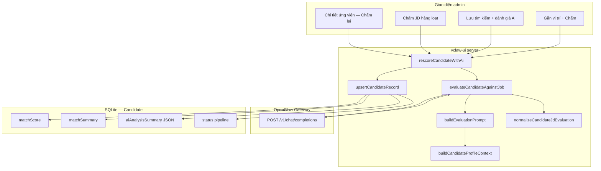
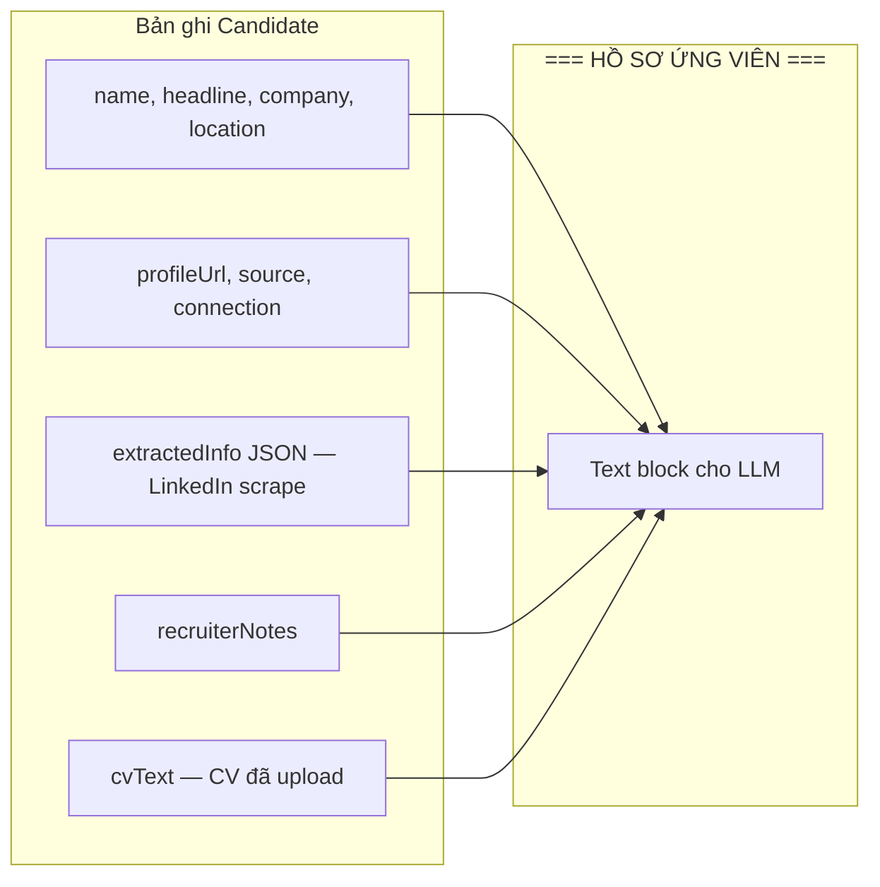
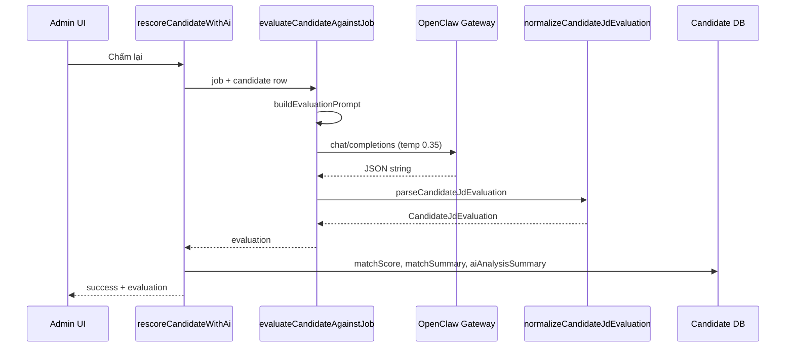
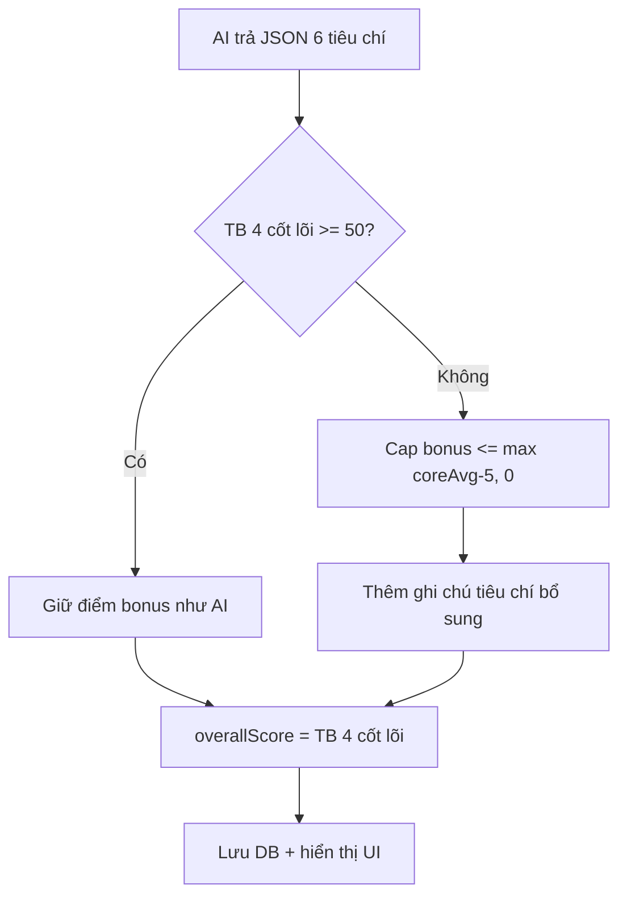
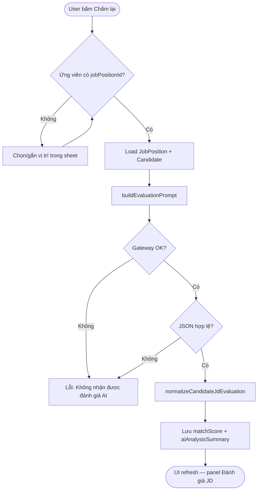

# Đánh giá JD (AI) — Cách hệ thống chấm điểm ứng viên

Tài liệu mô tả luồng **「Đánh giá JD」** / **「Chấm lại」** trong module Tuyển dụng (`admin/recruitment/candidates`). Đây là đánh giá **ứng viên đã lưu** so với **một vị trí tuyển dụng cụ thể**, không phải điểm sơ bộ khi tìm LinkedIn.

---

## 1. Tóm tắt

| Khía cạnh | Mô tả |
|-----------|--------|
| **Mục đích** | HR xem mức khớp ứng viên với JD (Job Description) của vị trí |
| **AI** | OpenClaw Gateway → `deepseek-web/deepseek-chat` (temperature 0.35) |
| **Điểm hiển thị** | `overallScore` 0–100% (trung bình 4 tiêu chí cốt lõi, có chỉnh hậu kỳ) |
| **Lưu trữ** | JSON trong `Candidate.aiAnalysisSummary`; tóm tắt ngắn trong `matchSummary` |
| **Điều kiện** | Ứng viên phải **gắn `jobPositionId`** (filter job hoặc gắn vị trí) |

---

## 2. Luồng tổng quan

---

## 3. Điểm vào từ UI

| Nơi bấm | Điều kiện | Server action |
|---------|-----------|---------------|
| Sheet **Chi tiết ứng viên** → **Chấm lại** | Có `jobPositionId` (ứng viên hoặc job đang filter) | `rescoreCandidateWithAi(candidateId, jobId?)` |
| Nút **Chấm JD (N)** trên danh sách | Đang filter **một vị trí** | `batchEvaluateCandidatesWithAi` → lần lượt `rescoreCandidateWithAi` |
| Lưu từ preview LinkedIn + **đánh giá AI** | Sau khi lưu ứng viên | Background task → `rescoreCandidateWithAi` |
| **Gắn & chấm** / **Đổi & chấm** trong sheet | Chọn job mới rồi chấm | `assignCandidateJobPosition` rồi `rescoreCandidateWithAi` |

**Lưu ý:** Phạm vi **「Mọi vị trí」** không có nút Chấm JD hàng loạt theo job — cần chọn vị trí hoặc gắn job trước.

---

## 4. Dữ liệu đưa vào prompt

Hàm `buildCandidateProfileContext` ([`lib/recruitment/candidate-profile-context.ts`](../lib/recruitment/candidate-profile-context.ts)) gom hồ sơ thành text:

### 4.1. LinkedIn (`extractedInfo`)

Parse JSON chứa: giới thiệu, kinh nghiệm, học vấn, kỹ năng, dự án, ngôn ngữ, đề xuất, thời điểm scrape.

Nguồn: nút **Cập nhật profile LinkedIn** (CDP / gateway) hoặc lúc lưu từ tìm kiếm.

### 4.2. Ghi chú HR (`recruiterNotes`)

Markdown/text do recruiter nhập. Block:

`=== GHI CHÚ HR (ưu tiên khi chấm JD) ===`

Prompt yêu cầu AI **ưu tiên** nội dung này khi chấm.

### 4.3. CV / Resume (`cvText`)

Text trích từ PDF/DOC/DOCX (upload). Block:

`=== CV / RESUME ===`

- Lưu DB tối đa ~12.000 ký tự (có thể tóm tắt qua gateway nếu dài).
- Khi chấm JD chỉ gửi tối đa ~6.000 ký tự đầu (`prepareCvTextForPrompt`).

### 4.4. JD (Job Position)

Từ bảng `JobPosition`: tiêu đề, yêu cầu, mô tả, hình thức, loại HĐ, lương, quyền lợi.

---

## 5. Gọi AI và parse kết quả

**Model:** header `x-openclaw-model: deepseek-web/deepseek-chat`, body `model: openclaw`.

**Output bắt buộc:** JSON (không markdown), schema trong prompt — xem [`candidate-jd-evaluation.ts`](../lib/recruitment/candidate-jd-evaluation.ts) hàm `buildEvaluationPrompt`.

---

## 6. Sáu tiêu chí chấm

### 6.1. Tiêu chí cốt lõi (quyết định % JD)

| Key | Nhãn UI | Vai trò |
|-----|---------|---------|
| `skills_fit` | Kỹ năng & stack | Khớp kỹ năng / công nghệ JD |
| `experience_fit` | Kinh nghiệm | Số năm, vai trò, domain |
| `education_fit` | Học vấn | Bằng cấp, chứng chỉ hỗ trợ JD |
| `projects_impact` | Dự án & thành tựu | Dự án, impact |

**`overallScore` (hiển thị % trên UI)** = trung bình cộng 4 tiêu chí trên (làm tròn 0–100).

### 6.2. Tiêu chí bổ sung (không tính vào %)

| Key | Nhãn UI |
|-----|---------|
| `languages_soft` | Ngôn ngữ & đề xuất |
| `location_fit` | Khu vực / làm việc |

Chỉ có ý nghĩa khi **TB 4 cốt lõi ≥ 50**. Prompt + code `normalizeCandidateJdEvaluation` **chặn** điểm bonus cao hơn cốt lõi khi chưa đạt ngưỡng (tránh “cứu” điểm khi sai nghề).

### 6.3. Các trường khác trong JSON

- **strengths** — danh sách điểm mạnh  
- **concerns** — cần lưu ý  
- **conclusion** — 2–4 câu kết luận HR (ngôn ngữ workspace vi/en)

---

## 7. Lưu database sau khi chấm

| Cột | Nội dung |
|-----|----------|
| `matchScore` | `evaluation.overallScore` |
| `matchSummary` | `conclusion` cắt tối đa 600 ký tự |
| `aiAnalysisSummary` | `JSON.stringify(evaluation)` — **bản đầy đủ** |
| `jobPositionId` | Vị trí dùng để chấm |
| `status` | Cập nhật theo quy tắc pipeline (xem mục 8) |

**Đã chấm JD?** `aiAnalysisSummary` bắt đầu bằng `{` → `hasJdEvaluation()` = true.

Điểm % trên bảng / badge chỉ hiện khi có JSON hợp lệ (`resolveCandidateDisplayMatchScore`).

---

## 8. Ảnh hưởng「Giai đoạn tuyển」(status)

Sau chấm, `upsertCandidateRecord` gọi `resolveCandidateStatusAfterScoring`:

| Điểm JD | Status gợi ý (nếu chưa khóa) |
|---------|------------------------------|
| ≥ 75 | `SCREENING` |
| 50–74 | `POTENTIAL` |
| < 50 | `REJECTED` |

**Không ghi đè** nếu status đang là `CONTACTED`, `INTERESTED`, `HIRED` (recruiter đã xử lý tay).

Chưa có JSON JD → cột pipeline hiển thị **—** (phạm vi mọi vị trí), không dùng nhãn「Chưa đánh giá JD」trùng trên badge %.

---

## 9. Khác với điểm「Sơ bộ」khi tìm LinkedIn

| | **Đánh giá JD** (tài liệu này) | **Sơ bộ** (tìm kiếm) |
|--|-------------------------------|----------------------|
| File | `candidate-jd-evaluation.ts` | `candidate-match.ts` |
| Khi nào | Sau khi ứng viên đã lưu + có job | Trong bước preview kết quả search |
| Độ sâu | 6 tiêu chí + strengths/concerns | Score + 1 câu summary / URL |
| Lưu | `aiAnalysisSummary` JSON | `matchScore` / `matchSummary` tạm lúc lưu |

Có thể chạy **Chấm lại** sau khi đã có điểm sơ bộ — kết quả JD **ghi đè** `matchScore` và `aiAnalysisSummary`.

---

## 10. Sơ đồ quyết định trước khi chấm

---

## 11. File mã nguồn chính

| File | Vai trò |
|------|---------|
| [`lib/recruitment/candidate-jd-evaluation.ts`](../lib/recruitment/candidate-jd-evaluation.ts) | Prompt, gọi gateway, parse/normalize JSON, hiển thị điểm |
| [`lib/recruitment/candidate-profile-context.ts`](../lib/recruitment/candidate-profile-context.ts) | Gom hồ sơ ứng viên cho prompt |
| [`lib/recruitment/candidate-status.ts`](../lib/recruitment/candidate-status.ts) | `hasJdEvaluation`, map điểm → pipeline status |
| [`lib/actions/recruitment/actions.ts`](../lib/actions/recruitment/actions.ts) | `rescoreCandidateWithAi`, `batchEvaluateCandidatesWithAi` |
| [`components/recruitment/candidate-detail-sheet.tsx`](../components/recruitment/candidate-detail-sheet.tsx) | UI Chấm lại + panel kết quả |
| [`components/recruitment/candidate-ai-evaluation-panel.tsx`](../components/recruitment/candidate-ai-evaluation-panel.tsx) | Hiển thị 6 tiêu chí, strengths, concerns |
| [`components/recruitment/use-recruitment-background-tasks.ts`](../components/recruitment/use-recruitment-background-tasks.ts) | Chấm JD hàng loạt nền |

---

## 12. Giới hạn hiện tại

- Cần **OpenClaw Gateway** và model DeepSeek hoạt động; lỗi mạng → không chấm được.
- PDF scan ảnh (không lớp text) → CV trống → AI chỉ dựa LinkedIn + ghi chú HR.
- Một lần chấm gắn **một** `jobPositionId`; đổi job → cần **Chấm lại** với job mới.
- Không tự chấm khi chỉ sửa ghi chú HR hoặc upload CV — user phải bấm **Chấm lại**.

---

## 13. Gợi ý vận hành cho HR

1. Gắn đúng **vị trí** trước khi chấm.  
2. **Cập nhật profile LinkedIn** và/hoặc **upload CV** + **ghi chú HR** (PV, nhận xét nội bộ) rồi mới **Chấm lại**.  
3. Đọc **concerns** và **conclusion**, không chỉ nhìn % — % là TB 4 tiêu chí cốt lõi, đã qua bước chặn bonus.

*Tài liệu đồng bộ với codebase tại thời điểm viết; khi đổi prompt hoặc model, cập nhật mục 5–6.*
