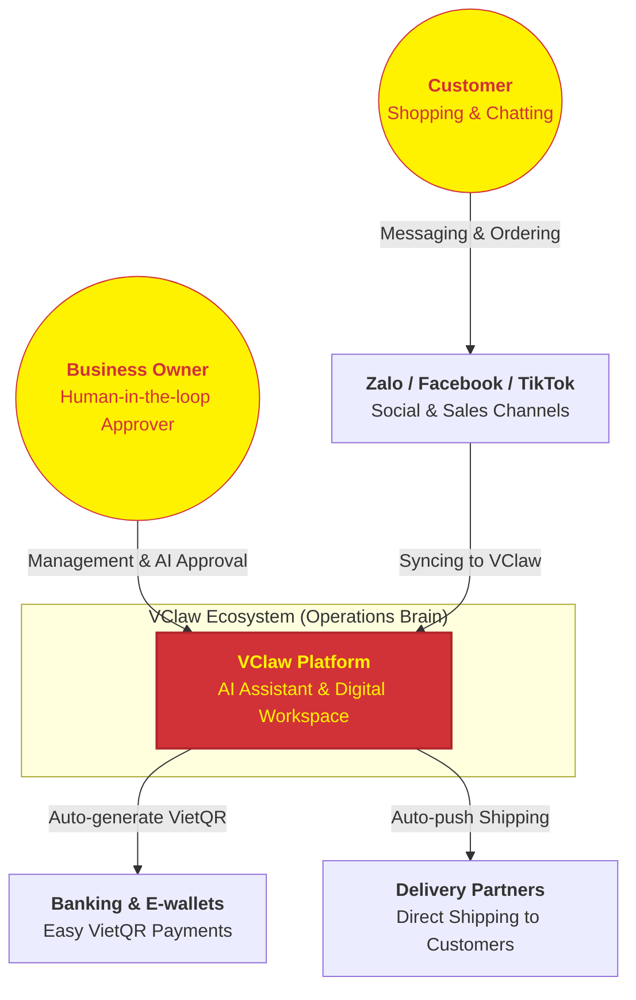

# 🌟 VCLAW PLATFORM VISION
## Your Intelligent Assistant for Business Prosperity

---

### 1. What is VClaw?
VClaw is not just management software; it is a lightweight **Business Operating System (Operations Console)** designed to turn your personal computer into a professional operations center.

We believe that every shop owner and small business deserves a dedicated "AI Assistant" that never tires—helping handle complex bookkeeping and reconciliation tasks so you can focus on what matters most: connecting with customers and growing your revenue.

---

### 2. How VClaw Connects Your Business World
VClaw acts as the central "brain," connecting all the tools you use daily into a seamless workflow:

---

### 3. Development Roadmap: With You at Every Step of Growth

#### 🚀 Phase 1: Operations Assistant (Freeing Your Labor)
Focusing on the most critical tasks: Unifying messages from multiple sources, automatically verifying payment bills, generating VietQR codes, and centralizing order management. You will never have to worry about missing an order or incorrect payments again.

#### 📈 Phase 2: Growth Assistant (Proactive Sales)
The AI begins to help you "earn money" proactively: suggesting message templates for re-engaging old customers, drafting attractive Facebook posts, and automatically reminding customers of upcoming appointments.

#### 🌐 Phase 3: Open Ecosystem (Total Automation)
Deeply connecting with all e-commerce platforms, automating everything from the moment a customer touches a product until the order is 100% complete. VClaw will become a true "star employee" in your business.

---

### 4. The VClaw Difference
- **Privacy & Security (Local-First)**: Your data stays on your machine. We respect your privacy and business secrets above all else.
- **AI-Native**: Not just dry buttons and menus; VClaw understands your language and supports you like a real person.
- **Maximum Savings**: Reduce manual tasks by 80%, allowing one person to handle the workload of a team of 3-5.

---
*VClaw - Empowering the prosperity of online sellers.*
