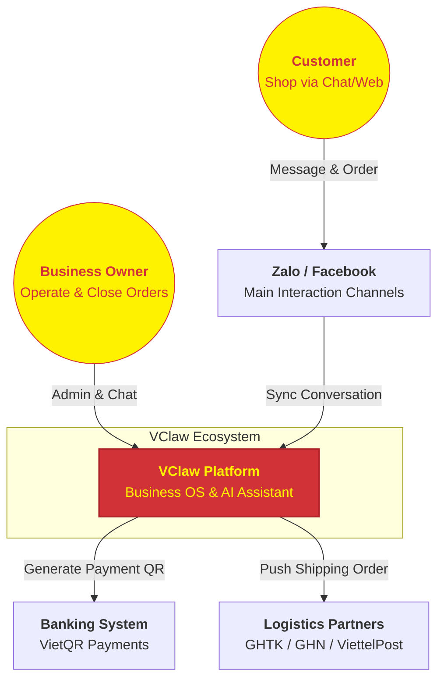

# VCLAW PLATFORM VISION
## Intelligent Business OS for the Social Commerce Era

---

### 1. What is VClaw?
VClaw is more than just management software; it's a lightweight **Business OS** designed to transform your personal computer into a professional operations center.

We focus on liberating business owners from repetitive tasks, allowing them to focus on what matters most: **Connecting with customers and Growing revenue.**

---

### 2. C4 Model - System Context
Here's a high-level overview of how VClaw connects your business world:

---

### 3. Roadmap & Future Vision

#### 🚀 Phase 1: Reactive Operations
Focusing on standardizing "near-money" workflows: Unified Messaging & Customer Management (CRM-lite), Task Inbox, VietQR generation, bill verification, and centralized order management.

#### 📈 Phase 2: Proactive Growth
AI begins to actively support you: suggesting advertising content, drafting marketing campaigns, automatically re-engaging old customers (follow-up), and intelligent sales consultation with guardrails.

#### 🌐 Phase 3: Omnichannel Ecosystem
Deep integration with marketplaces (Shopee, TikTok Shop), full automation from the moment a customer touches a sticker to final delivery, turning VClaw into the true "brain" of all business activities.

---

### 4. Core Values for Partners & Users
- **Local-First & Privacy**: Your data stays on your machine. Absolute security for customer information and revenue.
- **AI-Native**: Not just menus and buttons; everything can be controlled and optimized by Artificial Intelligence.
- **Time Saving**: Reduce manual tasks by 80%, allowing one person to handle the workload of a team of 3-5.

---
*VClaw - Partnering for the prosperity of Vietnamese businesses.*
