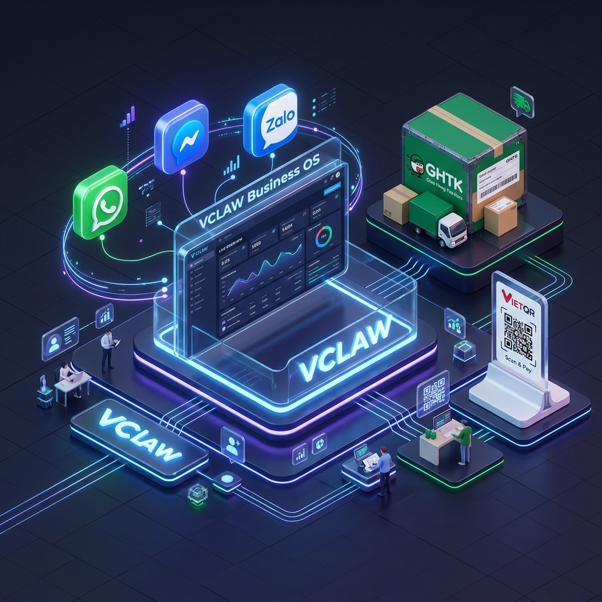
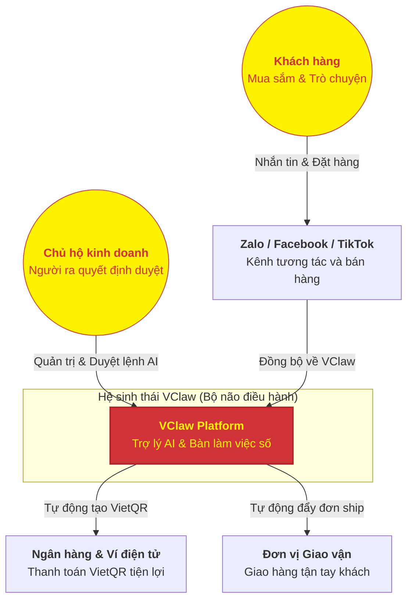
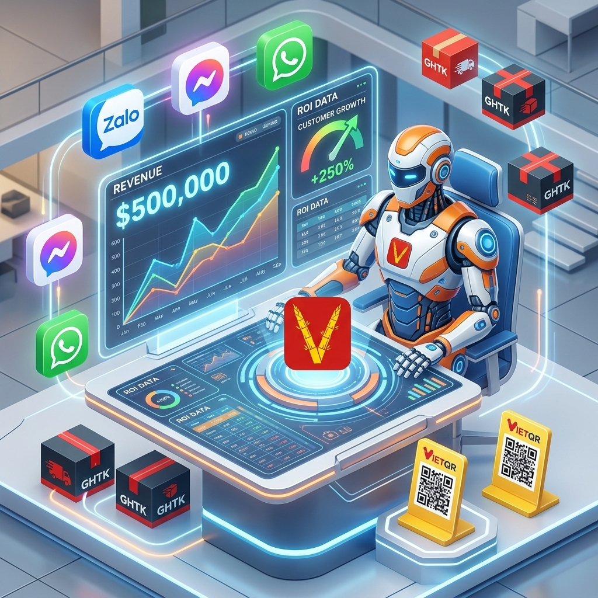

# 🌟 TẦM NHÌN NỀN TẢNG VCLAW (PLATFORM VISION)
## Trợ lý thông minh đồng hành cùng sự thịnh vượng của nhà bán hàng

---

### 1. VClaw là gì?
VClaw không chỉ là một phần mềm quản lý, mà là một **Hệ điều hành kinh doanh (Operations Console)** siêu nhẹ, được thiết kế để biến máy tính cá nhân của bạn thành một trung tâm vận hành chuyên nghiệp. 

Chúng tôi tin rằng mỗi chủ shop, mỗi hộ kinh doanh đều xứng đáng có một "người trợ lý" tận tụy, không bao giờ mệt mỏi, giúp xử lý các công việc sổ sách, đối soát phức tạp để bạn có thêm thời gian sáng tạo và kết nối với khách hàng.

---

### 2. Cách VClaw kết nối thế giới kinh doanh của bạn
VClaw đóng vai trò là "bộ não" trung tâm, kết nối tất cả các công cụ bạn đang dùng hàng ngày thành một luồng công việc mượt mà:

---

### 3. Lộ trình phát triển: Luôn bên bạn trên mọi nấc thang tăng trưởng

#### 🚀 Giai đoạn 1: Trợ lý vận hành (Giải phóng sức lao động)
Tập trung vào những việc "sát sườn" nhất: Hợp nhất tin nhắn từ nhiều nguồn, tự động soi bill chuyển khoản, tạo mã VietQR và quản lý đơn hàng tập trung. Bạn sẽ không bao giờ còn lo sót đơn hay nhầm tiền.

#### 📈 Giai đoạn 2: Trợ lý tăng trưởng (Chủ động bán hàng)
AI bắt đầu giúp bạn "kiếm tiền" chủ động hơn: Gợi ý các mẫu tin nhắn chăm sóc khách cũ, soạn bài đăng Facebook hấp dẫn, và tự động nhắc nhở khách hàng về các lịch hẹn sắp tới.

#### 🌐 Giai đoạn 3: Hệ sinh thái mở (Tự động hóa toàn diện)
Kết nối sâu rộng với mọi sàn TMĐT, tự động hóa từ lúc khách hàng chạm vào sản phẩm đến khi đơn hàng hoàn tất 100%. VClaw sẽ trở thành một "nhân viên xuất sắc" thực thụ trong doanh nghiệp của bạn.

---

### 4. Giá trị khác biệt của VClaw
- **Riêng tư & Bảo mật (Local-First)**: Dữ liệu của bạn nằm trên máy của bạn. Chúng tôi tôn trọng quyền riêng tư và bí mật kinh doanh của bạn hơn bất cứ điều gì.
- **AI-Native**: Không chỉ là những nút bấm khô khan, VClaw hiểu ngôn ngữ của bạn và hỗ trợ bạn như một con người thực thụ.
- **Tiết kiệm tối đa**: Giảm 80% các thao tác thủ công, giúp một người có thể vận hành khối lượng công việc của cả một đội ngũ.

---
*VClaw - Đồng hành cùng sự thịnh vượng của nhà bán hàng Việt.*
