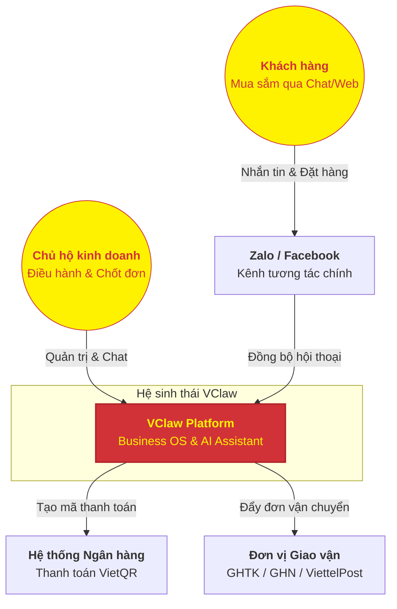

# TẦM NHÌN NỀN TẢNG VCLAW (PLATFORM VISION)
## Hệ điều hành kinh doanh thông minh cho kỷ nguyên Social Commerce

---

### 1. VClaw là gì?
VClaw không chỉ là một phần mềm quản lý, mà là một **Hệ điều hành kinh doanh (Business OS)** siêu nhẹ, được thiết kế để biến máy tính cá nhân của bạn thành một trung tâm vận hành chuyên nghiệp. 

Chúng tôi tập trung vào việc giải phóng các chủ hộ kinh doanh khỏi những tác vụ lặp lại, giúp họ tập trung vào điều quan trọng nhất: **Kết nối với khách hàng và Tăng trưởng doanh thu.**

---

### 2. Mô hình C4 - Bối cảnh hệ thống (System Context)
Dưới đây là cái nhìn tổng quát về cách VClaw kết nối thế giới kinh doanh của bạn:

---

### 3. Lộ trình phát triển & Tầm nhìn tương lai

#### 🚀 Giai đoạn 1: Trợ lý vận hành (Reactive Operations)
Tập trung vào việc chuẩn hóa các luồng "gần tiền" nhất: tạo mã VietQR, xác minh hóa đơn, chuẩn hóa địa chỉ giao hàng và quản lý đơn hàng tập trung.

#### 📈 Giai đoạn 2: Trợ lý tăng trưởng (Proactive Growth)
AI bắt đầu chủ động hỗ trợ bạn: gợi ý nội dung quảng cáo, soạn thảo chiến dịch marketing, tự động nhắc khách cũ (follow-up) và tư vấn bán hàng thông minh có kiểm soát.

#### 🌐 Giai đoạn 3: Hệ sinh thái mở (Omnichannel Ecosystem)
Kết nối sâu với các sàn TMĐT (Shopee, TikTok Shop), tự động hóa toàn diện từ lúc khách chạm vào sticker đến khi hàng được giao tận tay, biến VClaw thành "bộ não" thực sự cho mọi hoạt động kinh doanh.

---

### 4. Giá trị cốt lõi cho đối tác & Người dùng
- **Local-First & Privacy**: Dữ liệu của bạn nằm trên máy của bạn. Bảo mật tuyệt đối thông tin khách hàng và doanh thu.
- **AI-Native**: Không chỉ là menu và nút bấm, mọi thứ đều có thể điều khiển và tối ưu bằng trí tuệ nhân tạo.
- **Tiết kiệm thời gian**: Giảm 80% các thao tác thủ công, giúp một người có thể vận hành khối lượng công việc của một đội ngũ 3-5 người.

---
*VClaw - Đồng hành cùng sự thịnh vượng của hộ kinh doanh Việt.*
