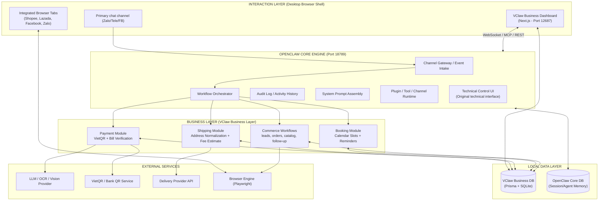
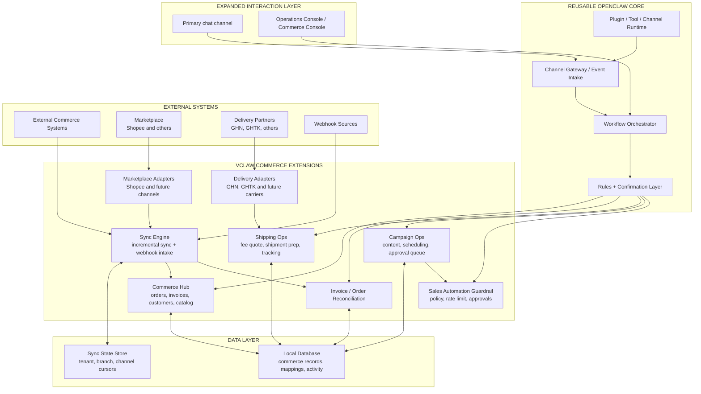

# SYSTEM ARCHITECTURE DOCUMENT
## PROJECT: VClaw - Local-first Operations Assistant for Small Businesses in Vietnam

---

## 1. ARCHITECTURE GOALS

The VClaw architecture in the MVP stage is designed to directly serve the goals stated in the BRD:

1. Run local-first on the user's machine to reduce deployment barriers and increase the ability to process operational data close to where it is generated.
2. Prioritize a primary communication channel in the early stages to ensure a stable end-to-end flow.
3. Support the core capabilities of the MVP: VietQR generation, bill verification support, address normalization and shipping estimation, and basic appointment management.
4. Leave room for a growth layer that is closer to the MVP, such as content assistance, follow-up, campaign drafting, and guarded auto-consultation.
5. Keep the architecture small enough to be operated, tested, and expanded gradually after the pilot.

This architecture does not assume the system's ability to self-generate new features, self-update business logic, or operate widely on the operating system. Components are clearly limited to reduce operational and security risks.

---

## 2. DESIGN PRINCIPLES

1. **Modularization by capability:** Each core feature is a relatively independent business module, communicating through a common coordination layer.
2. **Local-first but not local-only:** Operational data and configurations are prioritized for local storage; external services are only called when needed for QR, OCR, logistics, or sending reminders.
3. **AI as a decision support layer:** AI is used for extraction, suggestion, and normalization; high-risk operations must have a user confirmation step.
4. **Separated integration:** Each external partner is wrapped in its own adapter for easy replacement, testing, and error control.
5. **Horizontal gradual expansion:** After proving one channel and one segment works, the system will move to other capabilities or channels.
6. **Native Shell (Integrated Browser) for the seller:** The primary management interface is a Desktop application (native shell) acting as an orchestration architecture. It uses Playwright Chromium to render the VClaw UI (Next.js Standalone) and manage integrated browser tabs to interact directly with e-commerce platforms.

### 2.1 Technical Fork Model

The VClaw architecture is defined according to the `product-fork` model from OpenClaw, not a completely separate system. This leads to three clear technical layers:

1. **Reusable OpenClaw Core**
   - Gateway daemon
   - WebSocket protocol
   - Control UI shell
   - Session routing and multi-agent runtime
   - Plugin/channel/tool runtime
   - Config mechanism and system prompt assembly
2. **VClaw Product Layer**
   - Rebranding and UX for Vietnamese SMB users
   - Business workflows and business-oriented prompts/rules
   - Policy/confirmation layer for payments, sales, and automation
   - Simplified control UI and onboarding according to operational use cases
   - Commerce admin layer for non-technical sellers
3. **VClaw Growth and Self-Improvement Layer**
   - Market intelligence
   - Lead discovery and campaign assistance
   - Skill discovery, sandbox prototyping, and approval-gated release

The architectural rule is: prioritize adding capabilities at the `VClaw Product Layer` through configurations, plugins, tools, and new workflows; only modify the `Reusable OpenClaw Core` when there are product requirements that cannot be achieved with existing extension points.

---

## 3. ARCHITECTURE OVERVIEW

### 3.1 Current Diagram - Current MVP Architecture

The diagram below describes the baseline architecture for VClaw during the MVP stage. The focus is the clear separation between the **VClaw Business Dashboard** (Sales UI) and the **OpenClaw Core Engine** (AI Engine).

### 3.2 Future Diagram - Future Commerce Architecture

The future diagram below is not an MVP commitment. It only illustrates the expansion direction once the pilot proves value, especially if VClaw needs to go deeper into growth automation, marketplace-aware commerce, and multi-channel orchestration.

---

## 4. MAIN COMPONENTS

### 4.1 Interaction Layer

**Primary Chat Channel**

- Is the input event point from customers or operators.
- MVP should only choose one primary channel to reduce integration and support complexity.
- Incoming messages will be normalized into a unified event format before entering the business system.

**Integrated Browser Shell (VClaw Desktop App)**

- Is the primary management surface, packaged as a Desktop application (macOS/Windows).
- **Default Homepage (VClaw Business Dashboard)**: Runs on port **12687** as a dynamic Next.js server (Standalone), allowing the use of Middleware and Server Actions for in-depth order management and task approval (Human-in-the-loop). This is the primary interface for the business owner.
- **Platform Tabs**: Integrated browser engine (Playwright engine) to open Shopee, Lazada, Facebook, and Zalo directly.
- **Technical Control UI**: The original OpenClaw interface still runs on port **18789** for technical operations and advanced debugging but is hidden from the end-user.

**Remote Web Access**

- VClaw supports remote management access via secure tunnels (Tailscale/Cloudflare) pointing to port **8800**.
- The Desktop environment at the shop remains the primary "Local Host," ensuring browser profiles and cookies are stored securely on-site.

### 4.2 Application Orchestration Layer

**OpenClaw Core Engine (Port 18789)**

- Acts as the "Intelligent Backend" of the entire system.
- Responsible for receiving events, coordinating AI workflows, managing agent memory, and connecting with tools/plugins.
- Provides standard connection interfaces: WebSocket, REST API, and especially **MCP (Model Context Protocol)** so the VClaw UI can invoke AI capabilities.

**Channel Gateway / Event Intake**

- Receives messages or actions from the chat channel.
- Normalizes event metadata such as sender, content, attachments, and timestamp.
- Separates channel-specific logic from business workflows.
- This component is directly inherited from OpenClaw Core.

**Workflow Orchestrator**

- Is the central coordination point between input events and business modules.
- Decides which flow is triggered: QR generation, bill check, address normalization, booking, or response suggestion.
- Responsible for managing multi-step workflow states.
- In VClaw, this layer executes commerce workflows such as lead intake, order progression, and follow-up.

**Rules + Confirmation Layer**

- Controls actions that require user confirmation.
- Reduces risks when AI misinterprets images, addresses, or natural chat language.
- Is where safety policies are applied before sending results or recording data.
- This is a product-specific addition to VClaw and should not depend entirely on OpenClaw's default guardrails.

**Audit Log / Activity History**

- Records important actions such as QR generation, bill verification, appointment creation, and reminder sending.
- Helps operation, reconciliation, and user support when errors occur.

**System Prompt Assembly**

- OpenClaw already has a mechanism to assemble system prompts based on workspace, tools, skills, runtime, and bootstrap context.
- VClaw should inherit this mechanism but replace the persona, business instructions, and policy instructions for the SMB use case.

**Plugin / Tool / Channel Runtime**

- OpenClaw already supports TypeScript plugins running in-process with the ability to register channels, tools, hooks, CLI commands, background services, and config schemas.
- This is the primary extension point for VClaw to add Vietnamese business modules before deciding to modify the core.

### 4.3 Business Layer

**Payment Module**

- Generates VietQR from data pulled from chat or quick entry forms.
- Receives transfer photos and calls OCR/vision to extract data.
- Returns results as suggestions or confidence levels, instead of automatically confirming absolute payment.
- Can later expand into an `invoice/order reconciliation` layer that keeps order state, payment proof, and reconciliation notes in the same flow.

**Shipping Module**

- Normalizes non-standard Vietnamese addresses from conversations.
- Connects with logistics providers to get estimated fees or order preparation data.
- Can use an adapter model for partners such as `GHN`, `GHTK`, or other carriers without hard-coding the architecture to one provider.
- Does not yet include automatic shipment creation logic in the MVP if not necessary; that fits better in the post-pilot future state.

**Booking Module**

- Manages available time slots, creates appointments, and stores booking status.
- Generates reminders according to templates and passes them to the notification layer.
- Only supports basic booking in the MVP; does not yet include complex multi-staff/multi-branch booking optimization.

**Messaging Support Module**

- Provides content templates and suggested responses based on sales context or operational confirmation.
- Is a supporting module, not the focus of the first phase if FR1-FR4 are not yet completed.

**Growth Assist Module**

- Provides content drafts, campaign drafts, follow-up drafts, and structured growth suggestions.
- Can support guarded auto-consultation or semi-automated outreach in sufficiently clear situations.
- Must always work with policy, rate limits, approval queues, and audit trails.

**Commerce Workflows Module**

- Represents the general business expansion layer for SMB commerce.
- Can include lead capture, order status, lightweight catalog management, post-sale follow-up, and basic online sales connections.
- **Commerce Web Adapters**: Uses Playwright to interact directly with the Web versions of Zalo, Facebook, Shopee, and TikTok Shop to overcome API limitations.
- In the expansion direction, this module is also where data can be unified from `marketplace-aware commerce flows` such as Shopee or from external operational systems if data connectors ever become necessary later.
- This is a bridge to later expand to specific verticals such as ticketing, travel resellers, or B2B agents.

---

### 4.6 Browser Automation Subsystem (Playwright)

**Headful-to-Headless Engine**

- **Headful Mode (Visible)**: Used for initial login operations such as scanning Zalo/Facebook QR codes or two-factor authentication (2FA). This ensures "peace of mind" and security as users directly control the process.
- **Headless Mode (Background)**: Once login is successful, the browser is switched to background mode to save resources and perform automated tasks such as message synchronization, order retrieval, or shipping status checks.

**Profile Manager**

- Manages separate sessions for each sales account.
- Securely stores cookies and login status locally on the user's machine, avoiding the need for frequent re-logins.

### 4.4 Local Data Layer

**VClaw Business Database (Prisma + SQLite)**

- Stores business entities: Orders, Customers, Bookings, and Business Configurations.
- Ensures data consistency for the Dashboard.

**OpenClaw Core Database**

- Stores Agent configurations, Session memory (conversation history), and AI workflow states.
- Completely separated from business data for safe core updates.

**Scoped Local Files**

- Only accesses files that the user actively configures or imports.
- Does not assume the app can freely scan the entire disk.

### 4.5 External Integration Layer

**AI / OCR / Vision Provider**

- Serves tasks of identifying transfer photos, extracting addresses, or supporting intent classification.
- Results must pass through the confirmation layer before being used for business actions.

**VietQR / Bank QR Service**

- Generates payment QR data or images according to the amount and reference content.

**Delivery Provider API**

- Returns data such as normalized addresses, areas, or estimated shipping fees in the MVP.
- In the future state it can expand into shipment creation, delivery status sync, and tracking through adapters such as `GHN` and `GHTK`.

**Notification Service**

- Serves sending reminders or notifications according to configuration rules.
- Can be messaging channels, SMS, or other forms of notification depending on the stage.
- In the growth direction, this layer may also be used for follow-up or campaign messaging, but it must still be constrained by policy and approval logic.

---

## 5. MAIN PROCESSING FLOWS

### 5.1 VietQR Generation Flow

1. The user or customer sends payment-related content via a chat channel or form.
2. `Workflow Orchestrator` identifies the QR generation intent.
3. `Payment Module` extracts the amount, reference content, and account data.
4. If data is missing, the system requests confirmation or additional input via UI/chat.
5. The module calls the `QR Provider`, generates the QR, and returns the image or payload to be sent.
6. The system records the task log in the `Audit Log`.

### 5.2 Bill Verification Flow

1. The user uploads a bill/transfer photo.
2. `Payment Module` calls an OCR/vision provider to extract data.
3. Results are reconciled with expected transactions or information entered by the user.
4. The system returns support status like `match`, `mismatch`, `needs further check`.
5. The user confirms the final step if necessary.

### 5.3 Address Normalization and Shipping Estimation Flow

1. The address is taken from the conversation or entered by the user.
2. `Shipping Module` normalizes the address string, extracting necessary components.
3. If confidence is low, the system requests the user to edit before calling external APIs.
4. The module calls the `Delivery Provider API` to get an estimated fee.
5. Results are returned to the operational interface or sent back via chat if appropriate.

In the future state, this flow can extend into shipment creation, carrier code attachment, and shipping status reconciliation, but that should not be treated as a default MVP assumption.

### 5.4 Booking and Reminder Flow

1. The user creates a booking via chat or UI.
2. `Booking Module` checks empty slots in the local database.
3. After confirmation, the booking is saved and a reminder is registered.
4. At the configured time, the `Notification Service` sends a reminder according to the template.

### 5.5 Content / Campaign Draft Flow

1. The user chooses a sales objective, campaign idea, or customer group to target.
2. The `Growth Assist Module` creates a content draft or campaign draft based on product and channel context.
3. The `Rules + Confirmation Layer` applies policy checks for content, frequency, and approval requirements.
4. If approved, the content moves into a publishing queue or a follow-up queue.

### 5.6 Guarded Auto-Consultation Flow

1. A customer asks a repetitive question through the chat channel.
2. The `Workflow Orchestrator` and `Growth Assist Module` decide whether the intent is structured enough for semi-automated selling assistance.
3. If the intent is safe enough, the system prepares a policy-compliant response or a quick-approval draft.
4. If the intent is ambiguous or sensitive, the system routes it to the `Task Inbox` for a human decision.

---

## 6. ARCHITECTURAL DECISIONS FOR MVP

### 6.1 Choose One Main Channel First

The architecture supports multi-channel expansion, but the MVP should only be fully deployed for one primary channel. Simultaneously supporting Zalo OA, personal Zalo, Messenger, and Telegram from the start will significantly increase integration, testing, and support costs.

This does not cancel the multi-channel growth direction, but the first outbound and growth workflows should still stay anchored to one or very few well-controlled channels.

### 6.2 No Self-Coding or Self-Updating Mechanisms

The architecture completely removes components like `auto-coder`, `trend scraper`, and `self-updating business logic` from the MVP stage. These mechanisms increase security risks, make quality control difficult, and make it hard to trace when errors occur.

### 6.3 Limit Operating System Privileges

VClaw is a local-first application but is not designed as an agent with wide operating privileges on the entire machine. Local file access must follow a clearly configured scope, with setup screens and logging mechanisms.

### 6.4 Prioritize Simple Structured Data

In the early stages, data should be simple enough to support core tasks and basic reporting. Avoid over-designing schemas for verticals not yet deployed.

At the same time, the schema should leave enough room for `lead`, `sales channel`, `follow-up milestone`, `content draft`, and `approval state` so that growth features can enter the near-term roadmap without forcing a full redesign.

### 6.5 Prioritize Plugins First, Core Later

When implementing VClaw on OpenClaw, change decisions should follow this order:

1. Adjust configurations, agent identity, system prompt, and bootstrap context.
2. Add plugins, tools, workflows, or channel-specific adapters.
3. Only modify core gateway, protocol, routing, or control UI shell when the above two steps are not enough to meet product requirements.

Instead of trying to "repaint" the technical Control UI of OpenClaw, VClaw uses an independent application (Next.js) as the **Business Dashboard**.
This Frontend layer runs on port **12687**, calling port **18789** of the OpenClaw Core via MCP/WebSocket.

### 6.7 1-click Installer as Distribution Standard

No installation of dev-tools (git, npm, docker) is required. The product on the SMB's machine must be installed via one click (.exe or .dmg); the system will automatically start the background services and open the Web App in the browser. This is the key for VClaw to reach a mass market.

---

## 7. SECURITY AND OPERATIONAL REQUIREMENTS

1. Every file reading, image processing, and external API calling action must be logged.
2. Sensitive data such as tokens, payment configurations, and customer information need to be stored securely on the user's machine.
3. The system must have a fallback mechanism when OCR, AI, or external APIs fail.
4. Actions that incur costs or affect business data must have a clear confirmation step.

---

## 8. POST-MVP EXPANSION DIRECTIONS

After completing the pilot and having actual usage data, the architecture can expand in the following directions:

1. Add new channel adapters for other chat channels.
2. Add vertical-specific modules for spa, F&B, or freelancers.
3. Upgrade the operational reporting and rule engine.
4. Add cloud sync or backup mechanisms if users need multi-device support.

### 8.1 Growth Intelligence Layer

After the operational core is solid enough, the system can add or move closer a new layer specialized in growth problems instead of only internal operations.

Proposed expansion components:

**Market Intelligence Module**

- Collects and aggregates market signals from allowed data sources.
- Analyzes trends by industry, season, area, or customer group.
- Outputs insights for promotion, pricing, or product selection decisions.

**Lead Discovery Module**

- Supports identifying potential customer files according to user criteria.
- Combines data from campaigns, previous feedback, and market signals to rank leads.

**Campaign Assistant Module**

- Proposes promotional content, sales messages, follow-up scenarios, and deployment schedules.
- Can support semi-automation in structured workflows such as lead reminders, sending quotes, or sending offers.
- Is a good candidate to enter the near-term roadmap first at the `draft + approval` level before deeper automation is attempted.

**Sales Automation Guardrail**

- Every outreach, follow-up, or automated sales flow must have frequency limits, target limits, and content approval policies.
- Different platforms may have different spam and automation policies, so this layer must stand between the sales workflow and channel adapters.

### 8.2 Skill Discovery and Improvement Layer

After having enough actual usage data, VClaw can add a layer specialized in detecting system improvement opportunities.

Proposed expansion components:

**Trend Analysis Engine**

- Aggregates signals from usage logs, repetitive errors, user feedback, and market data.
- Identifies feature gaps or workflows with low effectiveness.

**Skill Discovery Engine**

- Analyzes repetitive tasks to propose new modules, rules, or workflows.
- The result is a structured proposal, not source code fed directly into production.

**Sandbox Prototyping Environment**

- Allows generating prompt, rule, template, or technical prototype proposals in a separate environment.
- Used to evaluate the quality of proposals before human review.

**Approval-Gated Release Pipeline**

- Every self-proposed improvement must follow the `proposal -> sandbox -> evaluation -> review -> approval -> release` flow.
- No mechanism to self-modify the production runtime or self-load new skills into the running system.

### 8.3 Architectural Impact of Expansion

When adding the above two layers, the overall architecture will need:

1. A better aggregated data store for usage analytics and market signals.
2. A quality assessment mechanism for generated content/rules before actual use.
3. A stronger policy layer to control automation on external channels.
4. A sandbox separate from production runtime for testing new workflows or skills.
5. An `incremental sync + webhook` mechanism if VClaw starts connecting deeply with POS/OMS, marketplaces, and external fulfillment systems.
6. A data model that is aware of `tenant/store/branch/channel` boundaries for multi-source commerce operations.

The current MVP architecture is designed to allow gradual expansion in the above directions without having to redo the entire coordination core, but it should only be activated when the MVP has enough pilot data and an operational team to control the risks.
