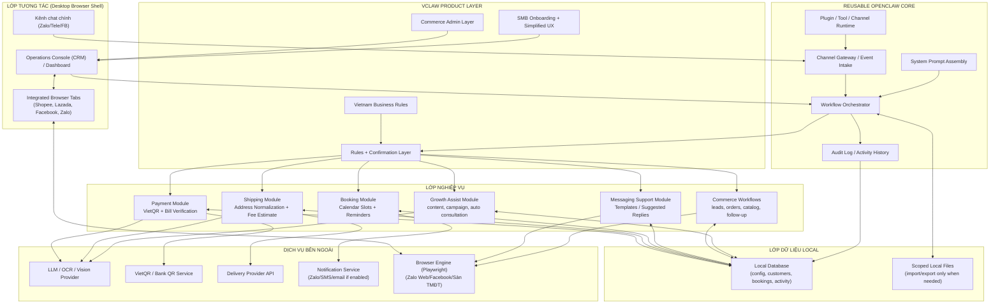
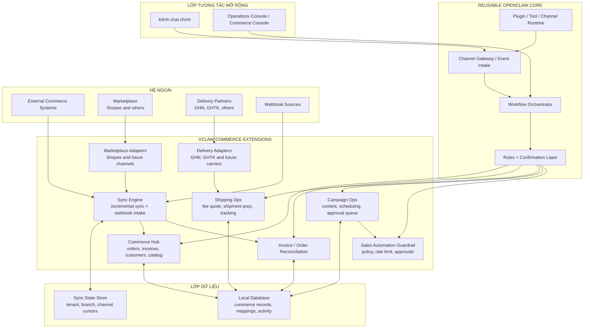

# TÀI LIỆU KIẾN TRÚC HỆ THỐNG (SYSTEM ARCHITECTURE)
## DỰ ÁN: VClaw - Trợ lý vận hành local-first cho hộ kinh doanh nhỏ tại Việt Nam

---

## 1. MỤC TIÊU KIẾN TRÚC

Kiến trúc VClaw trong giai đoạn MVP được thiết kế để phục vụ trực tiếp các mục tiêu đã nêu trong BRD:

1. Chạy local-first trên máy người dùng để giảm rào cản triển khai và tăng khả năng xử lý dữ liệu vận hành gần nơi phát sinh.
2. Ưu tiên một kênh giao tiếp chính trong giai đoạn đầu để đảm bảo một luồng end-to-end hoạt động ổn định.
3. Hỗ trợ các capability lõi của MVP: tạo VietQR, xác minh ảnh chuyển khoản ở mức hỗ trợ, chuẩn hóa địa chỉ và ước tính giao vận, quản lý lịch hẹn cơ bản.
4. Chừa sẵn chỗ cho một lớp tăng trưởng gần hơn với MVP như content assistance, follow-up, campaign drafting và auto consultation có guardrail.
5. Giữ kiến trúc đủ nhỏ để có thể vận hành, kiểm thử và mở rộng dần sau pilot.

Kiến trúc này không giả định khả năng hệ thống tự sinh tính năng mới, tự cập nhật logic nghiệp vụ hoặc tự thao tác rộng trên hệ điều hành. Các thành phần được giới hạn rõ ràng để giảm rủi ro vận hành và bảo mật.

---

## 2. NGUYÊN TẮC THIẾT KẾ

1. **Module hóa theo capability:** Mỗi tính năng lõi là một module nghiệp vụ độc lập tương đối, giao tiếp qua lớp điều phối chung.
2. **Local-first nhưng không local-only:** Dữ liệu vận hành và cấu hình ưu tiên lưu local; các dịch vụ ngoài chỉ được gọi khi cần cho QR, OCR, giao vận hoặc gửi nhắc.
3. **AI là lớp hỗ trợ quyết định:** AI dùng để trích xuất, gợi ý và chuẩn hóa; các thao tác rủi ro cao phải có bước xác nhận của người dùng.
4. **Tích hợp tách biệt:** Mỗi đối tác ngoài được bọc trong adapter riêng để dễ thay thế, kiểm thử và kiểm soát lỗi.
5. **Mở rộng dần theo chiều ngang:** Sau khi chứng minh một kênh và một phân khúc hoạt động, hệ thống mới mở sang capability hoặc channel khác.
6. **App-first (Browser Shell) cho người bán hàng:** Surface quản trị chính là một ứng dụng Desktop (native shell) đóng vai trò như một trình duyệt chuyên dụng. Nó chứa cả Operations Console (Next.js) và các tab trình duyệt tích hợp (Playwright) để tương tác với sàn TMĐT; CLI chỉ là lớp vận hành kỹ thuật.

### 2.1 Mô hình fork kỹ thuật

Kiến trúc VClaw được định nghĩa theo mô hình `product-fork` từ OpenClaw, không phải hệ thống tách biệt hoàn toàn. Điều này dẫn đến ba lớp kỹ thuật rõ ràng:

1. **Reusable OpenClaw Core**
   - Gateway daemon
   - WebSocket protocol
   - Control UI shell
   - Session routing và multi-agent runtime
   - Plugin/channel/tool runtime
   - Cơ chế config và system prompt assembly
2. **VClaw Product Layer**
   - Rebranding và UX cho người dùng SMB Việt Nam
   - Business workflows và business-oriented prompt/rules
   - Policy/confirmation layer cho thanh toán, bán hàng và automation
   - Simplified control UI và onboarding theo use case vận hành
   - Commerce admin layer cho người bán hàng không kỹ thuật
3. **VClaw Growth and Self-Improvement Layer**
   - Market intelligence
   - Lead discovery và campaign assistance
   - Skill discovery, sandbox prototyping và approval-gated release

Quy tắc kiến trúc là: ưu tiên thêm năng lực ở `VClaw Product Layer` bằng cấu hình, plugin, tools và workflow mới; chỉ chỉnh `Reusable OpenClaw Core` khi có yêu cầu sản phẩm không thể đạt được bằng extension points sẵn có.

---

## 3. TỔNG QUAN KIẾN TRÚC

### 3.1 Current Diagram - Kiến trúc MVP hiện tại

Sơ đồ dưới đây mô tả baseline kiến trúc mà VClaw nên ưu tiên trong giai đoạn MVP. Trọng tâm là một luồng vận hành local-first đủ nhỏ để xử lý thanh toán, đối soát bill, ước tính giao vận và lịch hẹn, đồng thời chừa chỗ cho một lớp growth assistance đủ nhẹ như content, follow-up và auto consultation có duyệt.

### 3.2 Future Diagram - Kiến trúc commerce sau pilot

Sơ đồ tương lai dưới đây không phải cam kết MVP. Nó chỉ mô tả hướng mở rộng khi pilot đã chứng minh được giá trị, đặc biệt nếu VClaw cần đi sâu hơn vào growth automation, marketplace-aware commerce và orchestration đa kênh.

---

## 4. CÁC THÀNH PHẦN CHÍNH

### 4.1 Lớp tương tác

**Kênh chat chính**

- Là điểm nhận sự kiện đầu vào từ khách hàng hoặc người vận hành.
- MVP chỉ nên chọn một kênh chính để giảm độ phức tạp tích hợp và hỗ trợ.
- Các message đến sẽ được chuẩn hóa thành một event format thống nhất trước khi vào hệ thống nghiệp vụ.

**Integrated Browser Shell (Operations Console)**

- Là surface quản trị chính, được đóng gói như một ứng dụng Desktop (macOS/Windows).
- **Tab Quản trị (Dashboard)**: Dùng cho onboarding, quản lý đơn hàng, khách hàng và phê duyệt tác vụ (Human-in-the-loop task inbox).
- **Tab Nền tảng (Platform Tabs)**: Tích hợp sẵn trình duyệt (Playwright engine) để mở trực tiếp Shopee, Lazada, Facebook, Zalo. Người dùng có thể thao tác trực tiếp trên các tab này trong khi Agent vẫn quan sát và hỗ trợ (ví dụ: tự điền mã QR, trích xuất thông tin đơn).
- Khác với Control UI của bản gốc (mang tính technical DevOps), UI VClaw là một "Trạm điều hành đa nền tảng".

**Remote Web Access**

- VClaw hỗ trợ truy cập quản trị từ xa thông qua tunnel an toàn (Tailscale/Cloudflare).
- Môi trường Desktop tại shop vẫn là "Local Host" chính, đảm bảo dữ liệu browser profiles và cookie được lưu trữ an toàn tại chỗ.

**Chat-native Admin Surfaces**

- Một số thao tác quản trị nhanh có thể được ánh xạ ra các surface chat-native như Telegram bot menu hoặc Zalo Web App.
- Các surface này không thay thế dashboard web chính, mà đóng vai trò shortcut cho những tác vụ ngắn như duyệt yêu cầu, xem trạng thái hoặc kích hoạt workflow có sẵn.

### 4.2 Lớp điều phối ứng dụng

**Channel Gateway / Event Intake**

- Nhận message hoặc action từ kênh chat.
- Chuẩn hóa metadata của sự kiện như người gửi, nội dung, tệp đính kèm, timestamp.
- Tách riêng logic channel-specific khỏi workflow nghiệp vụ.
- Thành phần này được kế thừa trực tiếp từ mô hình gateway tập trung của OpenClaw và là một trong các phần tái sử dụng quan trọng nhất.

**Workflow Orchestrator**

- Là điểm điều phối trung tâm giữa sự kiện đầu vào và các module nghiệp vụ.
- Quyết định luồng nào được kích hoạt: tạo QR, kiểm bill, chuẩn hóa địa chỉ, đặt lịch, hoặc gợi ý trả lời.
- Chịu trách nhiệm quản lý trạng thái workflow đa bước.
- Trong VClaw, lớp này là nơi dễ phát sinh product-fork customization nhất vì phải chuyển từ mô hình agent chung sang workflow nghiệp vụ có cấu trúc rõ hơn.
- Ngoài các luồng vận hành cơ bản, lớp này cũng cần điều phối các workflow thương mại như lead intake, order progression, follow-up, content drafting, campaign approval và auto consultation có guardrail.

**Rules + Confirmation Layer**

- Kiểm soát các hành động cần xác nhận của người dùng.
- Giảm rủi ro khi AI suy luận sai từ ảnh, địa chỉ hoặc ngôn ngữ chat tự nhiên.
- Là nơi áp dụng chính sách an toàn trước khi gửi kết quả ra ngoài hoặc ghi dữ liệu.
- Đây là lớp bổ sung mang tính sản phẩm của VClaw, không nên phụ thuộc hoàn toàn vào guardrail mặc định của OpenClaw.

**Audit Log / Activity History**

- Ghi lại các hành động quan trọng như tạo QR, xác minh bill, tạo lịch hẹn và gửi nhắc lịch.
- Giúp vận hành, đối soát và hỗ trợ người dùng khi có sai sót.

**System Prompt Assembly**

- OpenClaw đã có cơ chế lắp ghép system prompt theo workspace, tools, skills, runtime và bootstrap context.
- VClaw nên kế thừa cơ chế này nhưng thay phần persona, business instructions và policy instructions cho đúng use case SMB.

**Plugin / Tool / Channel Runtime**

- OpenClaw đã hỗ trợ plugin TypeScript chạy in-process với khả năng đăng ký channel, tool, hook, CLI command, background service và config schema.
- Đây là extension point chính để VClaw thêm business modules Việt Nam trước khi quyết định chỉnh sâu vào core.

### 4.3 Lớp nghiệp vụ

**Payment Module**

- Tạo VietQR từ dữ liệu rút ra từ chat hoặc form nhập nhanh.
- Nhận ảnh chuyển khoản và gọi OCR/vision để trích xuất dữ liệu.
- Trả về kết quả dạng gợi ý hoặc mức độ tin cậy, thay vì tự động xác nhận thanh toán tuyệt đối.
- Về sau có thể mở rộng thành lớp `invoice/order reconciliation` để gắn trạng thái đơn, bằng chứng thanh toán và ghi chú đối soát trong cùng một flow.

**Shipping Module**

- Chuẩn hóa địa chỉ tiếng Việt không chuẩn từ hội thoại.
- Kết nối với nhà cung cấp giao vận để lấy phí ước tính hoặc dữ liệu chuẩn bị đơn.
- Có thể dùng mô hình adapter để cắm các đối tác như `GHN`, `GHTK` hoặc đối tác khác mà không làm cứng kiến trúc.
- Chưa bao gồm logic tạo vận đơn tự động trong MVP nếu chưa cần thiết; phần này phù hợp hơn với future-state sau pilot.

**Booking Module**

- Quản lý khung giờ khả dụng, tạo lịch hẹn và lưu trạng thái đặt lịch.
- Tạo lịch nhắc theo mẫu và chuyển qua lớp notification.
- Chỉ hỗ trợ lịch cơ bản trong MVP; chưa bao gồm tối ưu lịch phức tạp nhiều nhân viên/nhiều chi nhánh.

**Messaging Support Module**

- Cung cấp mẫu nội dung và gợi ý phản hồi theo ngữ cảnh bán hàng hoặc xác nhận vận hành.
- Là module hỗ trợ, không phải trọng tâm phase đầu nếu chưa hoàn tất FR1-FR4.

**Growth Assist Module**

- Cung cấp content draft, campaign draft, follow-up draft và các gợi ý tăng trưởng có cấu trúc.
- Có thể hỗ trợ auto consultation hoặc outreach bán tự động ở các tình huống đủ rõ.
- Phải luôn đi kèm policy, rate limit, approval queue và audit trail phù hợp.

**Commerce Workflows Module**

- Đại diện cho lớp mở rộng nghiệp vụ chung cho SMB commerce.
- Có thể bao gồm lead capture, trạng thái đơn hàng, quản lý catalog nhẹ, follow-up sau bán hàng và các kết nối bán hàng online ở mức cơ bản.
- **Commerce Web Adapters**: Sử dụng Playwright để tương tác trực tiếp với các phiên bản Web của Zalo, Facebook, Shopee, TikTok Shop nhằm khắc phục hạn chế API.
- Trong hướng mở rộng, module này cũng là nơi hợp nhất dữ liệu từ `marketplace-aware commerce flows` như Shopee hoặc từ các hệ vận hành ngoài nếu về sau thực sự cần thêm data connectors.
- Đây là cầu nối để sau này mở rộng sang các vertical cụ thể như ticketing, travel reseller hoặc đại lý B2B.

---

### 4.6 Browser Automation Subsystem (Playwright)

**Headful-to-Headless Engine**

- **Chế độ Headful (Có giao diện)**: Sử dụng cho các thao tác đăng nhập ban đầu như quét mã QR Zalo/Facebook hoặc xác thực hai lớp (2FA). Điều này đảm bảo tính "an tâm" và bảo mật do người dùng trực tiếp kiểm soát.
- **Chế độ Headless (Ngầm)**: Sau khi đăng nhập thành công, trình duyệt được chuyển vào chế độ chạy ngầm để tiết kiệm tài nguyên và thực hiện các tác vụ tự động như đồng bộ tin nhắn, lấy đơn hàng hoặc kiểm tra trạng thái vận chuyển.

**Profile Manager**

- Quản lý các phiên (session) tách biệt cho từng tài khoản bán hàng.
- Lưu trữ an toàn cookie và trạng thái đăng nhập cục bộ trên máy người dùng, tránh việc phải đăng nhập lại nhiều lần.

### 4.4 Lớp dữ liệu local

**Local Database**

- Lưu cấu hình, lịch sử tác vụ, khách hàng, lịch hẹn và trạng thái workflow.
- Nên dùng một schema đơn giản, đủ cho MVP và dễ backup.

**Scoped Local Files**

- Chỉ truy cập các file mà người dùng chủ động cấu hình hoặc nhập vào.
- Không giả định ứng dụng có thể tự do quét toàn bộ ổ đĩa.

### 4.5 Lớp tích hợp ngoài

**AI / OCR / Vision Provider**

- Phục vụ các tác vụ nhận diện ảnh chuyển khoản, trích xuất địa chỉ hoặc hỗ trợ phân loại intent.
- Kết quả phải đi qua lớp confirmation trước khi dùng cho hành động nghiệp vụ.

**VietQR / QR Provider**

- Sinh dữ liệu hoặc ảnh QR thanh toán theo số tiền và nội dung tham chiếu.

**Delivery Provider API**

- Trả về dữ liệu như địa chỉ chuẩn hóa, khu vực hoặc phí giao hàng ước tính trong MVP.
- Ở future-state có thể mở rộng thêm tạo vận đơn, đồng bộ trạng thái giao hàng và tracking qua các adapter như `GHN`, `GHTK`.

**Notification Service**

- Phục vụ gửi nhắc lịch hoặc gửi thông báo theo quy tắc cấu hình.
- Có thể là kênh nhắn tin, SMS hoặc hình thức thông báo khác tùy giai đoạn.
- Ở hướng growth, lớp này cũng có thể được dùng cho follow-up hoặc campaign messaging, nhưng phải bị chặn bởi policy/approval layer.

---

## 5. LUỒNG XỬ LÝ CHÍNH

### 5.1 Luồng tạo VietQR

1. Người dùng hoặc khách hàng gửi nội dung liên quan đến thanh toán qua kênh chat hoặc form.
2. `Workflow Orchestrator` xác định intent tạo QR.
3. `Payment Module` trích xuất số tiền, nội dung tham chiếu và dữ liệu tài khoản.
4. Nếu dữ liệu thiếu, hệ thống yêu cầu xác nhận hoặc nhập bổ sung qua UI/chat.
5. Module gọi `QR Provider`, tạo QR và trả ảnh hoặc payload để gửi đi.
6. Hệ thống ghi log tác vụ vào `Audit Log`.

### 5.2 Luồng xác minh bill

1. Người dùng tải ảnh bill/chuyển khoản lên.
2. `Payment Module` gọi OCR/vision provider để trích xuất dữ liệu.
3. Kết quả được đối chiếu với giao dịch kỳ vọng hoặc thông tin do người dùng nhập.
4. Hệ thống trả về trạng thái hỗ trợ như `khớp`, `không khớp`, `cần kiểm tra thêm`.
5. Người dùng xác nhận bước cuối nếu cần.

### 5.3 Luồng chuẩn hóa địa chỉ và ước tính ship

1. Địa chỉ được lấy từ hội thoại hoặc người dùng nhập.
2. `Shipping Module` chuẩn hóa chuỗi địa chỉ, bóc tách các thành phần cần thiết.
3. Nếu độ tin cậy thấp, hệ thống yêu cầu người dùng chỉnh sửa trước khi gọi API ngoài.
4. Module gọi `Delivery Provider API` để lấy phí ước tính.
5. Kết quả được trả về giao diện vận hành hoặc gửi lại qua chat nếu phù hợp.

Trong future-state, luồng này có thể được kéo dài thêm sang bước tạo vận đơn, gắn mã vận chuyển và đối soát trạng thái giao hàng, nhưng không nên xem đó là mặc định của MVP.

### 5.4 Luồng đặt lịch và nhắc lịch

1. Người dùng tạo lịch qua chat hoặc UI.
2. `Booking Module` kiểm tra khung giờ còn trống trong local database.
3. Sau khi xác nhận, lịch được lưu và một lịch nhắc được đăng ký.
4. Tới thời điểm cấu hình, `Notification Service` gửi tin nhắc theo template.

### 5.5 Luồng content / campaign draft

1. Người dùng chọn mục tiêu bán hàng, chiến dịch hoặc nhóm khách cần tiếp cận.
2. `Growth Assist Module` tạo content draft hoặc campaign draft theo ngữ cảnh sản phẩm/kênh.
3. `Rules + Confirmation Layer` áp policy về nội dung, tần suất và approval requirement.
4. Nếu được duyệt, nội dung được đưa vào queue phát hành hoặc queue follow-up.

### 5.6 Luồng auto consultation có guardrail

1. Khách gửi một câu hỏi lặp lại qua kênh chat.
2. `Workflow Orchestrator` và `Growth Assist Module` xác định đây có phải intent đủ rõ để hỗ trợ bán tự động hay không.
3. Nếu intent an toàn, hệ thống tạo phản hồi theo policy hoặc đưa ra draft cho người dùng duyệt nhanh.
4. Nếu intent mơ hồ hoặc nhạy cảm, hệ thống chuyển về `Task Inbox` để người dùng quyết định.

---

## 6. QUYẾT ĐỊNH KIẾN TRÚC CHO MVP

### 6.1 Chọn một kênh chính trước

Kiến trúc hỗ trợ mở rộng nhiều channel, nhưng MVP chỉ nên triển khai hoàn chỉnh cho một kênh chính. Việc đồng thời hỗ trợ Zalo OA, Zalo cá nhân, Messenger và Telegram ngay từ đầu sẽ làm tăng mạnh chi phí tích hợp, kiểm thử và hỗ trợ.

Điều này không phủ nhận định hướng đa kênh cho tăng trưởng, nhưng phần growth/outbound ban đầu cũng nên bám vào một hoặc rất ít channel được kiểm soát tốt trước.

### 6.2 Không dùng cơ chế tự sinh code hoặc tự cập nhật nghiệp vụ

Kiến trúc loại bỏ hoàn toàn các thành phần kiểu `auto-coder`, `trend scraper`, `self-updating business logic` khỏi giai đoạn MVP. Những cơ chế này làm tăng rủi ro bảo mật, khó kiểm soát chất lượng và khó truy vết khi phát sinh lỗi.

### 6.3 Hạn chế quyền hệ điều hành

VClaw là ứng dụng local-first, nhưng không được thiết kế như một agent có quyền thao tác rộng trên toàn bộ máy. Việc truy cập file local phải theo phạm vi được cấu hình rõ ràng, có màn hình thiết lập và có cơ chế log.

### 6.4 Ưu tiên dữ liệu cấu trúc đơn giản

Ở giai đoạn đầu, dữ liệu nên đủ đơn giản để hỗ trợ các tác vụ cốt lõi và báo cáo cơ bản. Tránh thiết kế schema quá sớm cho các vertical chưa triển khai.

Tuy vậy, schema nên chừa đủ chỗ cho `lead`, `sales channel`, `follow-up milestone`, `content draft` và `approval state` để không phải thiết kế lại hoàn toàn khi growth features vào near-term.

### 6.5 Ưu tiên plugin trước, core sau

Khi triển khai VClaw trên nền OpenClaw, quyết định thay đổi nên đi theo thứ tự:

1. Điều chỉnh cấu hình, agent identity, system prompt và bootstrap context.
2. Thêm plugin, tool, workflow hoặc channel-specific adapter.
3. Chỉ chỉnh core gateway, protocol, routing hoặc control UI shell khi hai bước trên không đủ để đáp ứng yêu cầu sản phẩm.

### 6.6 Kiến trúc Frontend chia tách (Decoupled Operations Console)

Thay vì cố gắng "sơn" lại Control UI kỹ thuật của OpenClaw, VClaw sẽ sử dụng một ứng dụng độc lập (VD: Next.js/React) đóng vai trò là Operations Console.
Lớp Frontend này sẽ gọi API hoặc đọc trực tiếp từ `workspace` để hiển thị các số liệu gần gũi với kinh doanh (Đơn hàng, Lịch hẹn) cũng như tạo hộp thư phê duyệt (Human-in-the-loop task inbox). Với VClaw, lựa chọn mặc định cho người dùng cuối sẽ là:

1. `localhost web admin` (Operations Console) cho thiết lập và vận hành chính.
2. `remote web access` cho nhu cầu quản trị từ xa có kiểm soát.
3. `chat-native admin surfaces` cho tác vụ nhanh và các phím tắt vận hành.

CLI và các công cụ vận hành kỹ thuật (Control UI gốc) vẫn chạy ngầm nhưng được ẩn đi và không phải surface chính dành cho người bán hàng SMB.

### 6.7 Đóng gói 1-click Installer là tiêu chuẩn phân phối

Không yêu cầu cài đặt dev-tools (git, npm, docker). Sản phẩm trên máy của SMB phải được cài qua một click (.exe hoặc .dmg), hệ thống sẽ tự động khởi chạy service ngầm và mở Web App ra trình duyệt. Đây là điểm then chốt để VClaw có thể tiếp cận thị trường đại chúng.

---

## 7. YÊU CẦU BẢO MẬT VÀ VẬN HÀNH

1. Mọi thao tác đọc file, xử lý ảnh và gọi API ngoài phải có logging.
2. Các dữ liệu nhạy cảm như token, cấu hình thanh toán và thông tin khách hàng cần được lưu trữ an toàn trên máy người dùng.
3. Hệ thống phải có cơ chế fallback khi OCR, AI hoặc API ngoài thất bại.
4. Các hành động phát sinh chi phí hoặc ảnh hưởng dữ liệu nghiệp vụ phải có bước xác nhận rõ ràng.

---

## 8. ĐỊNH HƯỚNG MỞ RỘNG SAU MVP

Sau khi hoàn thành pilot và có dữ liệu sử dụng thực tế, kiến trúc có thể mở rộng theo các hướng sau:

1. Thêm channel adapter mới cho các kênh chat khác.
2. Thêm vertical-specific modules cho spa, F&B hoặc freelancer.
3. Nâng cấp báo cáo vận hành và rule engine.
4. Thêm cơ chế đồng bộ cloud hoặc backup nếu người dùng có nhu cầu đa thiết bị.

### 8.1 Lớp mở rộng tăng trưởng kinh doanh (Growth Intelligence Layer)

Sau khi lõi vận hành đã đủ dùng, hệ thống có thể bổ sung hoặc đẩy gần hơn một lớp mới chuyên phục vụ các bài toán tăng trưởng thay vì chỉ vận hành nội bộ.

Các thành phần mở rộng đề xuất:

**Market Intelligence Module**

- Thu thập và tổng hợp tín hiệu thị trường từ các nguồn dữ liệu được cho phép.
- Phân tích xu hướng theo ngành, mùa vụ, khu vực hoặc nhóm khách hàng.
- Trả ra insight phục vụ quyết định quảng bá, định giá hoặc chọn sản phẩm.

**Lead Discovery Module**

- Hỗ trợ xác định tệp khách hàng tiềm năng theo bộ tiêu chí của người dùng.
- Kết hợp dữ liệu từ chiến dịch, phản hồi trước đó và tín hiệu thị trường để xếp hạng lead.

**Campaign Assistant Module**

- Đề xuất nội dung quảng bá, thông điệp bán hàng, kịch bản follow-up và lịch triển khai.
- Có thể hỗ trợ bán tự động trong các workflow có cấu trúc rõ ràng như nhắc lại lead, gửi báo giá, gửi ưu đãi.
- Là ứng viên phù hợp để đi vào near-term roadmap ở mức `draft + approval` trước khi tăng độ tự động hóa.

**Sales Automation Guardrail**

- Mọi luồng outreach, follow-up hoặc bán hàng tự động phải có giới hạn tần suất, giới hạn đối tượng và chính sách phê duyệt nội dung.
- Các nền tảng khác nhau có thể có chính sách spam và automation khác nhau, nên lớp này phải đứng giữa workflow bán hàng và channel adapters.

### 8.2 Lớp tự cải tiến sản phẩm (Skill Discovery and Improvement Layer)

Sau khi có đủ dữ liệu sử dụng thực tế, VClaw có thể bổ sung một lớp chuyên phát hiện cơ hội cải tiến hệ thống.

Các thành phần mở rộng đề xuất:

**Trend Analysis Engine**

- Tổng hợp tín hiệu từ usage logs, lỗi lặp lại, phản hồi người dùng và dữ liệu thị trường.
- Xác định khoảng trống tính năng hoặc các workflow đang có hiệu quả thấp.

**Skill Discovery Engine**

- Phân tích các tác vụ lặp lại để đề xuất module mới, rule mới hoặc workflow mới.
- Kết quả đầu ra là proposal có cấu trúc, không phải mã nguồn được đưa thẳng vào production.

**Sandbox Prototyping Environment**

- Cho phép sinh prompt, rule, template hoặc prototype kỹ thuật trong môi trường tách biệt.
- Dùng để đánh giá chất lượng đề xuất trước khi có review của con người.

**Approval-Gated Release Pipeline**

- Mọi cải tiến tự đề xuất phải đi theo luồng `proposal -> sandbox -> evaluation -> review -> approval -> release`.
- Không có cơ chế tự sửa production runtime hoặc tự nạp skill mới vào hệ thống đang chạy thật.

### 8.3 Tác động kiến trúc nếu mở rộng

Khi thêm hai lớp trên, kiến trúc tổng thể sẽ cần:

1. Một kho dữ liệu tổng hợp tốt hơn cho usage analytics và market signals.
2. Một cơ chế đánh giá chất lượng nội dung/quy tắc được sinh ra trước khi dùng thật.
3. Một lớp chính sách mạnh hơn để kiểm soát automation trên các channel ngoài.
4. Một sandbox tách biệt với runtime production để thử nghiệm workflow hoặc skill mới.
5. Một cơ chế `incremental sync + webhook` nếu bắt đầu kết nối sâu với POS/OMS, marketplace và các hệ fulfillment ngoài.
6. Một mô hình dữ liệu có ý thức về `tenant/store/branch/channel` để phục vụ commerce đa nguồn.

Kiến trúc MVP hiện tại được thiết kế để cho phép mở rộng dần theo các hướng trên mà không phải làm lại toàn bộ lõi điều phối, nhưng chỉ nên kích hoạt khi MVP đã có dữ liệu pilot đủ mạnh và có đội ngũ vận hành kiểm soát được rủi ro.
