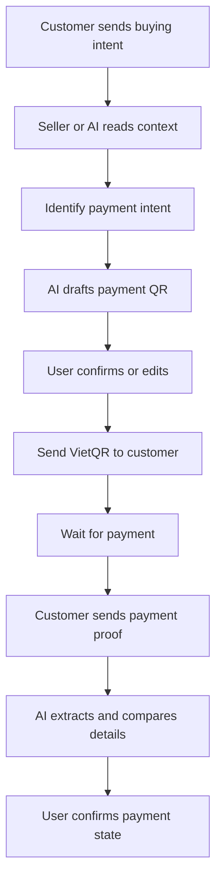
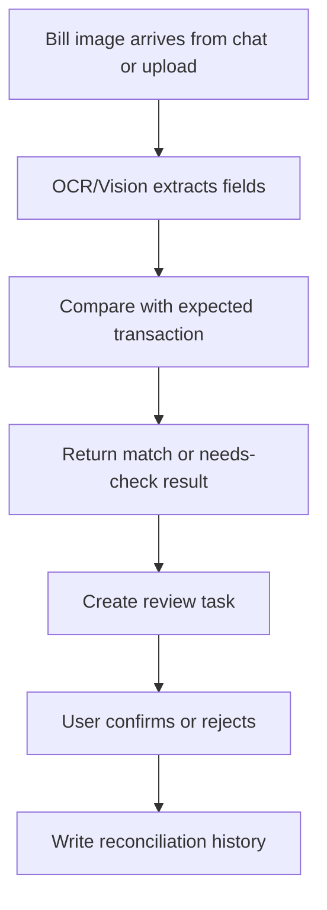
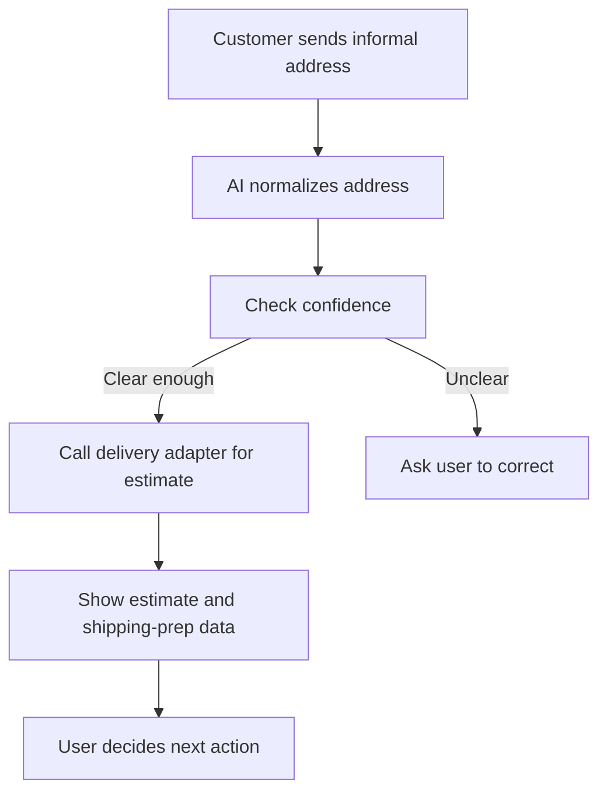
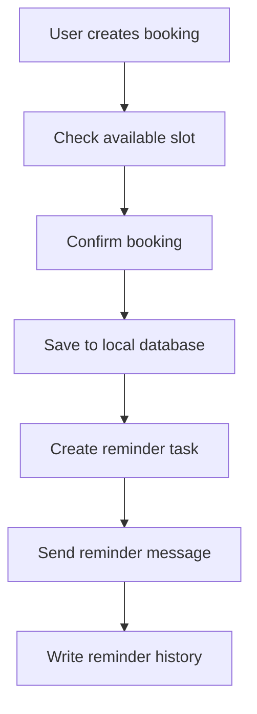
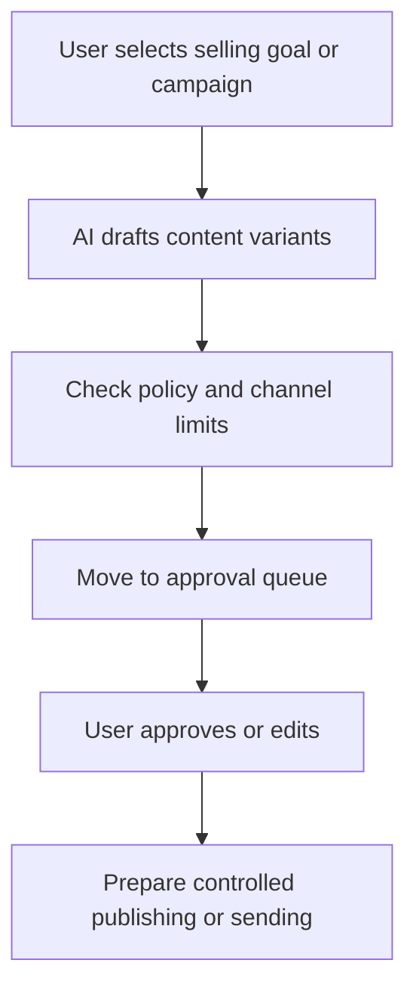
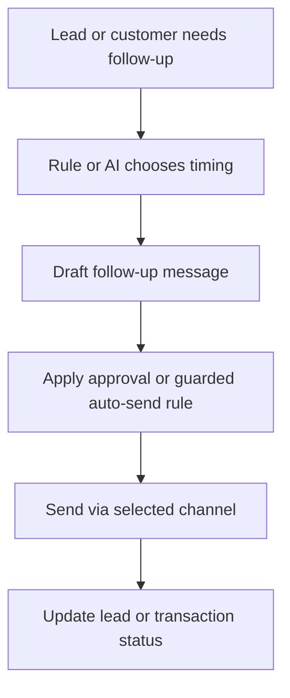
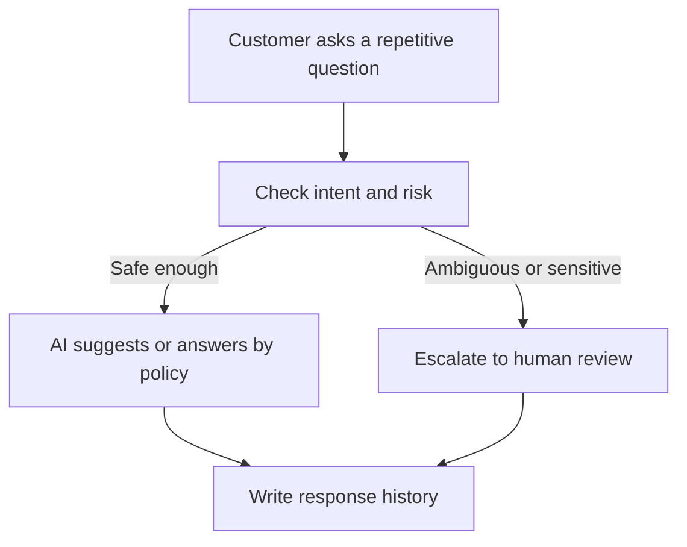

# PRODUCT REQUIREMENTS DOCUMENT (PRD)
## PROJECT: VClaw - Local-first Growth and Operations Assistant for Small Businesses in Vietnam

---

## 1. PRODUCT SUMMARY

VClaw is a `local-first online seller growth + operations assistant` for small business households and individual sellers in Vietnam. The product is designed to help users not only handle revenue-critical operational work such as responding to customers, generating VietQR, checking transfer proofs, normalizing shipping information, and managing basic bookings, but also become more proactive in growth through selling content drafts, promotion assistance, lead follow-up, guarded auto-consultation, and multi-channel selling coordination.

VClaw is not positioned as:

1. A technical DevOps mission-control dashboard.
2. A full POS / OMS / ERP suite.
3. A legal e-invoicing or accounting-compliance product.
4. A full advertising platform or an unrestricted autopilot seller bot.

VClaw is positioned as:

1. A **VClaw Business Dashboard** independent application running on port **8800**, serving as the "Business Operating System" (Business OS) for the shop owner.
2. An AI assistant layer (OpenClaw Core Engine) running in the background on port **12687**, helping non-technical sellers grow revenue and operate daily tasks faster via MCP.
3. A product integrated according to the "Sidecar" model, leveraging the OpenClaw core runtime but possessing its own business database (Prisma + SQLite).

This PRD acts as the product-level source of truth for the VClaw MVP, pilot, and near-term growth direction.

---

## 2. PRODUCT VISION AND POSITIONING

### 2.1 Product vision

VClaw exists to help a small seller or owner-operator both attract and nurture customers, consult and close orders, and manage follow-up operational work such as payments, shipping, and reminders without learning technical tools or jumping between too many disconnected apps.

### 2.2 Product positioning

The product should be framed in three layers:

1. `Core MVP`: a local-first operations and sales assistant focused on VietQR, assisted bill verification, address and shipping support, booking and reminders, and a human-review task inbox.
2. `Near-term growth layer`: proactive but controlled capabilities such as content assistance, campaign drafting, lead follow-up, guarded auto-consultation, sales channel awareness, and marketplace-aware selling.
3. `Future-state`: a broader commerce console with deeper automation, deeper multi-channel coordination, and optional deeper marketplace or fulfillment connections when there is proven demand.

### 2.3 Core differentiation

1. `Local-first`: operational data and configuration are primarily kept on the user's machine.
2. `Human-in-the-loop`: AI suggests, humans decide on sensitive actions.
3. `SMB-native UX`: business-facing language and workflows instead of developer-facing tools.
4. `Revenue-adjacent scope`: focus on workflows close to money, customer conversion, and retention.
5. `Proactive but controlled`: the product may draft, remind, and semi-automate, but must never quietly become uncontrolled autopilot.

---

## 3. TARGET USERS AND JTBD

### 3.1 Primary personas

**Persona A - Online shop owner-operator**

1. Runs a small shop with 1-3 operators.
2. Receives customers mainly from Zalo, Messenger, Telegram, social posts, or marketplaces.
3. Often has to reply to customers, check payments, quote shipping, and post content in the same day.
4. Does not want to learn terminals, tokens, or technical concepts.

**Persona B - Small service business owner**

1. Example: nails, salon, spa, appointment-based service business.
2. Strong need for confirming schedules, reminders, customer history, and follow-up.
3. Still needs payment handling and service-completion tracking.

### 3.2 Jobs-to-be-done

1. `Close payment quickly`: When a customer is ready to buy, I want to generate and send payment information in a few steps so I can increase my chance of closing.
2. `Check bills without manual reading`: When customers send transfer screenshots, I want the system to extract and compare the details so I do not need to read every receipt manually.
3. `Quote shipping quickly and accurately`: When customers send informal Vietnamese addresses, I want the system to normalize them and return a reasonable shipping estimate.
4. `Avoid missing urgent work`: When there are bookings, payment proofs, or pending order actions, I want them collected in one place so nothing gets lost.
5. `Track customers and order states without a heavy CRM`: When customers return or need follow-up, I want to see order state, basic history, and the next action in a simple workspace.
6. `Create selling content faster`: When I need to post or run a selling campaign, I want the system to suggest captions, content variants, and publishing timing so I do not start from zero.
7. `Nurture leads consistently`: When customers asked before but did not buy, I want the system to remind me at the right time and prepare a follow-up draft so I can improve conversion without spammy manual work.
8. `Consult repeatedly asked questions with control`: When customers ask repetitive questions about price, availability, booking times, or basic policies, I want the system to suggest or semi-automate responses with clear rules and approvals.

---

## 4. PROBLEM STATEMENT

### 4.1 Current pains

1. Customer communication is fragmented across channels.
2. Sellers repeatedly recreate the same payment, confirmation, and reminder content.
3. Bill checking and transaction-state tracking are still manual.
4. Shipping addresses are inconsistent and error-prone.
5. Non-technical users reject products with difficult setup.
6. Sellers lack lightweight tools for proactive growth such as content drafting, consistent posting, and lead re-engagement.
7. Repetitive customer consultation still consumes manual effort.

### 4.2 Business consequences

1. Slow replies reduce conversion.
2. Incorrect payment or shipping details increase operating cost.
3. Missed reminders or follow-up reduce repeat revenue.
4. Weak onboarding causes early churn.
5. Missing outreach rhythm and content output reduces growth opportunities.

---

## 5. PRODUCT GOALS AND SUCCESS METRICS

### 5.1 Product goals

1. Help users complete revenue-adjacent sales and operational flows faster than manual work.
2. Prove that a local-first product can still feel simple enough for non-technical sellers.
3. Deliver a web admin that functions as a real business workspace.
4. Expand from a reactive assistant into a controlled growth + operations assistant.

### 5.2 Success metrics

**Activation**

1. At least 70% of pilot users complete onboarding and connect the first communication channel.
2. Users complete at least one QR, task, or meaningful action within the first day.

**Time-to-value**

1. Time to generate and send payment information is reduced by at least 50%.
2. Time to review a common transfer proof is materially reduced.

**Daily usage**

1. Each active account processes at least 3 real tasks per day through VClaw.
2. The Task Inbox is used as a central decision surface.

**Growth usage**

1. Users generate or approve at least one sales-content draft, campaign draft, or follow-up action during trial.
2. At least one proactive capability such as content drafting, lead follow-up, or guarded auto-consultation shows repeat usage.

**Retention**

1. 14-day retention reaches at least 30% in the pilot cohort.

### 5.3 Go / no-go signals

**Go**

1. Users repeatedly return for real work.
2. Onboarding does not require heavy technical support.
3. At least two operational capabilities are used regularly.
4. Users begin using VClaw for proactive work, not only reactive tasks.

**No-go**

1. One-time use without repetition.
2. Low trust in OCR, shipping, or automated suggestions.
3. High setup friction.
4. Proactive features are perceived as spammy, unsafe, or low-value.

---

## 6. SCOPE

### 6.1 Core MVP operations

1. Local runtime (OpenClaw Core Engine) running on port **12687**.
2. **VClaw Business Dashboard** (Next.js) running on port **8800** as the default interface.
3. Dedicated business database (**Prisma + SQLite**) separated from the system DB.
4. One primary communication channel integrated end-to-end.
5. VietQR generation.
6. Assisted bill verification with user confirmation.
7. Address normalization and shipping estimation.
8. Basic booking and reminders.
9. Task Inbox for review-required actions.

### 6.2 Near-term growth features

1. Content assistance for captions, post drafts, and selling scripts.
2. Lead follow-up with timing suggestions and message drafts.
3. Guarded auto-consultation for repetitive intents.
4. Campaign drafting and approval queues.
5. Sales channel awareness across social, website, and marketplace inputs.

### 6.3 Out-of-scope for the core MVP

1. VAT e-invoicing and accounting compliance.
2. Full ERP, POS, or enterprise CRM.
3. Default automatic shipment creation.
4. Deep multi-system sync everywhere from day one.
5. Full simultaneous multi-channel support.
6. Self-generating product features or self-updating business logic.
7. Full autopilot advertising or unrestricted outbound automation.

### 6.4 Interpretation of `invoice`

Within VClaw, `invoice` refers to an `invoice/order reconciliation` record for sales operations:

1. A transaction or order waiting to be processed.
2. Payment state with transfer proof and reconciliation notes.
3. Shipping or service completion state attached to the same record.

This does not mean VAT or legal e-invoicing.

### 6.5 Shopee and KiotViet

1. `Shopee`: a highly relevant sales channel for the near-term marketplace-aware narrative, but deep sync remains controlled and staged.
2. `KiotViet`: a reference point for understanding how mature SMB products organize orders, invoices, customers, inventory, and channels; not a direct integration promise.

---

## 7. FEATURE EPICS

### 7.1 Epic A - Onboarding and Setup

**Goal**

Enable non-technical users to install, open, and configure the product without terminals.

**Acceptance criteria**

1. Users can complete initial setup without CLI.
2. Business-facing language replaces technical terminology.
3. After setup, users know the next meaningful action immediately.

### 7.2 Epic B - VietQR and Payment Assist

**Goal**

Reduce the time required to send payment information.

**Acceptance criteria**

1. QR can be generated from at least one clear input source.
2. Missing data triggers user clarification rather than silent guessing.
3. QR tasks are logged.

### 7.3 Epic C - Bill Verification and Reconciliation Support

**Goal**

Reduce manual bill checking and support transaction reconciliation.

**Acceptance criteria**

1. Results are shown as suggestions, confidence, or support states.
2. Money-state changes always require confirmation.
3. Bill-review tasks surface clearly in the Task Inbox or equivalent UI.

### 7.4 Epic D - Shipping and Address Support

**Goal**

Help users quote shipping faster and reduce address errors.

**Acceptance criteria**

1. Clear addresses return useful estimates or next-step suggestions.
2. Ambiguous addresses trigger correction requests.
3. Adapter-based carrier examples such as GHN/GHTK do not hard-code the product to one provider.

### 7.5 Epic E - Booking and Reminder

**Goal**

Prevent small service businesses from missing appointments.

**Acceptance criteria**

1. Users can create valid bookings.
2. Time-slot constraints are respected.
3. Reminder actions have logs.

### 7.6 Epic F - Task Inbox / Human-in-the-loop

**Goal**

Create one central surface for sensitive business decisions.

**Acceptance criteria**

1. Important tasks are clearly visible.
2. Users can distinguish AI suggestion from final human decision.
3. Actions generate history or logs.

### 7.7 Epic G - Commerce Console Lite

**Goal**

Provide a lightweight CRM-lite layer for customers, transactions, and follow-up.

**Acceptance criteria**

1. Users can view basic customer or transaction state.
2. Lead source or sales channel can be attached when data exists.
3. UI labels stay in business language such as `Customers`, `Orders`, `Payments`, and `Sales Channels`.

### 7.8 Epic H - Content Engine and Campaign Assistance

**Goal**

Help online sellers create selling content and campaign plans faster.

**Acceptance criteria**

1. At least one content draft or campaign draft can be created from product or service context.
2. Content can enter an approval queue before publishing or sending.
3. The system supports channel-specific adaptation rather than a single generic message.

### 7.9 Epic I - Lead Follow-up and Retention Automation

**Goal**

Help sellers avoid forgetting leads, unpaid customers, or re-engagement opportunities.

**Acceptance criteria**

1. Leads can be assigned next follow-up milestones.
2. The system can prepare follow-up drafts.
3. Outbound flows have frequency policies and approval points.

### 7.10 Epic J - Guarded Auto-Consultation and Sales Channel Orchestration

**Goal**

Reduce repetitive consultation work while coordinating customer and order context across multiple sales sources.

**Acceptance criteria**

1. The system distinguishes between safe semi-automation, suggestion-only, and mandatory human review.
2. Leads or transactions can be tagged with source channels.
3. Semi-automated consultation is always bound to policy or approval rules.

---

## 8. CORE USER FLOWS

### 8.1 `customerInquiryToPayment`

### 8.2 `billVerificationFlow`

### 8.3 `shippingQuoteFlow`

### 8.4 `bookingReminderFlow`

### 8.5 `campaignDraftToApproval`

### 8.6 `leadFollowupFlow`

### 8.7 `autoConsultationFlow`

### 8.8 Flow principles

1. AI may extract, suggest, draft, and normalize.
2. Humans must confirm actions affecting money, order states, shipping, or sensitive outreach.
3. When data quality or policy confidence is low, the product must fall back to assisted mode.
4. Outbound automation, content publishing, and guarded auto-consultation must follow `policy -> approval -> audit`.

---

## 9. ADMIN SURFACES AND UX

### 9.1 Surface hierarchy

1. `Local Web Admin / Operations Console` is the primary surface.
2. `Remote Web Access` is an optional extended mode.
3. `Chat-native admin surfaces` are quick-action shortcuts, not replacements for the dashboard.

### 9.2 Screen groups

1. `Onboarding`: shop, payment, channel, shipping, booking setup.
2. `Dashboard`: overview, metrics, urgent actions.
3. `Task Inbox`: human approvals and AI review tasks.
4. `Commerce`: customers, transactions, follow-up.
5. `Campaign / Content`: selling content, queues, approval, growth snapshots.
6. `Settings`: integrations, persona, automation policies, shipping settings.

### 9.3 UX principles

1. Use business language instead of technical system language.
2. Make AI suggestions and human decisions visibly distinct.
3. Keep setup and daily usage lightweight.
4. Ensure users see value early in the first week.
5. Make proactive tools feel like selling assistance, not a complex marketing automation suite.

---

## 10. INTEGRATION STRATEGY

### 10.1 Required for the MVP

1. One primary chat channel deployed end-to-end.
2. A QR/payment provider or VietQR generation mechanism.
3. An OCR/vision provider for bill support.
4. A delivery adapter for address normalization and fee estimation.

### 10.2 Delivery strategy

1. The MVP focuses on `fee estimate + shipping data preparation`.
2. GHN and GHTK are valid adapter examples.
3. Shipment creation, tracking, and fulfillment sync stay later.

### 10.3 Marketplace strategy

1. Near-term: identify `sales channel`, order source, and customer source.
2. Future-state: deeper marketplace sync such as Shopee only when there is real demand and a clear integration path.

### 10.4 Publishing and outbound strategy

1. Near-term: support drafting, approval queues, and guarded semi-automation.
2. Do not enable default full auto-posting or mass outbound behavior.
3. Every outbound workflow needs channel policies, frequency controls, and audit trails.

### 10.5 Reference patterns from mature SMB products

VClaw should study mature SMB products such as KiotViet to understand:

1. Common business objects such as `orders`, `invoices`, `customers`, `inventory`, and `sale channels`.
2. How an SMB product organizes admin surfaces and operational data.
3. Which product patterns SMB users are already familiar with.

### 10.6 Future-state implications

1. An `incremental sync + webhook` model will likely become important later.
2. The data model should be aware of `tenant/store/branch/channel`.
3. A policy engine, scheduler, approval queue, and audit design are necessary for outbound growth workflows.
4. Researching KiotViet must not be turned into an implied integration promise.

---

## 11. GUARDRAILS AND NON-FUNCTIONAL REQUIREMENTS

1. `Local-first`: operational data stays local by default.
2. `Privacy by default`: personal data and images require transparent access boundaries.
3. `Human approval`: sensitive money, order, shipping, and outreach actions require appropriate confirmation.
4. `Logging`: important actions must be traceable.
5. `Fallback behavior`: external or AI failures must degrade into reviewable assisted flows.
6. `No unsafe automation`: the product must not quietly drift into uncontrolled autopilot.
7. `Outbound compliance`: follow-up, promotion, and guarded auto-consultation must respect frequency limits, policies, and channel constraints.

---

## 12. RISKS, ASSUMPTIONS, AND DEPENDENCIES

### 12.1 Assumptions

1. Users are willing to install a local app if they see value within the first week.
2. A narrow pilot group can be used to learn quickly.
3. At least one stable chat channel and one delivery adapter can support the pilot.

### 12.2 Product-critical dependencies

1. Primary channel selection.
2. OCR/vision quality for real transfer screenshots.
3. Delivery partner stability for fee estimates.
4. Smooth onboarding without terminal use.
5. A policy layer clear enough to govern outbound and semi-automated selling behaviors.

### 12.3 Main risks

1. Scope creep into full ERP, marketplace OMS, or all-in-one seller suite territory.
2. Onboarding friction.
3. Low trust in AI results.
4. Excessive divergence from upstream OpenClaw.
5. Growth automation being perceived as spammy, inaccurate, or unsafe.

### 12.4 Mitigation

1. Lock the core MVP tightly.
2. Prefer plugin-first and adapter-first.
3. Use assisted mode before deep automation.
4. Measure pilot outcomes, not just implementation progress.
5. Enforce policy-first, approval queues, and rate limiting for outbound logic.

---

## 13. OUTCOME-BASED ROADMAP

### Phase 1 - Discovery and scope lock

**Desired outcome**

1. Finalize pilot persona, primary channel, and core workflows.
2. Finalize product narrative and MVP boundaries.

### Phase 2 - MVP foundation

**Desired outcome**

1. Users can set up the local app and access the web admin.
2. The primary channel becomes operational.
3. Task Inbox and workflow skeletons are in place.

### Phase 3 - Operations MVP

**Desired outcome**

1. The four core operational capabilities run end-to-end with enough stability for real use.
2. Pilot users use VClaw for actual daily operations.

### Phase 4 - Near-term growth layer

**Desired outcome**

1. Users start drafting or approving content, follow-up, or guarded consultation flows inside VClaw.
2. Growth assistance proves useful without breaking trust or compliance.

### Phase 5 - Post-pilot expansion

**Desired outcome**

1. The team decides whether to deepen multi-channel coordination, automation depth, or vertical expansion.
2. Marketplace-aware commerce and deeper guarded automation become conditional next steps rather than default promises.

---

## 14. PRODUCT DECISIONS TO KEEP STABLE

1. The core MVP is not POS, ERP, or legal invoicing.
2. `Invoice` in the current narrative means reconciliation record, not VAT e-invoice.
3. One well-executed primary channel is better than many partial channels.
4. Human-in-the-loop is a trust pillar, not a side feature.
5. The Operations Console is the visible product; OpenClaw runtime is the underlying substrate.
6. Growth automation is close enough to matter, but it must not be confused with unrestricted autopilot or a full advertising suite.

---

## 15. CONCLUSION

VClaw will only win if it solves a small number of very real, very frequent, and very revenue-adjacent problems for Vietnamese small sellers, while also helping them become more proactive in growth instead of only reacting to incoming tasks. This PRD therefore locks the direction as: `strong operations core, clear near-term growth layer, local-first, AI-enabled, but never at the expense of control`.

This document should serve as the primary entry point for the product narrative. The BRD, system architecture, commerce use cases, UI specs, and implementation plan remain supporting deep-dive documents by discipline.
