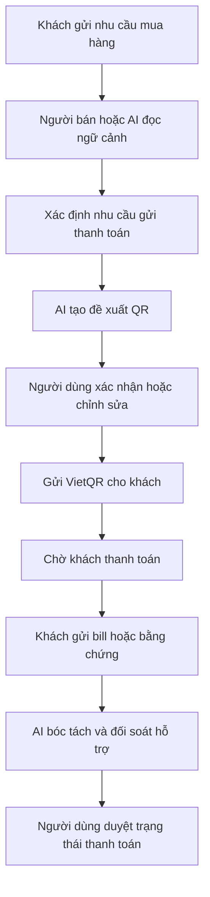
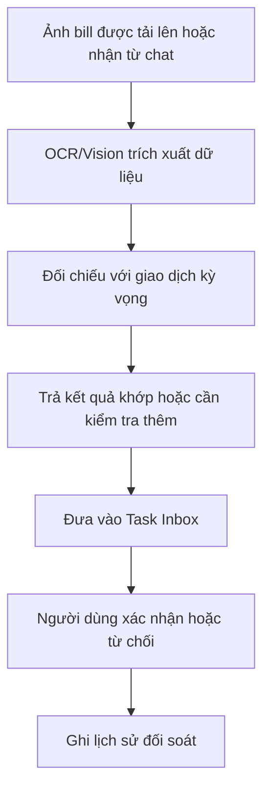
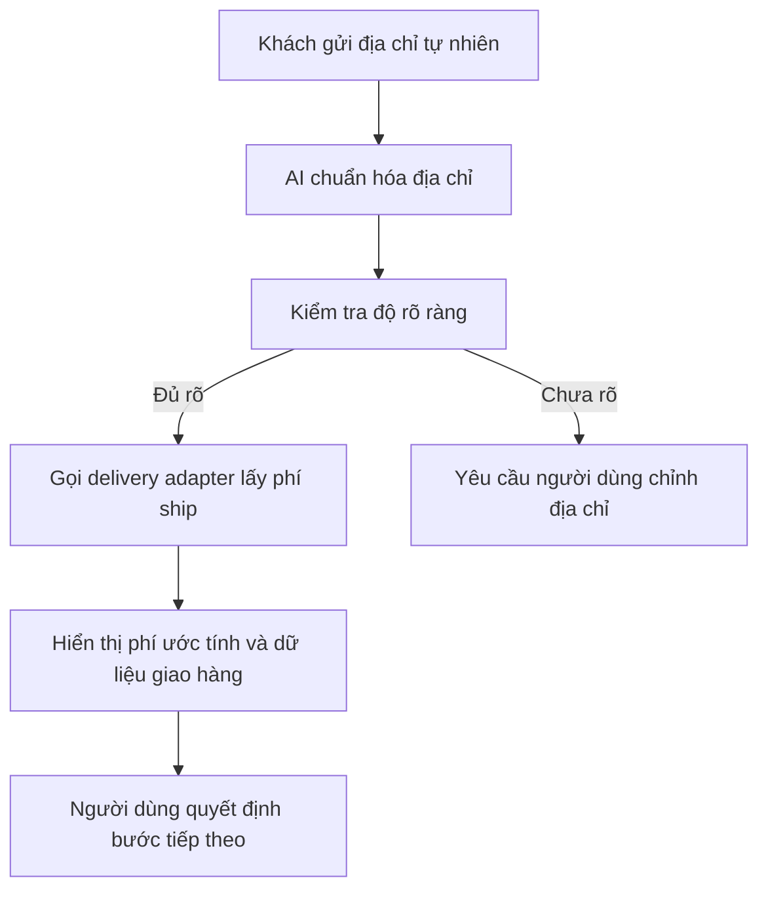
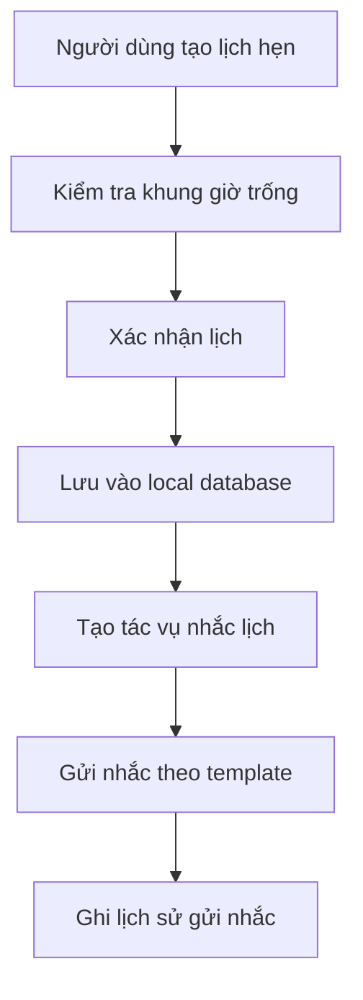
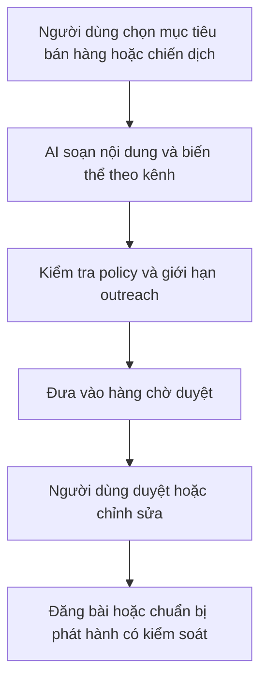
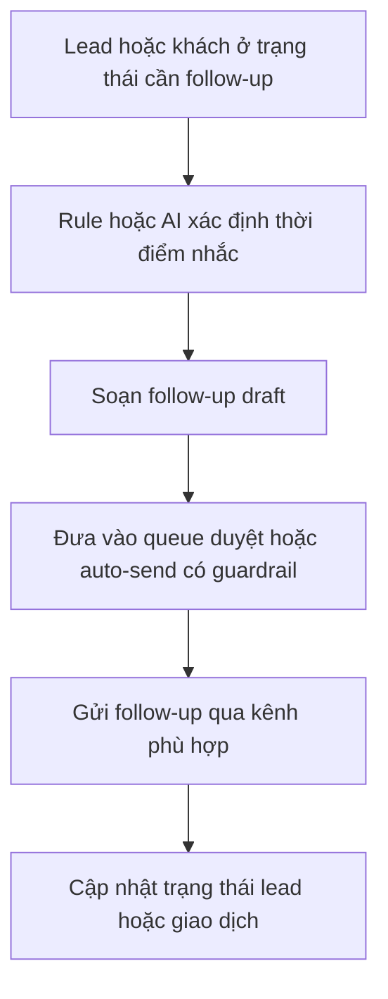
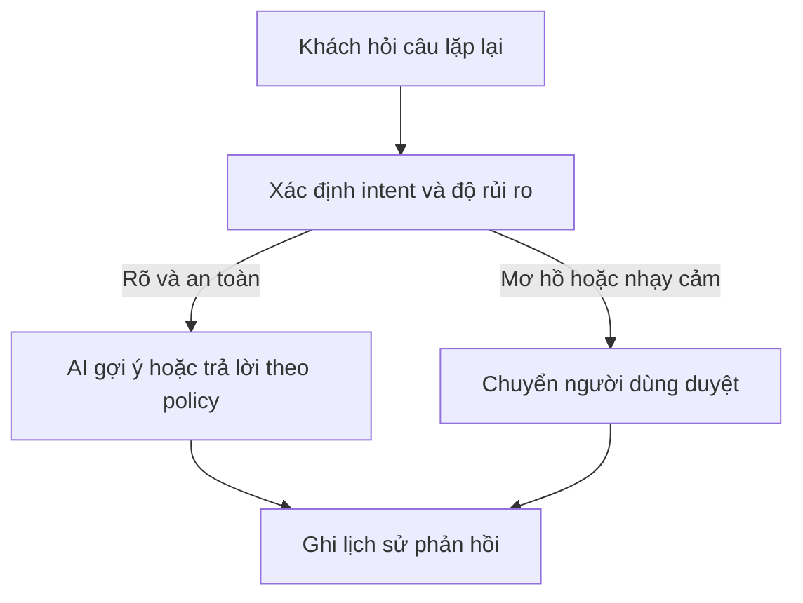

# TÀI LIỆU YÊU CẦU SẢN PHẨM (PRODUCT REQUIREMENTS DOCUMENT - PRD)
## DỰ ÁN: VClaw - Trợ lý vận hành và bán hàng local-first cho hộ kinh doanh nhỏ tại Việt Nam

---

## 1. TÓM TẮT SẢN PHẨM

VClaw là một `local-first online seller growth + operations assistant` dành cho hộ kinh doanh nhỏ và người bán hàng cá nhân tại Việt Nam. Sản phẩm không chỉ giúp người dùng xử lý nhanh các tác vụ sát doanh thu như trả lời khách, tạo VietQR, đối soát bill chuyển khoản, chuẩn hóa thông tin giao hàng và quản lý lịch hẹn, mà còn hỗ trợ chủ động hơn ở các hoạt động tăng trưởng như viết content bán hàng, gợi ý quảng bá, follow-up lead, tư vấn khách theo ngữ cảnh và điều phối bán hàng đa kênh.

VClaw không được định vị là:

1. Một bảng điều khiển kỹ thuật kiểu DevOps Mission Control.
2. Một hệ POS/OMS/ERP hoàn chỉnh.
3. Một công cụ hóa đơn điện tử hoặc kế toán tuân thủ pháp lý.

VClaw được định vị là:

1. Một **Business Dashboard** độc lập chạy trên cổng **8800**, đóng vai trò là "Hệ điều hành kinh doanh" (Business OS) cho chủ shop.
2. Một lớp trợ lý AI (OpenClaw Core) chạy ngầm trên cổng **12687**, giúp người bán hàng không kỹ thuật vừa tăng trưởng doanh thu vừa vận hành hằng ngày nhanh hơn qua MCP.
3. Một sản phẩm tích hợp theo mô hình "Sidecar", tận dụng lõi runtime OpenClaw nhưng sở hữu database nghiệp vụ riêng (Prisma + SQLite).

Mục tiêu của PRD này là tạo ra một `source of truth` ở cấp sản phẩm cho MVP và pilot của VClaw, để product, design và engineering cùng bám vào một narrative thống nhất.

---

## 2. PRODUCT VISION VÀ POSITIONING

### 2.1 Product vision

VClaw tồn tại để giúp một chủ shop nhỏ hoặc người vừa bán vừa vận hành có thể vừa kéo khách, nuôi lead, tư vấn và chốt đơn, vừa xử lý các tác vụ hậu cần như thanh toán, giao hàng và nhắc lịch mà không cần học công cụ kỹ thuật mới, không cần ngồi lọc lại từng đoạn chat và không cần mở quá nhiều app rời rạc.

### 2.2 Product positioning

Trong giai đoạn hiện tại, định vị nên được chốt như sau:

1. `Core MVP`: trợ lý vận hành và bán hàng local-first cho SMB Việt Nam, tập trung vào QR, bill verification hỗ trợ, address/shipping support, booking/reminder và task inbox.
2. `Near-term growth layer`: thêm các capability chủ động nhưng vẫn có guardrail như content assistance, campaign drafting, auto consultation có duyệt, lead follow-up, sales channel awareness và marketplace-aware selling.
3. `Future-state`: một commerce console hợp nhất hơn, có thể mở rộng automation depth, đa kênh sâu hơn, và tăng mức kết nối với marketplace, fulfillment hoặc external commerce systems khi có nhu cầu thật.

### 2.3 Điểm khác biệt cốt lõi

1. `Local-first`: dữ liệu vận hành và cấu hình ưu tiên ở máy người dùng.
2. `Human-in-the-loop`: AI đề xuất, con người quyết định ở các bước nhạy cảm.
3. `SMB-native UX`: giao diện kiểu công cụ kinh doanh, không phải công cụ cho developer.
4. `Revenue-adjacent workflows`: chọn bài toán sát tiền và lặp lại hằng ngày thay vì ôm scope rộng.
5. `Proactive but controlled`: sản phẩm có thể chủ động gợi ý, nhắc, soạn thảo và bán tự động ở những ngữ cảnh đủ cấu trúc, nhưng không được trượt thành full autopilot thiếu kiểm soát.

---

## 3. NGƯỜI DÙNG MỤC TIÊU VÀ JTBD

### 3.1 Persona chính

**Persona A - Chủ shop online kiêm vận hành**

1. Có 1-3 người xử lý đơn.
2. Nhận khách chủ yếu qua Zalo, Messenger hoặc Telegram.
3. Thường phải vừa chat, vừa check chuyển khoản, vừa báo phí ship.
4. Không muốn học terminal, token hay các khái niệm kỹ thuật.

**Persona B - Chủ cơ sở dịch vụ nhỏ nhận lịch qua chat**

1. Ví dụ: nail, salon, spa mini, dịch vụ đặt lịch theo khung giờ.
2. Nhu cầu mạnh về xác nhận lịch, nhắc lịch, giữ lịch sử khách và follow-up.
3. Vẫn cần khả năng xử lý thanh toán và trạng thái hoàn tất dịch vụ.

### 3.2 Người dùng chưa ưu tiên

1. Doanh nghiệp vừa và lớn có quy trình kế toán, CRM và phân quyền phức tạp.
2. Các ngành cần ERP, quản lý công nợ sâu hoặc hóa đơn VAT đầy đủ.
3. Các vertical đặc thù như bất động sản, KOL/KOC, reseller đa tầng phức tạp.

### 3.3 Jobs-to-be-done

**JTBD 1 - Chốt thanh toán nhanh**

Khi khách đã đồng ý mua, tôi muốn tạo và gửi thông tin thanh toán trong vài thao tác để giảm thời gian chờ và tăng khả năng chốt đơn.

**JTBD 2 - Soi bill mà không mất thời gian**

Khi khách gửi ảnh chuyển khoản, tôi muốn hệ thống bóc tách và gợi ý kết quả đối soát để tôi không phải đọc tay từng bill.

**JTBD 3 - Báo ship nhanh và đỡ sai địa chỉ**

Khi khách gửi địa chỉ kiểu tự nhiên, tôi muốn hệ thống chuẩn hóa địa chỉ và báo phí ship ước tính để đẩy đơn đi nhanh hơn.

**JTBD 4 - Không bỏ sót lịch và việc cần duyệt**

Khi có lịch hẹn, bill cần check hoặc đơn cần xử lý, tôi muốn mọi việc quan trọng dồn về một chỗ để không bỏ sót.

**JTBD 5 - Quản lý khách và đơn mà không cần CRM phức tạp**

Khi khách quay lại hoặc cần follow-up, tôi muốn xem được trạng thái đơn, lịch sử cơ bản và điểm cần xử lý tiếp theo trong một giao diện dễ hiểu.

**JTBD 6 - Viết nội dung bán hàng nhanh hơn**

Khi tôi cần đăng bài hoặc chạy một đợt bán hàng, tôi muốn hệ thống gợi ý content, caption, biến thể thông điệp và lịch đăng để tôi không phải nghĩ lại từ đầu mỗi lần.

**JTBD 7 - Nuôi lead mà không quên khách**

Khi có khách từng hỏi nhưng chưa mua, tôi muốn hệ thống nhắc đúng lúc và soạn trước follow-up để tôi tăng tỷ lệ quay lại mà không bị spam thủ công.

**JTBD 8 - Tư vấn có hỗ trợ hoặc bán tự động ở tình huống lặp lại**

Khi khách hỏi các câu lặp lại về giá, tình trạng hàng, lịch hoặc chính sách cơ bản, tôi muốn hệ thống có thể trả lời trước theo policy để tôi tiết kiệm thời gian mà vẫn kiểm soát được rủi ro.

---

## 4. BÀI TOÁN CẦN GIẢI QUYẾT

### 4.1 Current pains

1. Hội thoại khách bị phân mảnh trên nhiều kênh.
2. Người bán mất thời gian lặp đi lặp lại việc tạo QR, trả lời xác nhận và nhắc khách.
3. Việc kiểm bill và ghi nhận trạng thái giao dịch còn thủ công.
4. Địa chỉ giao hàng thường không chuẩn, dễ sai sót, mất thời gian báo phí ship.
5. Người dùng SMB không chấp nhận công cụ đòi hỏi setup kỹ thuật phức tạp.
6. Người bán thiếu công cụ chủ động để viết content, duy trì nhịp đăng bài và nuôi lead quay lại.
7. Việc tư vấn khách vẫn phụ thuộc nặng vào thao tác tay, kể cả ở những câu hỏi lặp lại.

### 4.2 Business consequences

1. Chậm phản hồi làm giảm tỷ lệ chốt đơn.
2. Sai thông tin thanh toán hoặc giao hàng làm tăng chi phí vận hành.
3. Bỏ sót lịch hẹn hoặc follow-up làm giảm doanh thu lặp lại.
4. Người dùng rời bỏ sản phẩm sớm nếu onboarding khó hoặc không tạo giá trị trong tuần đầu.
5. Thiếu nhịp outreach và content đều đặn khiến người bán bỏ lỡ cơ hội tăng trưởng.

---

## 5. MỤC TIÊU SẢN PHẨM VÀ SUCCESS METRICS

### 5.1 Product goals cho MVP

1. Giúp người dùng hoàn thành một luồng bán hàng hoặc vận hành sát doanh thu nhanh hơn so với cách thủ công.
2. Chứng minh rằng mô hình local-first vẫn có thể tạo trải nghiệm đủ dễ dùng cho người không kỹ thuật.
3. Tạo ra một web admin có thể dùng hằng ngày như một công cụ kinh doanh thật, không chỉ là shell kỹ thuật.
4. Mở rộng sản phẩm từ trợ lý xử lý tác vụ bị động sang trợ lý bán hàng chủ động có kiểm soát.

### 5.2 Success metrics

**Activation**

1. Tối thiểu 70% người dùng thử nghiệm hoàn thành onboarding và kết nối được kênh giao tiếp đầu tiên.
2. Người dùng đầu tiên tạo được ít nhất một QR hoặc xử lý được ít nhất một task trong vòng 1 ngày sau setup.

**Time-to-value**

1. Thời gian tạo và gửi QR giảm ít nhất 50% so với thao tác thủ công.
2. Thời gian xử lý một bill chuyển khoản phổ biến giảm đáng kể so với đọc tay.

**Daily usage**

1. Mỗi tài khoản active xử lý tối thiểu 3 tác vụ thực tế mỗi ngày qua VClaw.
2. Task Inbox được sử dụng như điểm vào chính cho các tác vụ cần duyệt.

**Growth usage**

1. Người dùng tạo hoặc duyệt được nội dung bán hàng, follow-up hoặc campaign draft ngay trong giai đoạn dùng thử.
2. Có tỷ lệ sử dụng lặp lại cho ít nhất một capability chủ động như content drafting, lead follow-up hoặc auto consultation assist.

**Retention**

1. Tỷ lệ quay lại sau 14 ngày đạt tối thiểu 30% trong nhóm pilot.

### 5.3 Pilot go / no-go signals

**Go signals**

1. Người dùng pilot dùng lại sản phẩm liên tục để xử lý tác vụ thật.
2. Onboarding không cần hỗ trợ quá nhiều từ đội kỹ thuật.
3. Tối thiểu 2 capability lõi được dùng hằng ngày.
4. Người dùng bắt đầu dùng VClaw không chỉ để xử lý việc đến, mà còn để tạo hoặc duyệt hành động bán hàng chủ động.

**No-go signals**

1. Người dùng chỉ dùng một lần rồi bỏ.
2. Quá nhiều lỗi OCR/ship khiến người dùng không tin kết quả gợi ý.
3. Onboarding hoặc cấu hình kênh giao tiếp tạo ma sát quá lớn.
4. Các capability chủ động bị xem là spammy, khó kiểm soát hoặc không tạo thêm giá trị thực.

---

## 6. PHẠM VI MVP

### 6.1 Must-have cho MVP

1. Local runtime (OpenClaw Core Engine) chạy trên cổng **12687**.
2. **VClaw Business Dashboard** (Next.js) chạy trên cổng **8800** làm giao diện mặc định.
3. Database nghiệp vụ riêng (**Prisma + SQLite**) tách biệt với DB hệ thống.
4. Một kênh giao tiếp chính được tích hợp end-to-end.
4. Tạo VietQR theo ngữ cảnh chat hoặc form.
5. Bill verification ở mức hỗ trợ có xác nhận người dùng.
6. Chuẩn hóa địa chỉ và báo phí ship ước tính.
7. Lịch hẹn cơ bản và nhắc lịch theo template.
8. Task Inbox cho các action cần duyệt.
9. Local logging và lịch sử tác vụ tối thiểu.

### 6.2 Near-term growth features

1. Content assistance cho caption, post draft, sales script và biến thể nội dung theo kênh.
2. Lead follow-up có gợi ý thời điểm và nội dung.
3. Auto consultation có guardrail cho các tình huống lặp lại.
4. Campaign drafting và queue duyệt nội dung/outreach.
5. Sales channel awareness cho social, website và marketplace.

### 6.3 Should-have nếu MVP ổn định sớm

1. Mẫu phản hồi theo ngữ cảnh.
2. Báo cáo tác vụ hằng ngày.
3. Nhắc thanh toán hoặc nhắc lịch nâng cao.
4. Remote access có kiểm soát.
5. Một lớp commerce console cơ bản hơn cho khách, đơn, follow-up.

### 6.4 Out-of-scope cho MVP

1. Hóa đơn điện tử hoặc VAT.
2. Kế toán, ERP, CRM enterprise đầy đủ.
3. Tạo vận đơn tự động hoàn chỉnh như default behavior.
4. Đồng bộ sâu đa sàn và đa hệ thống cùng lúc.
5. Multi-channel end-to-end đồng thời ngay từ đầu.
6. Tự sinh tính năng, tự cập nhật business logic, hoặc tự động hóa thiếu guardrail.
7. Full autopilot cho quảng cáo, outreach hoặc tư vấn không có bước duyệt phù hợp.

### 6.5 Diễn giải thuật ngữ `hóa đơn`

Trong phạm vi VClaw hiện tại, `hóa đơn` được hiểu theo nghĩa gần với `invoice/order reconciliation` phục vụ vận hành bán hàng:

1. Bản ghi giao dịch hoặc đơn đang chờ xử lý.
2. Trạng thái thanh toán kèm bill/chứng từ chuyển khoản.
3. Ghi chú đối soát và trạng thái giao hàng hoặc hoàn tất dịch vụ.

Thuật ngữ này không đồng nghĩa với hóa đơn điện tử hoặc tài liệu pháp lý-kế toán.

### 6.6 Shopee và KiotViet trong scope

1. `Shopee`: được xem là một sales channel quan trọng cho narrative near-term về marketplace-aware selling; tuy nhiên đồng bộ sâu đơn hàng, tồn kho hoặc fulfillment vẫn cần được kiểm soát theo từng giai đoạn.
2. `KiotViet`: được xem là nguồn tham khảo để hiểu sản phẩm SMB mature đang tổ chức các đối tượng như orders, invoices, customers, inventory và sale channels như thế nào; đây không phải là tuyên bố future scope rằng VClaw sẽ tích hợp với KiotViet.

---

## 7. EPIC VÀ FEATURE REQUIREMENTS

### 7.1 Epic A - Onboarding và Setup

**Mục tiêu**

Giúp người dùng không kỹ thuật cài, mở và cấu hình sản phẩm mà không cần terminal.

**User value**

Người dùng thấy giá trị sớm và không bỏ cuộc ở bước setup.

**Phạm vi**

1. Setup Wizard lần đầu.
2. Cấu hình thông tin shop, QR thanh toán, kênh giao tiếp.
3. Cấu hình cơ bản cho giao vận và lịch hẹn nếu có.

**Non-goals**

1. Không biến onboarding thành giao diện kỹ thuật kiểu nhập hàng loạt env vars.
2. Không bắt người dùng hiểu OpenClaw hay core runtime.

**Acceptance criteria**

1. Người dùng có thể hoàn thành setup cơ bản mà không cần terminal.
2. UI hiển thị ngôn ngữ nghiệp vụ thay vì khái niệm kỹ thuật.
3. Sau onboarding, người dùng biết bước tiếp theo để xử lý tác vụ đầu tiên.

### 7.2 Epic B - VietQR và Payment Assist

**Mục tiêu**

Rút ngắn thời gian gửi thông tin thanh toán cho khách.

**User value**

Người bán chốt thanh toán nhanh hơn và giảm sai sót khi nhập tay.

**Phạm vi**

1. Tạo VietQR từ chat context hoặc form.
2. Điền số tiền, nội dung tham chiếu và dữ liệu tài khoản.
3. Gửi QR lại qua UI hoặc kênh chat phù hợp.

**Non-goals**

1. Không tự xác nhận thanh toán chỉ từ việc gửi QR.
2. Không xử lý nghiệp vụ kế toán phía sau giao dịch.

**Acceptance criteria**

1. Người dùng có thể tạo QR từ ít nhất một nguồn đầu vào rõ ràng.
2. Nếu thiếu dữ liệu, hệ thống yêu cầu bổ sung thay vì suy đoán bừa.
3. Tác vụ tạo QR được lưu vào lịch sử thao tác.

### 7.3 Epic C - Bill Verification và Reconciliation Support

**Mục tiêu**

Giảm thời gian soi bill thủ công và hỗ trợ đối soát giao dịch.

**User value**

Người bán có thể xác nhận hoặc từ chối một bill nhanh hơn nhờ AI gợi ý.

**Phạm vi**

1. Upload hoặc nhận ảnh bill/chuyển khoản.
2. OCR/vision trích xuất các trường cơ bản.
3. Hệ thống trả về trạng thái hỗ trợ như `khớp`, `không khớp`, `cần kiểm tra thêm`.
4. Người dùng quyết định bước cuối.

**Non-goals**

1. Không auto-approve thanh toán trong MVP.
2. Không thay thế quy trình đối soát kế toán đầy đủ.

**Acceptance criteria**

1. Kết quả luôn được hiển thị dưới dạng gợi ý có độ tin cậy hoặc trạng thái hỗ trợ.
2. Mọi action thay đổi trạng thái tiền phải có xác nhận người dùng.
3. Task duyệt bill xuất hiện ở Task Inbox hoặc màn hình tương đương.

### 7.4 Epic D - Shipping và Address Support

**Mục tiêu**

Giúp người dùng báo phí ship nhanh hơn và đỡ sai địa chỉ.

**User value**

Giảm thời gian chuẩn hóa địa chỉ và giảm sai sót khi lên đơn.

**Phạm vi**

1. Chuẩn hóa địa chỉ tiếng Việt tự nhiên.
2. Tách phần địa chỉ đủ để gọi delivery adapter.
3. Trả về phí ship ước tính hoặc dữ liệu chuẩn bị giao hàng.

**Non-goals**

1. Không bắt buộc tạo vận đơn tự động ở MVP.
2. Không khóa cứng một đối tác vận chuyển duy nhất.

**Acceptance criteria**

1. Nếu địa chỉ đủ rõ, hệ thống trả được kết quả ước tính hoặc đề xuất tiếp theo.
2. Nếu địa chỉ mơ hồ, hệ thống yêu cầu chỉnh sửa thay vì tiếp tục âm thầm.
3. Mô hình adapter cho phép nêu ví dụ nhà vận chuyển như GHN/GHTK mà không đổi narrative sản phẩm.

### 7.5 Epic E - Booking và Reminder

**Mục tiêu**

Giúp các shop dịch vụ nhỏ không bỏ sót lịch hẹn.

**User value**

Giảm tình trạng quên lịch, trùng lịch hoặc không nhắc khách.

**Phạm vi**

1. Tạo lịch hẹn cơ bản.
2. Kiểm tra khung giờ trống.
3. Lưu trạng thái lịch và gửi nhắc theo template.

**Non-goals**

1. Không giải bài toán booking phức tạp nhiều chi nhánh, nhiều nhân sự ở MVP.

**Acceptance criteria**

1. Người dùng tạo được một lịch hẹn hợp lệ.
2. Hệ thống tránh ghi nhận lịch vào khung giờ bị đánh dấu không khả dụng.
3. Có log tối thiểu cho tác vụ nhắc lịch.

### 7.6 Epic F - Task Inbox / Human-in-the-loop

**Mục tiêu**

Tạo một điểm vào trung tâm cho các quyết định nghiệp vụ nhạy cảm.

**User value**

Người dùng không phải mò lại lịch sử chat để tìm việc cần xử lý.

**Phạm vi**

1. Hiển thị task cần duyệt theo dạng feed hoặc queue.
2. Hành động nhanh như duyệt, từ chối, xem chi tiết.
3. Các loại task ưu tiên: bill verification, địa chỉ/ship, lịch hẹn, cảnh báo workflow.

**Non-goals**

1. Không biến inbox thành ticketing system enterprise.

**Acceptance criteria**

1. Task quan trọng xuất hiện rõ trong giao diện vận hành chính.
2. Người dùng phân biệt được đề xuất từ AI và quyết định cuối của mình.
3. Hành động trên task tạo ra log hoặc lịch sử tra cứu.

### 7.7 Epic G - Commerce Console cơ bản

**Mục tiêu**

Tạo một lớp CRM-lite đủ nhẹ để người dùng theo dõi khách, đơn và follow-up mà không kéo MVP thành một OMS hoàn chỉnh.

**User value**

Người dùng nhìn được trạng thái vận hành ở mức vừa đủ mà không phải dùng CRM phức tạp.

**Phạm vi**

1. Danh sách khách hàng cơ bản hoặc danh sách giao dịch tối thiểu.
2. Đơn hoặc giao dịch dạng order-like entity.
3. Trạng thái giao dịch, ghi chú, bằng chứng thanh toán.
4. Follow-up và gắn nguồn đơn cơ bản.
5. Có thể triển khai theo kiểu `lite surface` trong MVP và mở rộng dần sau khi P1 ổn định.

**Non-goals**

1. Không xây OMS đầy đủ.
2. Không cam kết đồng bộ tồn kho hoặc fulfillment sâu trong MVP.

**Acceptance criteria**

1. Nếu surface này được bật trong MVP, người dùng có thể xem được hồ sơ khách hoặc trạng thái giao dịch cơ bản.
2. Có thể gắn nguồn lead hoặc sales channel ở mức đơn giản khi dữ liệu có sẵn.
3. Tên gọi và UX dùng ngôn ngữ kinh doanh như `Khách hàng`, `Đơn`, `Thanh toán`, `Kênh bán`.

### 7.8 Epic H - Content Engine và Campaign Assistance

**Mục tiêu**

Giúp người bán online tạo nội dung và triển khai các hoạt động quảng bá nhanh hơn mà không cần bắt đầu từ trang trắng.

**User value**

Người dùng có thể giữ nhịp bán hàng và quảng bá đều hơn dù nguồn lực ít.

**Phạm vi**

1. Soạn caption, bài đăng, biến thể nội dung theo kênh.
2. Gợi ý lịch đăng và campaign draft.
3. Queue duyệt nội dung trước khi đăng hoặc gửi đi.

**Non-goals**

1. Không trở thành ads manager đầy đủ.
2. Không auto-publish hàng loạt không có kiểm soát ở giai đoạn đầu.

**Acceptance criteria**

1. Người dùng tạo được ít nhất một content draft hoặc campaign draft từ dữ liệu sản phẩm/dịch vụ có sẵn.
2. Nội dung có thể vào queue duyệt trước khi phát hành.
3. Hệ thống cho phép chỉnh theo kênh thay vì dùng một bản chung cho mọi nơi.

### 7.9 Epic I - Lead Follow-up và Retention Automation

**Mục tiêu**

Giúp người bán không bỏ quên lead cũ, khách chưa thanh toán hoặc khách cần quay lại.

**User value**

Tăng khả năng chuyển đổi và giữ chân mà không đòi hỏi người bán phải nhớ thủ công từng đầu việc.

**Phạm vi**

1. Nhắc khách chưa phản hồi.
2. Nhắc khách chưa thanh toán.
3. Follow-up sau bán hàng hoặc sau lịch hẹn.
4. Queue duyệt hoặc policy cho outbound messages.

**Non-goals**

1. Không chạy mass outreach không giới hạn.
2. Không gửi tự động mọi lúc mọi nơi mà không có rule rõ.

**Acceptance criteria**

1. Lead hoặc khách có thể được gắn mốc follow-up tiếp theo.
2. Hệ thống có thể soạn sẵn follow-up draft.
3. Các luồng outbound có policy tần suất và điểm duyệt rõ ràng.

### 7.10 Epic J - Auto Consultation và Sales Channel Orchestration

**Mục tiêu**

Giúp VClaw hỗ trợ tư vấn nhanh hơn trên các tình huống lặp lại và điều phối khách/đơn từ nhiều nguồn bán hàng.

**User value**

Người bán tiết kiệm thời gian tư vấn, đồng thời có góc nhìn thống nhất hơn giữa social, website và marketplace.

**Phạm vi**

1. Gợi ý trả lời hoặc trả lời bán tự động cho các intent có cấu trúc rõ ràng.
2. Nhận biết nguồn khách/đơn từ social, website, landing page, marketplace.
3. Gắn sales channel vào hồ sơ lead hoặc giao dịch.

**Non-goals**

1. Không thay thế hoàn toàn người bán ở những tình huống mơ hồ hoặc nhạy cảm.
2. Không xem marketplace sync sâu là điều kiện bắt buộc của lớp orchestration ban đầu.

**Acceptance criteria**

1. Hệ thống phân biệt được trường hợp nên gợi ý, nên tự trả lời có guardrail, và trường hợp phải chuyển cho người dùng duyệt.
2. Lead hoặc giao dịch có thể được gắn nguồn đến ở mức cơ bản.
3. Tư vấn bán tự động luôn đi kèm policy hoặc queue duyệt khi cần.

---

## 8. CORE USER FLOWS

### 8.1 customerInquiryToPayment

### 8.2 billVerificationFlow

### 8.3 shippingQuoteFlow

### 8.4 bookingReminderFlow

### 8.5 campaignDraftToApproval

### 8.6 leadFollowupFlow

### 8.7 autoConsultationFlow

### 8.8 Nguyên tắc chung của flow

1. AI có thể gợi ý, trích xuất và chuẩn hóa.
2. Người dùng phải xác nhận ở các bước có tác động tới tiền, đơn hoặc trạng thái nghiệp vụ.
3. Khi tích hợp ngoài lỗi hoặc dữ liệu không rõ, sản phẩm phải nghiêng về `fallback to assisted mode` thay vì tự động hóa tiếp.
4. Outbound automation, content publishing hoặc auto consultation đều phải đi qua `policy -> approval -> audit` theo mức phù hợp.

---

## 9. ADMIN SURFACES VÀ UX PRINCIPLES

### 9.1 Surface hierarchy

1. `Local Web Admin / Operations Console` là surface chính.
2. `Remote Web Access` là mode mở rộng khi có nhu cầu.
3. `Chat-native admin surfaces` là shortcut cho tác vụ nhanh, không thay dashboard chính.

### 9.2 Screen groups

1. `Onboarding`: cấu hình shop, QR, kênh chat, giao vận, lịch.
2. `Dashboard`: tổng quan, metric cards, cảnh báo và việc cần xử lý.
3. `Task Inbox`: nơi AI trình các việc cần duyệt.
4. `Commerce`: khách hàng, đơn/giao dịch, follow-up.
5. `Campaign / Content`: nội dung bán hàng, lịch đăng, queue duyệt, gợi ý quảng bá.
6. `Settings`: cấu hình integrations, AI persona, nhà vận chuyển, sales policy và automation rules.

### 9.3 UX principles

1. Dùng ngôn ngữ nghiệp vụ thay vì ngôn ngữ kỹ thuật.
2. Mọi hành động nhạy cảm phải hiển thị rõ phần nào là đề xuất của AI.
3. Giữ giao diện ít bước, ít khái niệm, ít màn hình rối.
4. Người dùng phải nhìn thấy giá trị sớm trong tuần đầu.

---

## 10. INTEGRATION STRATEGY

### 10.1 Bắt buộc cho MVP

1. Một kênh chat chính được chọn để triển khai end-to-end.
2. Một QR/payment provider hoặc cơ chế tạo VietQR.
3. Một OCR/vision provider để xử lý bill hỗ trợ.
4. Một delivery adapter cho mức chuẩn hóa địa chỉ và báo phí ship.

### 10.2 Delivery strategy

1. MVP tập trung vào `fee estimate + shipping data preparation`.
2. Có thể nêu ví dụ adapter như `GHN` hoặc `GHTK`.
3. Tạo vận đơn, tracking và đồng bộ fulfillment là future-state.

### 10.3 Marketplace strategy

1. Near-term: nhận biết `sales channel`, nguồn đơn, nguồn khách.
2. Future-state: đồng bộ sâu hơn với marketplace như Shopee khi có nhu cầu thật và đối tác rõ ràng.

### 10.4 Publishing và outbound strategy

1. Near-term: hỗ trợ soạn thảo, queue duyệt và bán tự động có guardrail.
2. Không mặc định bật auto-post hoặc auto-outreach hoàn toàn.
3. Mọi outbound flow cần có giới hạn tần suất, policy channel và audit trail.

### 10.5 Tham khảo từ các sản phẩm mature như KiotViet

Nếu đi tiếp sau pilot, VClaw nên xem các sản phẩm mature như KiotViet là nguồn tham khảo để hiểu:

1. Các object nghiệp vụ thường gặp như `orders`, `invoices`, `customers`, `inventory`, `sale channels`.
2. Cách một sản phẩm SMB tổ chức surface quản trị và data model.
3. Những pattern vận hành nào người dùng SMB đã quen thuộc.

### 10.6 Product implications cho future-state

1. Cần mô hình `incremental sync + webhook`.
2. Cần dữ liệu có ý thức về `tenant/store/branch/channel`.
3. Cần queue, scheduler và policy engine đủ rõ cho outbound workflows.
4. Không nên biến phần nghiên cứu KiotViet thành promise tích hợp trong narrative MVP hiện tại.

---

## 11. GUARDRAILS VÀ NON-FUNCTIONAL PRODUCT REQUIREMENTS

1. `Local-first`: dữ liệu vận hành ưu tiên lưu local.
2. `Privacy by default`: mọi truy cập dữ liệu cá nhân hoặc ảnh phải minh bạch.
3. `Human approval`: các action liên quan đến tiền, đơn, ship hoặc lịch phải có bước xác nhận phù hợp.
4. `Logging`: mọi thao tác quan trọng phải có lịch sử tra cứu.
5. `Fallback behavior`: khi AI hoặc API ngoài lỗi, sản phẩm phải chuyển về chế độ hỗ trợ thay vì im lặng thất bại.
6. `No unsafe automation`: MVP không được tối ưu theo kiểu tự động hóa vượt ngưỡng kiểm soát.
7. `Outbound compliance`: mọi flow quảng bá, follow-up hoặc auto tư vấn phải có giới hạn tần suất và policy theo từng kênh.

---

## 12. RỦI RO, GIẢ ĐỊNH VÀ PHỤ THUỘC

### 12.1 Giả định

1. Người dùng sẵn sàng cài một phần mềm local nếu giá trị thấy rõ từ tuần đầu.
2. Có thể pilot trên một nhóm người dùng hẹp để học nhanh.
3. Có thể tìm được ít nhất một kênh chat và một delivery adapter đủ ổn định cho MVP.

### 12.2 Product-critical dependencies

1. Quyết định chọn kênh chat chính.
2. Chất lượng OCR/vision cho bill thực tế.
3. Độ ổn định của đối tác giao vận cho phí ship.
4. Độ mượt của onboarding không cần terminal.

### 12.3 Rủi ro chính

1. Scope phình quá sớm sang marketplace, ERP hoặc đa ngành.
2. Onboarding khó khiến người dùng bỏ giữa chừng.
3. Kết quả AI sai quá nhiều làm mất niềm tin.
4. Divergence với upstream OpenClaw tăng nhanh nếu fork core quá sớm.

### 12.4 Hướng giảm thiểu

1. Khóa chặt must-have của MVP.
2. Ưu tiên plugin-first và adapter-first.
3. Thiết kế assisted mode thay vì full automation.
4. Đo pilot theo outcome người dùng, không chỉ theo task kỹ thuật đã làm.

---

## 13. ROADMAP THEO OUTCOME SẢN PHẨM

### Phase 1 - Discovery và scope lock

**Outcome mong muốn**

1. Chốt được persona pilot, channel chính và 4 workflow lõi.
2. Chốt được narrative sản phẩm và ranh giới MVP.

### Phase 2 - MVP foundation

**Outcome mong muốn**

1. Người dùng có thể setup local app và vào web admin.
2. Kênh chính bắt đầu gửi nhận dữ liệu ổn định.
3. Task Inbox và skeleton workflow hoạt động.

### Phase 3 - Pilot release

**Outcome mong muốn**

1. 4 capability lõi chạy end-to-end đủ dùng thật.
2. Người dùng pilot xử lý công việc hằng ngày qua VClaw thay vì chỉ demo.

### Phase 4 - Post-pilot expansion

**Outcome mong muốn**

1. Quyết định có mở thêm channel, vertical hoặc commerce integrations sâu hơn hay không.
2. Nếu tín hiệu tốt, bắt đầu mở rộng growth workflows như campaign assistance, auto consultation sâu hơn và marketplace-aware commerce.

---

## 14. QUYẾT ĐỊNH SẢN PHẨM CẦN GIỮ ỔN ĐỊNH

1. MVP không phải là POS hoặc ERP.
2. Hóa đơn trong narrative hiện tại là reconciliation record, không phải VAT e-invoice.
3. Một channel chính tốt hơn nhiều channel nửa vời.
4. Human-in-the-loop không phải tính năng phụ, mà là trụ cột niềm tin của sản phẩm.
5. Operations Console là sản phẩm mặt tiền; OpenClaw runtime là nền phía sau.
6. Growth automation là phần định hướng gần, nhưng không được hiểu thành full autopilot hay ads suite đầy đủ.

---

## 15. KẾT LUẬN

VClaw chỉ có cơ hội thắng nếu giải được một số ít bài toán rất thật, rất sát tiền và rất thường xuyên của hộ kinh doanh nhỏ Việt Nam, đồng thời giúp họ chủ động hơn trong tăng trưởng doanh thu chứ không chỉ xử lý tác vụ đến sau. PRD này vì vậy chốt hướng đi theo nguyên tắc: `MVP lõi vận hành, near-term growth rõ ràng, local-first, có AI nhưng không đánh đổi kiểm soát`.

Tài liệu này nên được xem là cửa vào chính cho phần product. Các tài liệu như BRD, System Architecture, Commerce Use Cases và UI Specs tiếp tục đóng vai trò tài liệu chuyên sâu theo từng góc nhìn.
