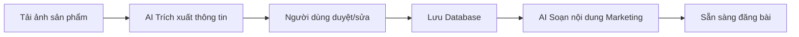
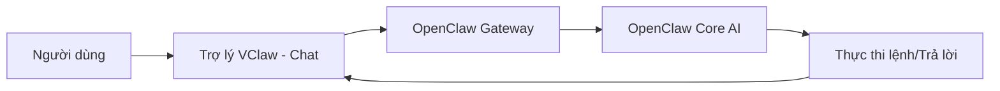

# COMMERCE ADMIN AND OMNICHANNEL USE CASES
## DỰ ÁN: VClaw - Lớp quản trị bán hàng cho SMB trên nền OpenClaw

---

## 1. MỤC TIÊU TÀI LIỆU

Tài liệu này tập trung vào câu hỏi mang tính sản phẩm:

1. Người bán hàng không kỹ thuật sẽ quản trị VClaw như thế nào.
2. Những use case kinh doanh cốt lõi nào VClaw cần hỗ trợ ngoài phần setup kỹ thuật.
3. Làm sao để sản phẩm mở rộng từ chat operations sang commerce operations mà không làm phình phạm vi quá sớm.

---

## 2. NGUYÊN TẮC SẢN PHẨM

1. Người bán hàng không nên cần CLI để sử dụng hằng ngày.
2. Trải nghiệm chính phải đi qua web admin dễ hiểu, đặt trọng tâm vào việc bán hàng và vận hành.
3. Chat-native admin chỉ là surface phụ cho tác vụ nhanh.
4. Lõi sản phẩm nên phục vụ `generic SMB commerce` trước khi đi vào vertical riêng.
5. Vertical như ticketing, attraction sales hoặc đại lý B2B chỉ nên mở rộng khi lõi commerce đã vững.
6. Sản phẩm không chỉ phản ứng theo inbound inquiry mà còn phải hỗ trợ `proactive growth workflows` có guardrail.

---

## 3. LAYERED ADMIN SURFACES

### 3.1 Localhost Web Admin (Decoupled Operations Console)

Đây là surface quản trị chính cho người dùng cuối. Khác với các giao diện kỹ thuật (Mission Control) của OpenClaw, Dashboard này là một Web App kinh doanh theo mô hình CRM-lite:

Các khu vực nên có:

1. **Onboarding**
   - Chọn kênh chat chính
   - Kết nối tài khoản
   - Thiết lập QR thanh toán
   - Thiết lập giao vận
   - Thiết lập lịch hẹn hoặc giờ phục vụ
2. **Operations Console (Bàn làm việc số)**
   - Khách hàng & Hội thoại (Kết hợp Hộp thư duyệt tác vụ và quản lý hội thoại đa kênh)
   - Xác minh và đối soát Bill chuyển khoản
   - Xem và chốt lịch hẹn
   - Dashboard tổng quan với KPI và biểu đồ tăng trưởng
   - Xử lý cảnh báo hoặc lỗi nghiệp vụ
3. **Commerce Console**
   - Khách hàng
   - Lead
   - Đơn hoặc giao dịch
   - Sản phẩm/dịch vụ
   - Follow-up
4. **VClaw Token (Zalo Integration) & Automation**
   - Kết nối Zalo / Bot status
   - Automation rules & templates
   - Automation queue
   - Follow-up policies & Reminders

### 3.2 Remote Web Access

Đây là mode bổ sung cho người dùng cần quản trị ngoài máy cài đặt.

Nguyên tắc:

1. Mặc định vẫn là local-only.
2. Remote access chỉ bật khi người dùng có nhu cầu.
3. Ưu tiên tunnel hoặc lớp remote access an toàn hơn là public exposure trực tiếp.
4. Các hành động nhạy cảm cần thêm xác thực và audit.

### 3.3 Chat-native Admin Surfaces

Các surface này dành cho thao tác nhanh:

1. Telegram bot menu
2. Zalo Web App hoặc mini admin surface
3. Menu hành động nhanh trong chat

Các tác vụ phù hợp:

1. Duyệt bill vừa OCR xong
2. Xem trạng thái đơn/tác vụ
3. Bật hoặc tạm dừng một workflow
4. Xem tóm tắt doanh số/ngày
5. Mở sâu vào web admin khi cần chỉnh cấu hình

---

## 4. USE CASE COMMERCE CHUNG CHO SMB

### 4.1 Omnichannel lead intake

Người bán nhận khách từ nhiều nguồn:

1. Zalo
2. Messenger
3. Telegram
4. Form hoặc link ngoài
5. Các trang bán hàng online hoặc landing pages
6. Marketplace như Shopee

VClaw cần:

1. Gom lead vào một nơi.
2. Gắn nguồn lead.
3. Gắn trạng thái lead.
4. Gợi ý follow-up.
5. Gắn `sales channel` đủ rõ để phục vụ cả vận hành và tăng trưởng.

Ở giai đoạn gần, mục tiêu là nhận biết khách đến từ đâu và gắn đúng `sales channel` để người bán có một inbox hợp nhất. Việc đồng bộ sâu trạng thái đơn, tồn kho hoặc fulfillment từ Shopee chỉ nên xem là hướng mở rộng sau pilot.

### 4.2 Assisted selling

VClaw hỗ trợ người bán chốt đơn nhanh chóng:

1. Gợi ý trả lời nhanh.
2. Gợi ý nội dung chốt đơn.
3. **Tạo mã VietQR**: Nhận biết số tiền và nội dung từ hội thoại để tạo ảnh QR gửi trực tiếp cho khách.
4. Ghi trạng thái giao dịch và thiết lập ghi chú đơn hàng.

### 4.3 Xác minh ảnh chuyển khoản (Bill Verification)

Một use case trọng tâm trong vận hành hàng ngày:

1. Khi khách gửi ảnh biên lai hoặc chụp màn hình chuyển khoản, AI dùng OCR/Vision để bóc tách.
2. Trích xuất thông tin: Số tiền, thời gian, nội dung tham chiếu (mã đơn).
3. Hệ thống trả về gợi ý đối soát (khớp, không khớp, cần xác minh thêm).
4. Người dùng duy trì quyền quyết định cuối cùng thay vì hệ thống tự động gạch nợ.

### 4.4 Chuẩn hóa địa chỉ và ước tính giao vận (Shipping Assist)

Hỗ trợ việc đóng gói và báo phí không bị gián đoạn:

1. Nhận địa chỉ viết tay/tự nhiên (natural text) từ tin nhắn của khách.
2. Dùng AI phân tách cấp địa lý (Tỉnh/Thành, Quận/Huyện, Phường/Xã, Đường/Số nhà).
3. Gọi tới các Delivery Adapter (VD: GHN, GHTK) để lấy bảng giá phí ship ước tính.
4. Gợi ý người dùng lựa chọn phương thức giao hàng và báo luôn chi phí cho khách.

### 4.5 Quản lý lịch hẹn và nhắc lịch (Booking & Reminder)

Dành riêng cho nhóm cửa hàng dịch vụ (spa, nail, salon):

1. Nhận thông tin khung giờ mong muốn từ đoạn chat.
2. Kiểm tra xung đột thời gian (slots khả dụng).
3. Tạo lịch, gán nhãn dịch vụ tương ứng.
4. Thiết lập kịch bản nhắc khách đến đúng hẹn (reminders) một cách tự động nhưng có thể cấu hình thời điểm (VD: trước 2 giờ).

### 4.6 Hộp thư duyệt tác vụ (Human-in-the-loop Task Inbox)

Điểm tập trung cốt lõi của VClaw để tránh để AI "lộng quyền":

1. Tập hợp các đề nghị thay đổi quan trọng do AI tạo ra (duyệt bill, chốt phí ship, tạo đơn) vào một hàng đợi chung.
2. Cung cấp một giao diện dễ xem, cho phép người bán ấn "Chấp nhận" hoặc "Sửa lại".
3. Mọi hành động được Audit-log để truy xuất lịch sử.

### 4.7 Proactive selling và growth assistance

Ngoài việc hỗ trợ khi khách đã hỏi, VClaw cũng nên hỗ trợ người bán chủ động hơn trong tăng trưởng:

1. Soạn content bán hàng theo sản phẩm, chiến dịch hoặc tệp khách.
2. Gợi ý lịch đăng bài hoặc lịch follow-up.
3. Chuẩn bị nội dung remarketing cho khách cũ hoặc lead chưa chốt.
4. Gợi ý hoặc tự động trả lời ở các intent lặp lại theo policy rõ ràng.
5. Đưa mọi action outbound vào queue duyệt hoặc rule engine phù hợp.

### 4.8 Order-like workflow

Ngay cả khi chưa có OMS hoàn chỉnh, VClaw vẫn nên có workflow đơn giản:

1. Khách quan tâm
2. Đã tư vấn
3. Đã gửi giá/QR
4. Chờ thanh toán
5. Đã thanh toán
6. Đang xử lý
7. Hoàn tất
8. Cần follow-up

Workflow này dùng được cho:

1. Bán sản phẩm
2. Đặt lịch dịch vụ
3. Giữ chỗ
4. Bán gói dịch vụ
5. Sau này mở rộng sang bán vé

### 4.9 Catalog hoặc service listing nhẹ

Ở giai đoạn đầu, VClaw chỉ cần hỗ trợ mức cơ bản:

1. Danh sách sản phẩm
2. Danh sách dịch vụ
3. Giá
4. Mô tả ngắn
5. Tình trạng còn bán

Mục tiêu không phải xây sàn thương mại điện tử, mà là giúp agent có đủ ngữ cảnh để bán hàng và tư vấn.

### 4.10 Follow-up và retention

VClaw nên giúp người bán không quên khách:

1. Nhắc khách chưa phản hồi
2. Nhắc khách chưa thanh toán
3. Nhắc khách đến lịch hẹn
4. Chăm sóc sau bán hàng
5. Gợi ý khách quay lại

Nguyên tắc ở đây là:

1. Hỗ trợ `semi-automated follow-up` trước.
2. Có giới hạn tần suất theo kênh.
3. Có policy duyệt cho các luồng nhạy cảm hoặc outbound hàng loạt.

### 4.11 Marketplace-aware commerce

Khi người bán bắt đầu nhận đơn từ các nền tảng như Shopee, VClaw nên nhìn bài toán theo hai lớp:

1. **Near-term:** nhận biết `sales channel`, gắn nguồn đơn, gộp khách và hội thoại vào cùng một hồ sơ vận hành.
2. **Future-state:** đồng bộ sâu hơn về đơn hàng, khách hàng, trạng thái giao hàng, catalog hoặc tồn kho nếu có đối tác và nhu cầu thật.

Điều này giúp VClaw giữ được lợi thế là `commerce console hợp nhất`, thay vì cố biến MVP thành một OMS đa sàn hoàn chỉnh ngay từ đầu.

### 4.12 Campaign và content operations

Đối với người bán online, phần `content` và `campaign` không nên bị tách rời khỏi commerce workflow. VClaw nên hỗ trợ:

1. Viết caption hoặc bài đăng theo sản phẩm, dịch vụ hoặc chương trình ưu đãi.
2. Tạo biến thể nội dung theo kênh như chat, social, marketplace note hoặc landing page.
3. Đưa nội dung vào `queue duyệt` trước khi đăng hoặc gửi đi.
4. Gắn nội dung và chiến dịch với lead source hoặc sales channel để người dùng đo cái gì đang tạo ra khách.

### 4.13 Auto consultation có guardrail

Một số loại tư vấn lặp lại có thể được xử lý theo mô hình bán tự động:

1. Câu hỏi cơ bản về giá, tình trạng hàng, thời gian giao, khung giờ dịch vụ.
2. Câu hỏi follow-up sau khi người bán đã có context rõ từ lịch sử khách.
3. Gợi ý hoặc tự động trả lời chỉ khi policy xác định đây là intent an toàn.

Không nên:

1. Tự động tư vấn mọi tình huống mơ hồ.
2. Tự động đưa ra cam kết về giá, tồn kho hoặc chính sách ngoài rule đã được duyệt.

### 4.14 Quản lý sản phẩm bằng AI (AI-Powered Product Cataloging)

Đây là Use Case tập trung vào việc giúp người bán nhanh chóng đưa sản phẩm lên hệ thống:

1. **Trích xuất thông tin từ ảnh**: Người dùng tải ảnh sản phẩm lên, AI sử dụng Vision để trích xuất Tên, Giá, Mô tả và phân loại (Category) gợi ý.
2. **Hỗ trợ Marketing**: Dựa trên thông tin sản phẩm, AI soạn thảo nội dung bán hàng (caption, bài post) phù hợp với đa kênh.
3. **Quản trị Catalog**: Người bán quản lý danh mục sản phẩm tập trung, dùng làm ngữ cảnh cho các cuộc hội thoại và tư vấn sau này.

### 4.15 Trợ lý VClaw - Hỗ trợ và điều khiển toàn cục (Global VClaw Assistant)

Đây là tầng tương tác linh hoạt nhất của VClaw, cho phép người dùng giao tiếp trực tiếp với hệ thống thông qua một trợ lý ảo thông minh:

1. **Hỏi đáp nghiệp vụ**: Người dùng có thể hỏi Trợ lý VClaw về tình trạng đơn hàng, doanh thu trong ngày hoặc thông tin một khách hàng cụ thể thông qua chat.
2. **Điều khiển giao diện**: Thực hiện các lệnh điều hướng nhanh (ví dụ: "Cho tôi xem danh sách đơn hàng chưa thanh toán").
3. **Hỗ trợ soạn thảo**: Nhờ Trợ lý VClaw viết lại hoặc dịch các đoạn nội dung ngay trong khung chat để copy-paste vào các kênh khác.

---

## 5. DATA OBJECTS TỐI THIỂU

Các đối tượng dữ liệu tối thiểu nên có trong lớp commerce:

### 5.1 Customer

1. Tên
2. Kênh đến
3. Thông tin liên hệ
4. Nhãn/tag
5. Lịch sử tương tác

### 5.2 Lead

1. Nguồn lead
2. Nhu cầu
3. Trạng thái
4. Người phụ trách hoặc agent xử lý
5. Mốc follow-up tiếp theo

### 5.3 Order-like entity

1. Mã giao dịch
2. Khách hàng
3. Giá trị
4. Trạng thái
5. Bằng chứng thanh toán
6. Ghi chú vận hành

### 5.4 Catalog or service item

1. Tên
2. Loại
3. Giá
4. Trạng thái
5. Metadata cơ bản

---

## 6. LỘ TRÌNH MỞ RỘNG THEO VERTICAL

### 6.1 Generic SMB trước

Phải hoàn thiện trước:

1. Lead intake
2. Follow-up
3. Payment assist
4. Booking/service workflow
5. Basic commerce admin
6. Gắn được nguồn đơn và sales channel cơ bản từ social, website và marketplace
7. Content và campaign assistance ở mức draft + approval
8. Auto consultation có guardrail cho intent lặp lại

### 6.2 Ticketing và đại lý bán hàng sau

Khi generic commerce đã ổn định, mới mở rộng sang:

1. Vé vui chơi B2C
2. Vé du lịch
3. Attraction reseller
4. Đại lý B2B phân phối nhiều nền tảng

Khi đó, sản phẩm mới cần thêm:

1. Inventory hoặc quota sync
2. Chính sách giá đại lý
3. Booking reference / ticket code
4. Reconciliation với đối tác
5. Multi-supplier mapping

### 6.3 Định hướng tích hợp marketplace và POS/OMS

Nếu mở rộng từ `channel-aware` sang `system-aware commerce`, VClaw sẽ cần một lớp tích hợp có cấu trúc hơn:

1. **Marketplace adapters:** ví dụ Shopee và các sàn khác trong tương lai.
2. **Delivery adapters:** ví dụ GHN, GHTK để nối liền order flow với shipping flow.
3. **System-aware data model:** nếu về sau cần nhận thêm dữ liệu từ hệ ngoài, mô hình dữ liệu phải đủ rõ cho `orders`, `invoices`, `customers`, `inventory`, `sale channels`.
4. **Incremental sync + webhook intake:** đây là pattern có thể tham khảo từ các hệ mature, không phải cam kết rằng VClaw sẽ mặc định tích hợp với một hệ như KiotViet.

Đây là định hướng future-state, không phải điều kiện để MVP có giá trị.

### 6.4 Guardrail cho growth automation

Khi VClaw hỗ trợ các workflow chủ động hơn, tài liệu sản phẩm cần khóa rõ các guardrail:

1. Không auto-post hoặc auto-send hàng loạt như mặc định.
2. Có queue duyệt cho content hoặc outbound khi vượt ngưỡng rủi ro.
3. Có rate limit và chính sách theo từng channel.
4. Mọi outbound action phải có lịch sử tra cứu.

---

## 7. QUYẾT ĐỊNH UX QUAN TRỌNG

1. Dashboard phải nói bằng ngôn ngữ nghiệp vụ như `Khách hàng`, `Đơn`, `Thanh toán`, `Lịch hẹn`, `Kênh bán`.
2. Không đẩy các khái niệm như `session`, `agent`, `routing`, `tool policy` ra mặt tiền cho user SMB.
3. Mọi cấu hình kênh và workflow chính phải qua wizard hoặc form.
4. Các xác nhận nhạy cảm phải hiển thị rõ "đề xuất từ AI" và "quyết định của người dùng".
5. Các action chủ động như viết content, follow-up hoặc auto tư vấn phải được hiển thị như công cụ hỗ trợ bán hàng, không phải hệ marketing automation phức tạp.

---

## 8. KẾT LUẬN

VClaw không nên chỉ được nhìn như một hệ thống kỹ thuật hay một giao diện DevOps "Mission Control" thuần túy fork từ OpenClaw. Để sống sót và tạo rễ tại thị trường SMB, nó phải trở thành:

1. Một `web-based operations console (CRM-lite)` cực kỳ dễ cài đặt bằng 1-click installer.
2. Một `commerce operations assistant` hỗ trợ gom lead, kiểm soát bill, theo dõi đơn và follow-up theo cơ chế trợ lý tự động báo cáo qua hộp thư cần duyệt.
3. Một `seller growth + operations assistant` có thể giúp viết content, duy trì nhịp bán hàng, hỗ trợ follow-up và tư vấn có guardrail chứ không chỉ xử lý việc đến.
4. Một nền tảng có thể mở rộng dần sang các vertical như ticketing hoặc đại lý bán hàng đa nền tảng sau khi lõi generic commerce đã được chứng minh.
