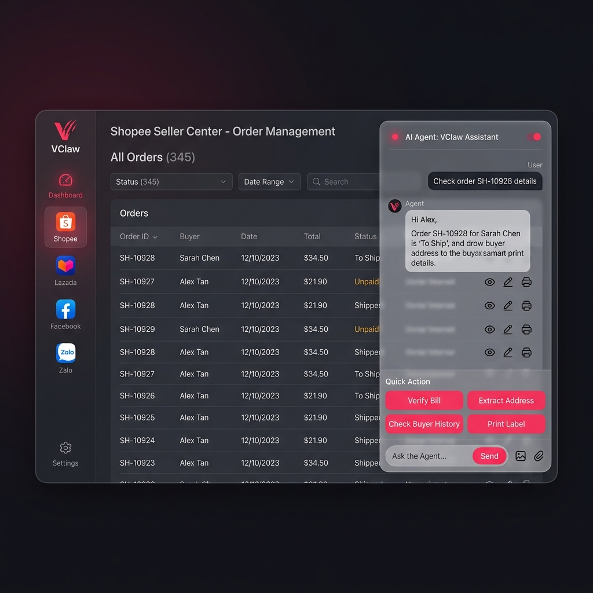
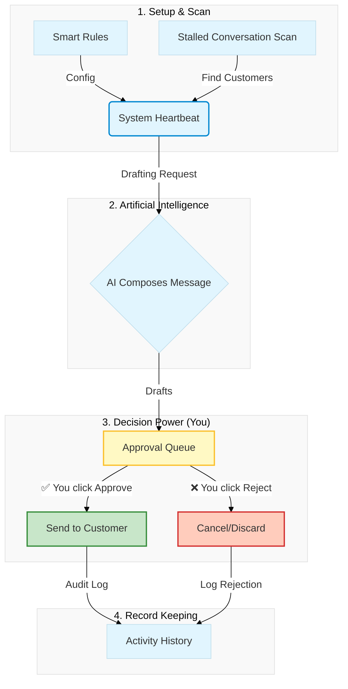

# 🎨 VCLAW USER EXPERIENCE (PRODUCT TOUR)
## Where Technology Meets Simplicity

Welcome to the VClaw interface tour. We design everything with one philosophy: **Clean interface, deep features, 1-tap operations.**

---

## 1. Design Philosophy: "Friendly Like a Friend"

VClaw completely eliminates dry technical jargon. You won't see complex command lines. Instead, you'll find:
- **Natural Language**: AI communicates with you like a real employee. For example: *"I've checked Customer A's bill; the amount is perfectly correct. You can approve the order now!"*
- **Modern Style**: Using blurred glass layers (Glassmorphism), rounded corners, and easy-on-the-eyes colors, helping you work all day without feeling tired.
- **You are the Decider**: AI only provides suggestions; you always have the final say by pressing the **[Approve]** button.

---

## 2. Main Workspaces

The system is designed as an **Operations Browser**, allowing you to oversee all your work in a single window:

1. **Sidebar (Channel Switcher)**: Helps you jump quickly between the main Dashboard and Shopee, Facebook, or Zalo tabs.
2. **Content Area (Digital Workspace)**: Where charts, customer lists, and chat windows are displayed.
3. **Agent Overlay (Companion Assistant)**: A small toolbar that always appears in the corner, ready to help you calculate or extract addresses at any time.

---

## 3. Explore Typical Screens

### 3.1. Digital Workspace (Main Dashboard)
This is the "command center" you'll see every morning.
- **Quick KPIs**: Instantly see how many orders and how much revenue is pending today.
- **Growth Charts**: Track your shop's growth day by day, week by week.


### 3.2. Task Inbox - The Heart of VClaw
This is where the AI "sets the table" for you. Every customer request is categorized into intuitive task cards:
- Green Card: Payment matched, waiting for you to ship.
- Amber Card: Customer asking for address, waiting for you to approve shipping quote.
- Operation: You just skim through and click **[Approve]**.

### 3.3. Integrated Tabs (Omnichannel Browser)
For the first time, you can browse Shopee with an AI assistant by your side. The AI will help you automatically fill in customer info or check their shopping history instantly.



---

## 4. Features You Will Love

- **Bill OCR Scanning**: Simply drag a customer's payment screenshot in; the AI will read the amount and reconcile it.
- **Smart Address Extraction**: No matter how the customer writes their address, the AI understands and standardizes it for the carrier.
- **Automatic VietQR**: No more manual bank account entry; QR codes are automatically generated for each unique order.## 5. Automation Control Center (`/admin/zalouser?tab=automation`)

This is the "brain" behind all of VClaw's automated operations. We designed this screen with the philosophy of **"Absolute Control"**: Every AI-generated message must pass through your approval before it reaches the customer.

the interface is divided into intuitive areas, helping you manage everything from high-level strategy to specific message drafts:

---

### 5.1 Smart Statistic Cards
At the top of the page are 3 "hot keys" displaying current task statuses. You can instantly see how many items need your approval without searching through lists.

- **Pending**: Tasks that are scheduled and ready to run.
- **Pending Approval**: **This is the most critical section.** It holds the drafts AI has finished composing, waiting for your single click of "Approve" to be sent.
- **Completed**: Records of successful customer engagement efforts.

---

### 5.2 Smart Rules Configuration
This is where you set the "personality" and "care level" of your shop. Simply toggle a switch and adjust the timing; the AI will automatically remember:

| Rule | Your assistant will help you... | Reminder Timing |
|---|---|---|
| **Payment Care** | Remind customers to send their bill after they've received a payment QR code. | After 2 hours |
| **Appointment Reminder** | Send a thoughtful message before an appointment so customers don't forget. | 2 hours before |
| **Lead Re-engagement** | Automatically check in with customers who have been silent for too long. | After 7 days |

> **💡 User Experience**: You only need to set this up once. The system will automatically suggest a list of customers needing care every time you activate the "System Heartbeat."

---

### 5.3 System Heartbeat Panel
The **"Run Now"** button is like giving an order to your entire staff to start their shift. The AI scans all data and executes:
- **Automatic reminders/follow-ups** for incomplete orders.
- **Cross-sell suggestions** for potential leads.
- **Greetings** to your Zalo friends and community groups.

---

### 5.4 Access Campaign Management (Marketing Manager)
This tool helps you identify "forgotten" customers (no interaction for > 4 hours).
- The interface displays a list of customers alongside their last message to help you quickly grasp the context.
- You can choose to **"Re-engage"** individuals or click a single button to let AI handle everyone at once.

---

### 5.5 Approval Inbox (Safety Gate)
This is VClaw's ultimate safety checkpoint. Here, you can preview exactly what the AI has drafted.
- If it looks great: Click ✅ **Approve** to send immediately.
- If it's not quite right: Click ❌ **Reject**.
- You can also compose manual campaigns and put them in this queue for scheduled sending.

---

### 5.6 Activity Log (Audit Trail)
A transparent repository for all automated actions. You can verify what the AI sent, to whom, when, and what the result was, allowing you to optimize your sales process over time.

---

### Safe Operational Workflow

To ensure the AI always speaks your language, the data flow is strictly established as follows:



```
[Setup Rules] ─────┐
                   │
[Activate Scan] ───┴──→ [AI Drafting] ───→ [APPROVAL QUEUE]
                                               │
                                       ┌───────┴───────┐
                                 ✅ APPROVE       ❌ REJECT
                                       │               │
                                 [Send Message]    [Discard]
                                       │               │
                                       └───────┬───────┘
                                               ↓
                                       [SYSTEM ACTIVITY LOG]
```

---
*VClaw - Taking your business to the next level through simplicity and trust.*
