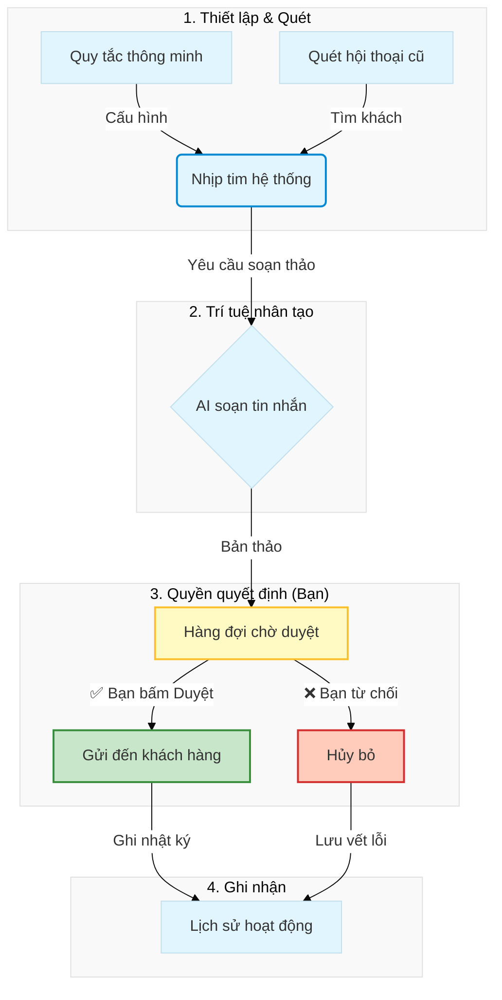

# 🎨 TRẢI NGHIỆM GIAO DIỆN VCLAW (PRODUCT TOUR)
## Nơi công nghệ gặp gỡ sự đơn giản

Chào mừng bạn đến với chuyến tham quan giao diện của VClaw. Chúng tôi thiết kế mọi thứ với triết lý: **Giao diện sáng, tính năng sâu, thao tác 1 chạm.**

---

## 1. Triết Lý Thiết Kế: "Thân thiện như một người bạn"

VClaw loại bỏ hoàn toàn các thuật ngữ kỹ thuật khô khan. Bạn sẽ không thấy những dòng lệnh phức tạp. Thay vào đó là:
- **Ngôn ngữ tự nhiên**: AI giao tiếp với bạn như một nhân viên thực thụ. Ví dụ: *"Em đã kiểm tra Bill của khách A, số tiền hoàn toàn chính xác, anh duyệt đơn nhé!"*
- **Phong cách hiện đại**: Sử dụng các lớp kính mờ (Glassmorphism), góc bo tròn và màu sắc dịu mắt, giúp bạn làm việc cả ngày mà không thấy mệt mỏi.
- **Quyền quyết định thuộc về bạn**: AI chỉ đưa ra đề xuất, bạn luôn là người nhấn nút **[Duyệt]** cuối cùng.

---

## 2. Các Khu Vực Làm Việc Chính

Hệ thống được thiết kế như một **Trình duyệt Quản trị**, giúp bạn bao quát toàn bộ công việc chỉ trong một cửa sổ:

1. **Thanh Sidebar (Bộ chuyển đổi kênh)**: Giúp bạn nhảy nhanh giữa Dashboard chính và các tab Shopee, Facebook hoặc Zalo.
2. **Khu vực Nội dung (Bàn làm việc số)**: Nơi hiển thị các biểu đồ, danh sách khách hàng và khung chat.
3. **Lớp phủ Agent (Trợ lý đồng hành)**: Một thanh công cụ nhỏ luôn xuất hiện ở góc màn hình, sẵn sàng hỗ trợ bạn tính toán, trích xuất địa chỉ bất cứ lúc nào.

---

## 3. Khám Phá Các Màn Hình Tiêu Biểu

### 3.1. Bàn Làm Việc Số (Main Dashboard)
Đây là "trung tâm chỉ huy" mà bạn sẽ nhìn thấy mỗi sáng.
- **KPI nhanh**: Xem ngay hôm nay có bao nhiêu đơn hàng, bao nhiêu tiền đang chờ về.
- **Biểu đồ doanh thu**: Theo dõi sự tăng trưởng của shop theo từng ngày, từng tuần.


### 3.2. Hộp Thư Tác Vụ (Task Inbox) - Trái tim của VClaw
Đây là nơi AI "dọn sẵn cỗ" cho bạn. Mọi yêu cầu từ khách hàng được phân loại thành các thẻ tác vụ trực quan:
- Thẻ xanh: Đã khớp tiền, chờ bạn bấm gửi hàng.
- Thẻ vàng: Khách đang hỏi địa chỉ, chờ bạn duyệt báo giá ship.
- Thao tác: Bạn chỉ cần lướt qua và bấm **[Duyệt]**.

### 3.3. Trình Duyệt Đa Kênh (Integrated Tabs)
Lần đầu tiên, bạn có thể vừa lướt Shopee vừa có AI hỗ trợ bên cạnh. AI sẽ giúp bạn tự động điền thông tin khách hàng hoặc kiểm tra lịch sử mua sắm của họ ngay lập tức.


---

## 4. Những Tính Năng Bạn Sẽ Yêu Thích

- **Quét Bill OCR**: Chỉ cần kéo ảnh chuyển khoản của khách vào, AI sẽ tự đọc số tiền và đối soát.
- **Trích xuất địa chỉ thông minh**: Khách gửi địa chỉ kiểu gì AI cũng hiểu và chuẩn hóa được để gọi ship.
- **VietQR tự động**: Không còn phải gõ số tài khoản thủ công, mã QR tự sinh ra cho từng đơn hàng riêng biệt.

---

## 5. Trung Tâm Điều Khiển Tự Động (`/admin/zalouser?tab=automation`)

Đây là "bộ não" vận hành mọi hoạt động tự động của VClaw. Chúng tôi thiết kế màn hình này với triết lý **"Kiểm soát tuyệt đối"**: Mọi tin nhắn AI soạn ra đều phải qua sự phê duyệt của bạn trước khi đến tay khách hàng.

Giao diện được chia thành các khu vực trực quan, giúp bạn quản lý từ chiến lược tổng thể đến từng dòng tin nhắn cụ thể:

---

### 5.1 Bảng Chỉ Số Thông Minh (Statistic Cards)
Ngay đầu trang là 3 "phím nóng" hiển thị trạng thái công việc hiện tại. Bạn có thể biết ngay mình còn bao nhiêu việc cần duyệt mà không cần lục tìm trong danh sách.

- **Đang chờ xử lý**: Những công việc đã lên lịch và chuẩn bị chạy.
- **Chờ duyệt đăng**: **Đây là mục quan trọng nhất.** Nơi tập trung các bản thảo mà AI đã soạn xong, đang chờ một cú click "Duyệt" của bạn để gửi đi.
- **Đã hoàn tất**: Ghi nhận những nỗ lực tiếp cận khách hàng thành công.

---

### 5.2 Cấu Hình Quy Tắc Thông Minh (Smart Rules)
Nơi bạn thiết lập "tính cách" và "sự quan tâm" của shop đối với khách hàng. Chỉ cần gạt công tắc và chỉnh thời gian, AI sẽ tự động ghi nhớ:

| Quy tắc | Trợ lý sẽ giúp bạn... | Thời điểm nhắc |
|---|---|---|
| **Chăm sóc thanh toán** | Nhắc khách gửi bill sau khi họ đã nhận mã QR thanh toán. | Sau 2 giờ |
| **Nhắc lịch hẹn** | Gửi tin nhắn quan tâm trước giờ hẹn để khách không quên. | Trước 2 giờ |
| **Hâm nóng Lead** | Tự động hỏi thăm những khách đã im lặng quá lâu. | Sau 7 ngày |

> **💡 Trải nghiệm người dùng**: Bạn chỉ cần cài đặt một lần. Hệ thống sẽ tự động đề xuất danh sách khách hàng cần chăm sóc mỗi khi bạn kích hoạt "Nhịp tim hệ thống".

---

### 5.3 Nhịp Tim Hệ Thống (Heartbeat Panel)
Nút **"Chạy ngay"** giống như việc bạn ra lệnh cho toàn bộ nhân viên bắt đầu ca làm việc. AI sẽ quét qua toàn bộ dữ liệu và thực hiện:
- **Tự động nhắc nợ/thanh toán** các đơn hàng còn dở dang.
- **Tư vấn thêm (Cross-sell)** cho những khách hàng tiềm năng.
- **Gửi lời chào** đến bạn bè và các nhóm cộng đồng của bạn trên Zalo.

---

### 5.4 Quản Lý Chiến Dịch Tiếp Cận (Marketing Manager)
Công cụ này giúp bạn tìm ra những khách hàng đang bị "bỏ rơi" (không có tương tác > 4 giờ).
- Giao diện hiển thị danh sách khách hàng kèm nội dung tin nhắn cuối cùng để bạn dễ dàng nắm bắt ngữ cảnh.
- Bạn có thể chọn **"Tiếp cận lại"** từng người hoặc nhấn một nút duy nhất để AI tự động chăm sóc tất cả.

---

### 5.5 Hàng Đợi Phê Duyệt (Approval Inbox)
Đây là "chốt chặn" an toàn nhất của VClaw. Tại đây, bạn có thể xem trước nội dung AI đã soạn.
- Nếu thấy nội dung đã hay: Bấm ✅ **Duyệt** để gửi ngay.
- Nếu thấy chưa phù hợp: Bấm ❌ **Từ chối**.
- Bạn cũng có thể tự soạn một chiến dịch thủ công và đưa vào hàng đợi này để lên lịch gửi sau.

---

### 5.6 Nhật Ký Hoạt Động (Activity Log)
Nơi lưu trữ minh bạch mọi hành động tự động. Bạn có thể kiểm tra lại AI đã gửi gì cho ai, vào lúc nào và kết quả ra sao để tối ưu hóa quy trình bán hàng của mình.

---

### Quy Trình Vận Hành An Toàn

Để đảm bảo AI luôn nói đúng ý bạn, luồng dữ liệu được thiết lập chặt chẽ như sau:



```
[Thiết lập Rule] ───┐
                    │
[Kích hoạt Quét] ───┴──→ [AI Soạn Tin] ───→ [HÀNG ĐỢI CHỜ DUYỆT]
                                                    │
                                            ┌───────┴───────┐
                                      ✅ DUYỆT        ❌ TỪ CHỐI
                                            │               │
                                      [Gửi Khách]      [Hủy bỏ]
                                            │               │
                                            └───────┬───────┘
                                                    ↓
                                            [NHẬT KÝ HỆ THỐNG]
```

---
*VClaw - Đưa việc kinh doanh của bạn lên một tầm cao mới bằng sự đơn giản và tin cậy.*
