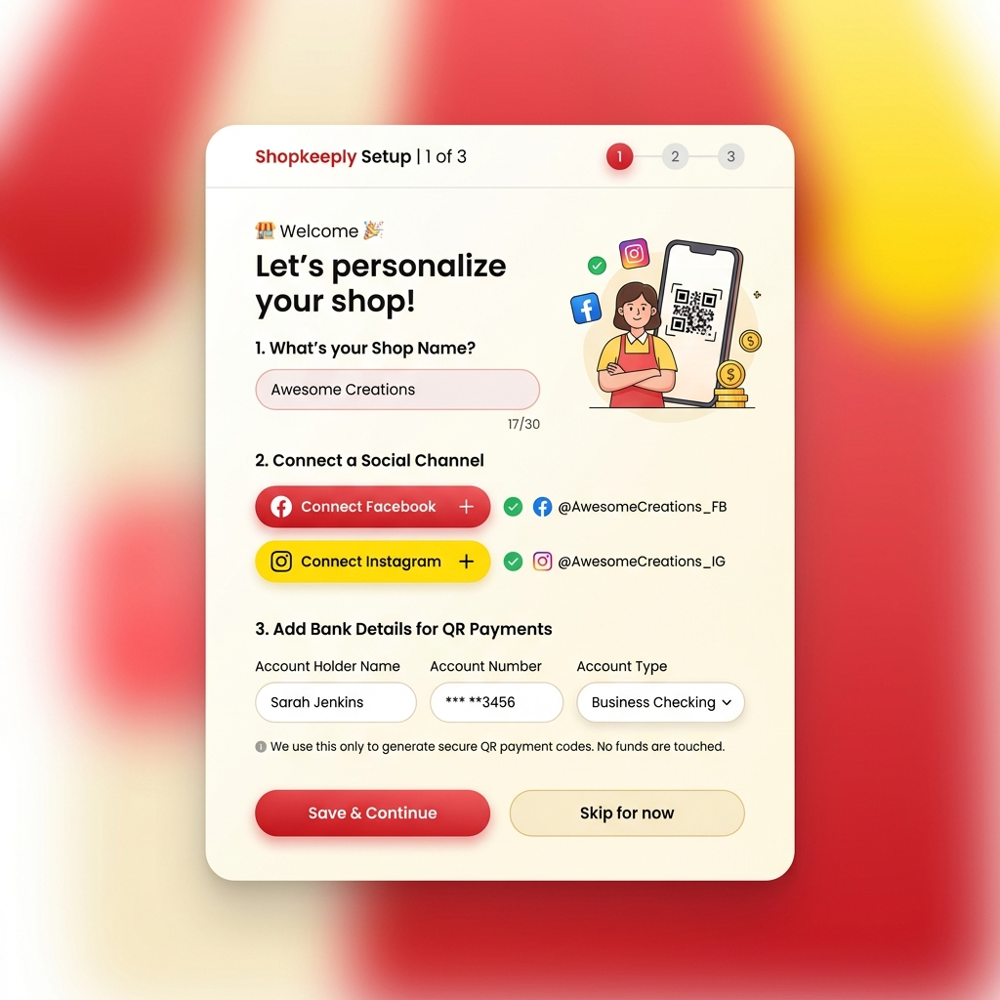
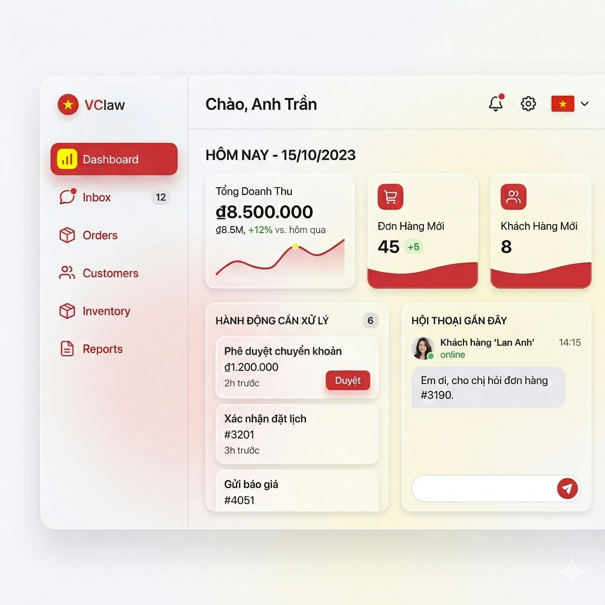

# VClaw UI/UX Specifications

This document defines the interface structure for the VClaw **Operations Console (Digital Workspace)**, based on the strategy of "transitioning from a Technical tool (Mission Control) to a Business tool (CRM-lite)."

---

## 1. Design Philosophy

1. **Reject Dev-Ops language:** Concepts like `Terminal`, `Tail Logs`, `Agent Memory`, or `Cron Job` are not present on the main interface. If an error occurs, the AI will summarize it in natural language: *"Could not scan the amount on Customer A's bill."*
2. **Bright, modern, high-aesthetic interface:** SMBs need a workspace that feels light and effortless. Apply a Minimalist style, Glassmorphism (blurred glass layers), rounded corners, and high-contrast colors (clean, banking-grade reliability).
3. **"Human-in-the-loop" Power:** Decisions to change business status (receiving money, shipping goods) are only suggested by the AI; humans click the **[Approve]** button.

---

## 2. Main Screen System (Screen Map)

The Web application architecture is divided into a Navigation Column (Sidebar) on the left and Content on the right, including the following screens:

*   **Setup Wizard (Onboarding)** - Runs only the first time.
*   **Home (Overview Dashboard)** - Quick statistics and urgent tasks.
*   **Task Inbox** - Where the AI presents tasks requiring user action.
*   **Conversations** - Consolidated view for Zalo, Telegram, etc.
*   **Orders & Customers (Commerce)** - Mini CRM to track money and goods.
*   **Settings** - Change prompts, connect VietQR, configure shipping providers.

---

## 3. Mockups & Typical Interfaces

Below are draft mockups simulating the visual flow to show the difference between VClaw and the original OpenClaw Control UI.

### 3.1. Initial Installation Flow (Onboarding Wizard)

Unlike developer tools that require entering Tokens and API keys from the command line, VClaw welcomes the seller with a friendly dialog, similar to creating a Shopify or KiotViet account.

> [!TIP]
> **Onboarding Logic:** An AI Agent running in the background will take this information (Shop name, QR image, and Bank name) to automatically insert into the context configuration Prompt without the user ever knowing they are "programming" the AI.

### 3.2. Digital Workspace (Operations Console Dashboard)

This is the screen the business owner sees every morning when opening their laptop or accessing it via a tablet at the shop.

> [!NOTE]
> The screen is divided into clear business areas: Revenue Statistics, New Customer Count, Approval Box (Task Inbox) as the focus, and a support chat panel on the right.

---

## 4. Screen Features Specification

### Screen 1: Overview (Dashboard)
*   **Top Metric Cards:**
    *   `VietQR Revenue Today`: Cumulative data from invoices validated by the system.
    *   `Chat Customer Count`: (from Social Channels).
    *   `Unprocessed Orders Count`: Aggregated from the AI inbox.
*   **Center Panel (Urgent Actions):** 
    *   Displayed in a Feed (Timeline) flow. The AI will push cards here.
    *   *Features:* Quick action buttons `[Approve]`, `[Reject]`, `[View Details]`.

### Screen 2: Task Inbox (Human-in-the-loop Inbox)
This is the "heart" of the VClaw difference. Instead of forcing the shop owner to open Chat to see a messy history, the AI separates tasks here.
*   **Task Type 1 - Verify Bill:** AI extracts the transfer bill from the customer sent in social media. AI displays information "Amount 500k, Header 1234". Button: `[Confirm Receipt]` -> AI will automatically chat back to the customer "Thank you, we have received it."
*   **Task Type 2 - Approve Order / Address:** Customer messages "Building A apartment X". AI catches the location, providing a normalized form. Button: `[Create Order & Quote Shipping Fee]`.

### Screen 3: Customers & Orders (Mini CRM)
*   Displays a list of customers automatically tagged (e.g., `Wholesale Customer`, `No-show Customer` automatically tagged by AI from text).
*   Data-table interface with a search bar and status filters.

### Screen 4: Shop Setup (Settings & Channels)
*   **Communication Channels:** Scan QR to log in to Zalo OA / Telegram Bot.
*   **Teaching AI (AI Persona):** Free-text text-area: "My shop sells shoes, always happy to quote 20% off...". The AI will translate this text and insert it as a System Prompt under the Core.
*   **Plugin Configuration:** Fill in Ahamove/GHTK (nếu có).

---

## 5. Proposed Frontend Development Architecture (Tech Stack)

To design Wireframes like the modern Mockups above, we need:

1. **Framework:** Next.js 14/15 (App Router). Allows static Frontend code to link with local files via API routes.
2. **UI Library:** Tailwind CSS + Shadcn UI (Excellent for making Dashboard components with Glassmorphism or Card layouts).
3. **State Management:** Zustand (lighter than Redux for holding order status).
4. **Data Sync:** Read directly from the `workspace.json` and `local.db` files written by the OpenClaw core engine.

> [!IMPORTANT]  
> Actions on the UI should not poke directly into the Database to change status. The UI should only send `Events` down to the OpenClaw Gateway. For example: When a user clicks [Approve Bill], the Web UI sends the `USER_APPROVED_BILL_ID_1` event via WebSocket, then the OpenClaw Core Workflow Orchestrator handles everything (Updating DB, notifying Agent to respond to customer). This model ensures complete separation between the UI and the Logic processing layer.
