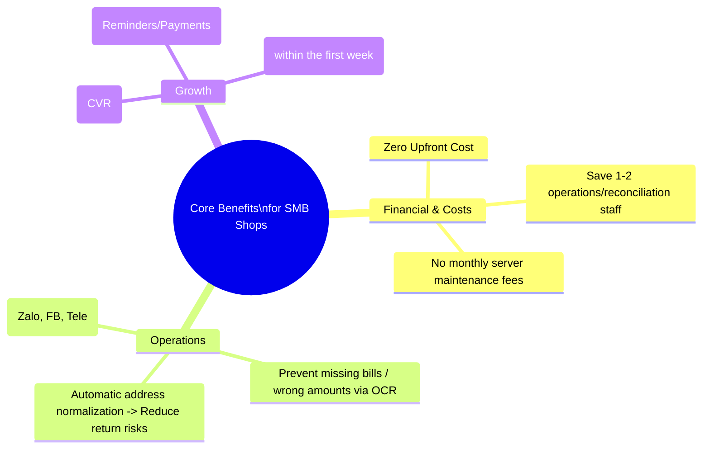
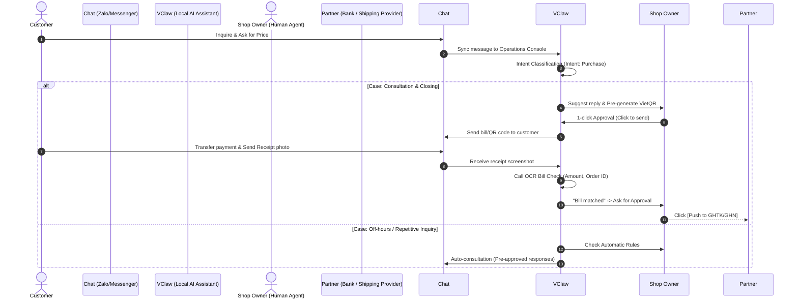
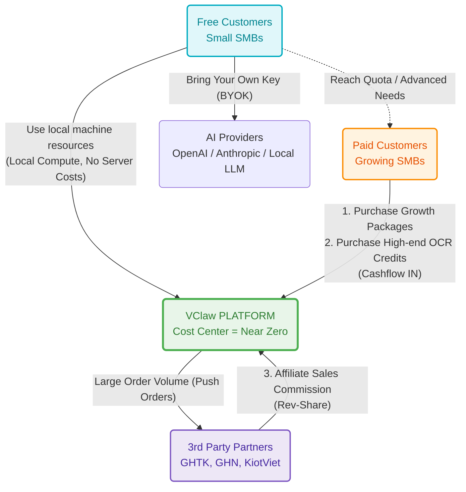

# BUSINESS AND FINANCIAL FEASIBILITY REPORT
## PROJECT: VClaw - Omnichannel Operations and Sales Assistant for Vietnam SMBs

---

## 1. EXECUTIVE SUMMARY

This report analyzes the feasibility of the VClaw project from business and financial perspectives, specifically evaluating the **Freemium model (providing a widely free platform and charging for high-value features/services)**.

Unlike traditional SaaS CRM systems (Sapo, KiotViet, Haravan) that require massive server costs and charge users monthly subscription fees, **VClaw holds an absolute advantage due to its Local-first architecture (running directly on the user's machine)**. This creates an extremely low operating cost structure (Burn-rate) for the development team, making the Free-to-play strategy both feasible and financially safe. SMB customers receive a powerful digital assistant without upfront cost risks, while the platform maintains clear profit ladders from value-added services and premium features.

---

## 2. VALUE PROPOSITION AND CUSTOMER BENEFITS

For the project to be feasible, the product must create tangible value for users (SMBs). The diagram below summarizes the absolute benefits VClaw provides:

**Detailed analysis of user benefits:**
*   **No entry cost barriers:** Unlike traditional POS models that force 2-3 million VND/year packages, SMBs install VClaw with a 1-click installer and start immediately.
*   **Operational touchpoints - Solving daily pain points:** Customers transferring wrong amounts, sending fake receipt photos. Manual bill checking is exhausting. VClaw completely solves this headache with AI OCR reconciliation, giving shop owners peace of mind.
*   **Human-in-the-loop safety:** The "Human-in-the-loop" mechanism ensures shop owners are always the final decision-makers (Approve/Edit) before sending, providing a sense of security and control.

---

## 3. PRODUCT USAGE SCENARIOS

How does money and data flow from customer message to order completion? The diagram below simulates a core `Use Case` of VClaw.

**Scenario Smoothness (User Experience):**
Shop owners see "ready-to-go" information and only need to approve. Instead of switching between 3-4 screens (Bank App -> Chat App -> Ledgers), they use a single VClaw Operations Console.

---

## 4. FINANCIAL EVALUATION AND CASH FLOW STRATEGY

The financial focus of the project lies in the Freemium Cash Flow Diagram below:

### 4.1. The Secret to Sustainable Free Tier (Low Burn-rate)
In SaaS, the biggest risk is becoming a "Victim of Success" - more free users leading to server bankruptcy.
However, **VClaw is Local-first**:
*   Processing power, RAM, CPU are sourced from the user's laptop/PC.
*   **"No Variable Cost" Strategy**: The free version runs on a **BYOK (Bring Your Own Key)** configuration - users provide their own API Keys (OpenAI, Gemini, etc.) or use **Local Models** (Ollama, etc.). The platform does not sponsor tokens/OCR for the free mass.
=> **Conclusion:** VClaw can have 100,000 users with near-zero incremental infrastructure costs for the project. The Free tier serves as a perfect market-share "magnet".

### 4.2. Monetization & Profit Centers
The platform activates monetization as market share grows:

**[Stream 1] SaaS Fees / Advanced Add-ons (B2C & B2B):**
*   **Auto-Growth & Marketing:** Auto-generate omnichannel remarketing from old data. Unlock Shopee, TikTok Shop synchronization.
*   **Multi-agent Package:** Multi-user accounts for shops with 5-10 staff, with KPI tracking.
*   **Cloud-Hosted Version:** Subscription for a 24/7 Cloud version for users who sell only via Phone/Tablet without a PC.

**[Stream 2] Credit Based (Pay-per-use):**
*   **High-Volume OCR:** High-accuracy OCR API credits for shops checking 500+ bills daily.

**[Stream 3] B2B Ecosystem Revenue (Ecosystem Rev-share):**
*   **Shipping Affiliate:** Commission from shipping providers (GHTK, GHN) for high-volume order pushes.
*   **Plugin Store:** Commissions from 3rd party developers selling extensions on VClaw.

---

## 5. CUSTOMER ROI MODEL

To justify paying fees, we must prove that the money spent generates immediate profit.

### 5.1. Estimated Time Saving

| Task | Before VClaw | After VClaw (Target) | Savings / Transaction |
|---|---:|---:|---:|
| Generate & send VietQR | 60–120s | 10–20s | ~1.5 mins |
| Verify receipt photos | 2–4 mins | 30–60s | ~2.5 mins |
| Address normalization & Shipping | 2–3 mins | 30–60s | ~1.5 mins |
| Reminders/Follow-up | Manual 5-10m | AI Template 1m | ~7 mins |

**Quantitative Conclusion:** An average shop with 20 transactions/day saves at least **60 - 90 minutes of daily operations**. With a labor cost of 50k/hour, the shop saves **~1.5 - 2.5 million VND/month**. This is sufficient to justify VClaw Pro/Premium packages.

---

## 6. GO-TO-MARKET (GTM) STRATEGY IN VIETNAM

1. **Community & Organic:** Focus on "Online Shop Owners" and "Zalo Business Community" groups.
2. **Partnerships:** Link with delivery providers (GHTK, GHN) as the default order push tool.
3. **Reseller/Agency:** Partner with setup agencies that install VClaw as part of their service package.

---

## 7. FINANCIAL SUMMARY & P&L

In conclusion, the project is **Highly Financially Feasible**. Unlike SaaS startups that burn money, VClaw has the best financial risk structure (Local-compute). Once an active user base is established, revenue from value-added services and shipping affiliates will provide a sustainable and attractive Profit Margin.
