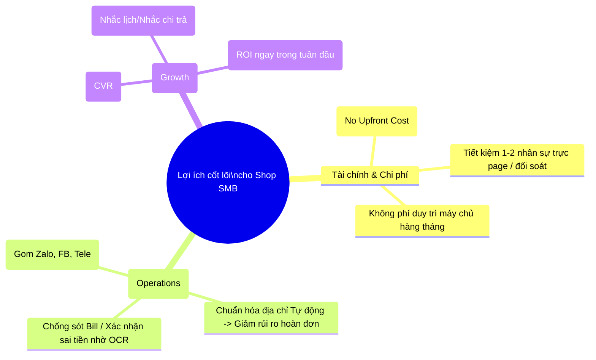
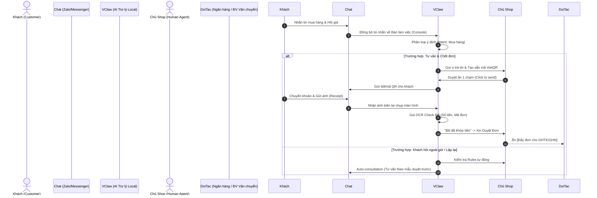
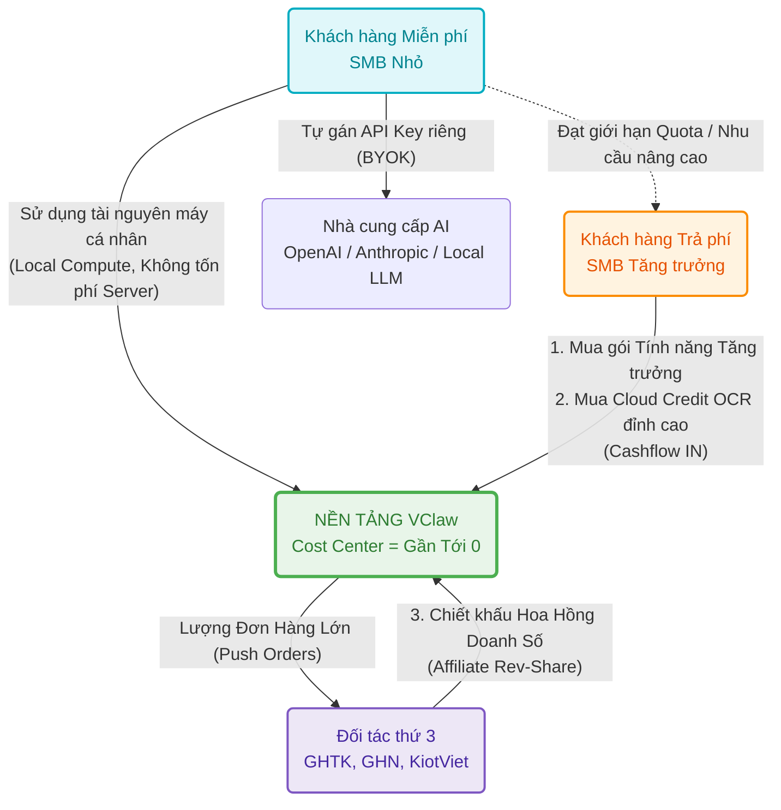

# BÁO CÁO ĐÁNH GIÁ TÍNH KHẢ THI KINH DOANH VÀ TÀI CHÍNH
## DỰ ÁN: VClaw - Trợ lý vận hành và bán hàng đa kênh cho SMB Việt Nam

---

## 1. TÓM TẮT ĐIỀU HÀNH (EXECUTIVE SUMMARY)

Báo cáo này tập trung phân tích tính khả thi dự án VClaw từ góc nhìn kinh doanh, chiến lược tài chính, và đặc biệt là đánh giá mô hình **Freemium (Cung cấp nền tảng miễn phí rộng rãi và thu phí từ các tính năng/dịch vụ giá trị cao)**.

Khác với các hệ thống SaaS CRM truyền thống (Sapo, KiotViet, Haravan) đòi hỏi chi phí máy chủ khổng lồ và người dùng phải đối mặt với phí thuê bao hàng tháng, **VClaw sở hữu lợi thế tuyệt đối nhờ lõi kiến trúc Local-first (chạy trực tiếp trên máy người dùng)**. Điều này tạo ra một cấu trúc chi phí vận hành (Burn-rate) cực thấp cho đội ngũ phát triển, biến chiến lược Free-to-play trở nên khả thi và an toàn về mặt dòng tiền. Khách hàng SMB nhận được một trợ lý số đắc lực mà không có rủi ro chi phí ban đầu, trong khi nền tảng vẫn có các nấc thang lợi nhuận rõ ràng từ dịch vụ giá trị gia tăng (Value-Added Services) và tính năng cao cấp.

---

## 2. CHUỖI GIÁ TRỊ VÀ LỢI ÍCH CHO NGƯỜI DÙNG (VALUE PROPOSITION)

Để dự án khả thi, sản phẩm phải tạo ra giá trị hữu hình cho người dùng (SMB). Biểu đồ dưới đây tóm tắt những lợi ích tuyệt đối mà VClaw mang lại:

**Phân tích chi tiết lợi ích người dùng:**
*   **Không rào cản chi phí khởi đầu:** Khác với các mô hình POS truyền thống buộc mua gói từ 2-3 triệu/năm, SMB cài đặt VClaw 1-click và bắt đầu ngay.
*   **Điểm chạm vận hành - Giải quyết nỗi đau hằng ngày:** Khách chuyển khoản sai số dư, gửi nhầm ảnh giả mạo. Việc ngồi soi Bill thủ công gây mệt mỏi. VClaw giải quyết hoàn toàn khâu nhức nhối này với AI OCR đối soát, giúp chủ shop kinh doanh an tâm hơn.
*   **Không bị AI "Cướp cò":** Cơ chế "Human-in-the-loop" giúp chủ shop luôn là người ra quyết định cuối (Duyệt/Sửa) trước khi gửi đi, mang lại cảm giác an toàn và kiểm soát.

---

## 3. TÌNH HUỐNG SỬ DỤNG SẢN PHẨM (PRODUCT USAGE SCENARIOS)

Hành trình của tiền và dữ liệu diễn ra như thế nào từ khi khách nhắn tin đến khi chốt đơn? Sơ đồ dưới đây mô phỏng một `Use Case` cốt lõi của VClaw.

**Sự mượt mà trong tình huống (User Experience):** 
Chủ shop nhìn thấy thông tin đã được "dọn cỗ" sẵn, chỉ cần duyệt. Thay vì đổi 3-4 màn hình App Ngân hàng -> App Chat -> Sổ sách, họ chỉ dùng một giao diện VClaw Operations Console duy nhất.

---

## 4. ĐÁNH GIÁ MÔ HÌNH TÀI CHÍNH VÀ CHIẾN LƯỢC DÒNG TIỀN (CASH FLOW MODEL)

Trọng tâm tài chính của dự án nằm ở Sơ đồ Dòng tiền Freemium dưới đây:

### 4.1. Bí quyết duy trì gói Miễn phí (Free Tier) không lỗ (Low Burn-rate)
Trong lĩnh vực SaaS, rủi ro lớn nhất là "Nạn nhân của sự thành công" - càng nhiều người dùng miễn phí, tiền Server Cloud sập do không gánh nổi.
Tuy nhiên, **VClaw là Local-first**:
*   Sức mạnh xử lý, RAM, CPU lấy từ trên laptop/PC của chính người dùng.
*   **Chiến lược "Không gánh biến phí"**: Phiên bản miễn phí chạy theo cấu hình **BYOK (Bring Your Own Key)** - người dùng tự cung cấp API Key của họ (OpenAI, Gemini, etc.) hoặc sử dụng các **Local Model** (Ollama, v.v.). Nền tảng không tài trợ token/OCR bừa bãi cho tập người dùng miễn phí.
=> **Kết luận:** VClaw có thể cho 100,000 người dùng xài ứng dụng mà chi phí cơ sở hạ tầng (Infra server) phát sinh thêm của dự án coi như bằng 0. Gói Free đóng vai trò như cỗ máy "hút" thị phần hoàn hảo.

### 4.2. Cấu trúc Thu phí & Sinh lời (Monetization & Profit Centers)
Nền tảng sẽ kích hoạt kiếm tiền khi tệp người dùng đủ lớn và uy tín được thiết lập:

**[Luồng 1] Thu phí SaaS / Add-on Nâng cao (B2C & B2B):**
*   **Gói Auto-Growth & Marketing:** Tự động tạo chiến dịch Remaketing đa kênh từ Data cũ. Mở khóa đồng bộ đa gian hàng Shopee, TikTok Shop.
*   **Gói Multi-agent:** Cho phép chủ Shop chia quyền quản lý Bàn làm việc cho 5-10 nhân viên Sale có tracking KPI.
*   **Cloud-Hosted Version:** Thu phí cung cấp một phiên bản VClaw chạy trên Cloud (chạy 24/7) cho chị em bán hàng chỉ dùng Điện Thoại/Tablet mà không có PC.

**[Luồng 2] Credit Based (Trả theo mức độ sử dụng):**
*   **High-Volume OCR:** Bản free giới hạn hoặc tự host model nhỏ OCR hay sai. VClaw bán gói "Credit gọi API OCR xịn" cho các Shop kiểm 500 bill mỗi ngày với độ chuẩn xác 99.9%.

**[Luồng 3] Doanh thu B2B từ hệ sinh thái (Ecosystem Rev-share):**
*   **Shipping Affiliate:** VClaw như một cái phễu hứng hàng ngàn Shop nhỏ. Đóng gói traffic này kí kết đẩy qua GHTK, GHN. Các bên Giao vận sẽ cắt % hoa hồng lại cho VClaw theo hợp đồng.
*   **Plugin Store:** Trở thành một App Store cho các nhà phát triển thứ 3 vào lập trình thêm extension. VClaw ăn % khi Developer bán plugin.

---

## 5. PHÂN TÍCH RỦI RO & BÀI TOÁN CHỐNG LỖ (RISK MITIGATION)

| Loại Rủi Ro | Phân Tích & Xác Suất | Chiến Lược Giải Quyết / Khắc Phục |
| :--- | :--- | :--- |
| **Bản Free giết chết Bản Paid** | Gói Free quá ngon hạn chế người nâng cấp. | Khóa một số chỉ số định lượng cụ thể (VD: max 1 kênh Zalo, max giới hạn tự động 100 tác vụ/ngày). Đạt ngưỡng thì Shop đã ra đơn nhiều nên họ sẵn sàng trả tiền. |
| **Giá vốn API đối tác bật tăng**| Open AI hoặc Đối tác OCR tăng giá đột ngột. | Thiết kế Core bằng mô hình Adapters (như hiện tại). Cho phép swap linh hoạt sang LLM nội địa hoặc Provider giá rẻ hơn ngay tức khắc. |
| **Khách hàng Drop/Churn Rate cao** | "Loại cô dì chú bác" không biết cài đặt App. | Làm UI One-Click Installer như bộ cài Unikey. Video hướng dẫn tiếng Việt thuần túy (Không dùng thuật ngữ Agent, LLM, Prompt...). |

---

## 5. DỰ TOÁN ROI CHO KHÁCH HÀNG (CUSTOMER ROI MODEL)

Để khách hàng sẵn sàng trả phí, chúng ta cần chứng minh tiền họ bỏ ra sẽ "đẻ" ra lợi nhuận ngay lập tức.

### 5.1. Ước tính Tiết kiệm thời gian (Time Saving)

| Tác vụ | Trước VClaw | Sau VClaw (mục tiêu) | Tiết kiệm / Giao dịch |
|---|---:|---:|---:|
| Tạo & gửi mã VietQR | 60–120s | 10–20s | ~1.5 phút |
| Soi ảnh bill/biên lai | 2–4 phút | 30–60s | ~2.5 phút |
| Chuẩn hóa địa chỉ & báo ship | 2–3 phút | 30–60s | ~1.5 phút |
| Nhắc lịch/Follow-up nhắc nợ | Soạn tay 5-10p | Template AI 1p | ~7 phút |

**Kết luận định lượng:** Nếu một shop trung bình có 20 giao dịch/ngày, họ tiết kiệm được ít nhất **60 - 90 phút vận hành mỗi ngày**. Với mức lương nhân sự 50k/giờ, shop tiết kiệm được **~1.5 - 2.5 triệu VNĐ/tháng**. Con số này đủ để chi trả cho các gói Pro/Premium của VClaw.

---

## 6. CHIẾN LƯỢC GO-TO-MARKET (GTM) TẠI VIỆT NAM

1. **Cộng đồng & Truyền miệng (Organic):** Tập trung vào các hội nhóm "Chủ shop online", "Cộng đồng kinh doanh Zalo" để lan tỏa bản Free.
2. **Kênh Đối tác (Partnerships):** Liên kết với các đơn vị giao vận (GHTK, GHN) để VClaw trở thành công cụ hỗ trợ "Push đơn" mặc định cho khách hàng của họ.
3. **Reseller/Agency:** Hợp tác với các cá nhân/đơn vị chuyên setup vận hành cho shop để họ cài đặt VClaw như một phần của gói dịch vụ.

---

## 6. KẾT LUẬN CHUNG P&L

Tóm lại, dự án **Cực Kỳ Khả Thi Về Tài Chính**. Khác hoàn toàn với các Start-up đốt tiền làm SaaS. VClaw có cấu trúc phòng thủ rủi ro tài chính tốt nhất hiện tại (Local-compute). Một khi xây dựng thành công tệp người dùng quen thuộc thói quen, thì lợi nhuận từ các dịch vụ Giá trị gia tăng và Hoa hồng Giao vận (Affiliate) sẽ mang lại mô hình kinh doanh có tỷ suất lợi nhuận (Profit Margin) vô cùng bền vững và hấp dẫn.
