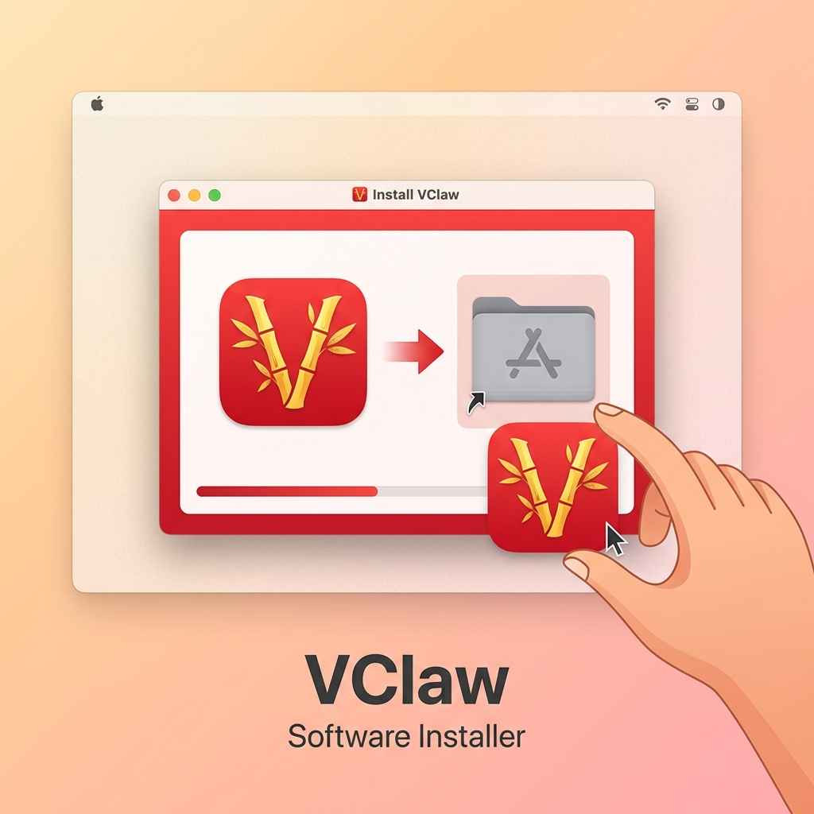
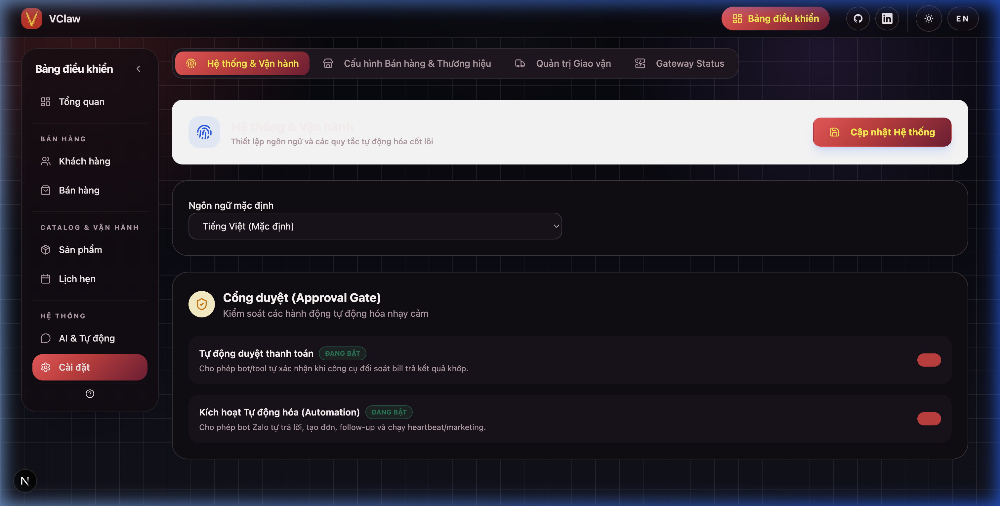
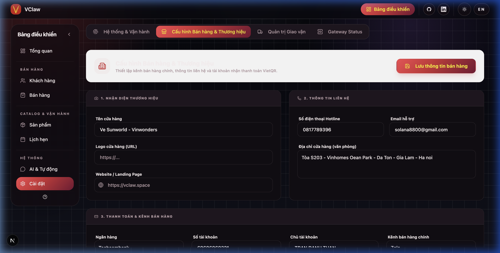
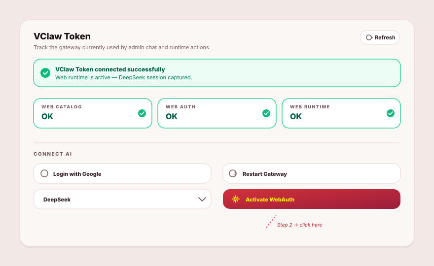
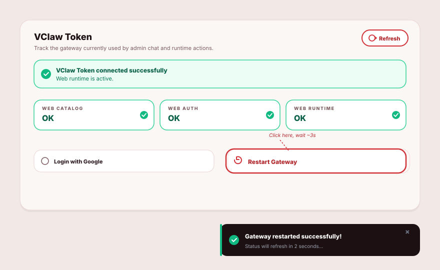
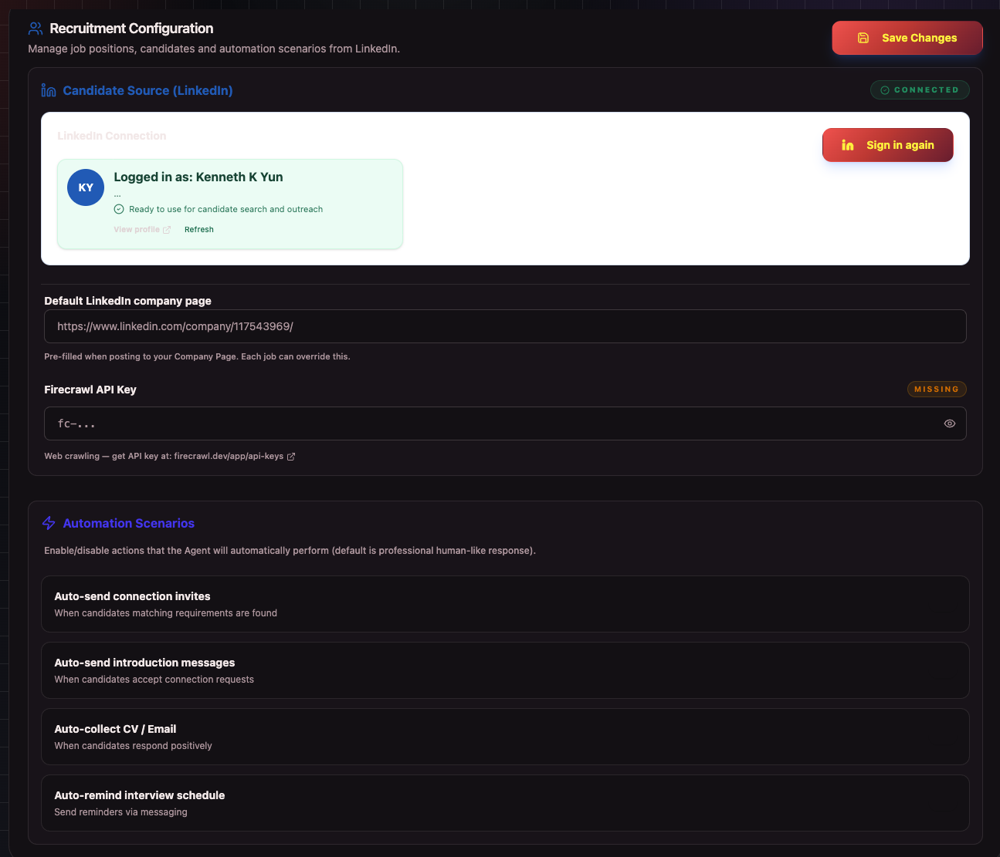

# 🚀 Cài đặt & Cấu hình VClaw

Chỉ mất 5 phút để bạn cài đặt và bắt đầu bán hàng với VClaw. Hãy làm theo các bước dưới đây để thiết lập ứng dụng.

---

## 1. 📥 Cài đặt ứng dụng

VClaw hỗ trợ cả **Windows 10/11 (x64)** và **macOS (Apple Silicon & Intel)**. Chọn đúng bộ cài cho máy của bạn:

| Hệ điều hành | Tệp cài đặt           | Cách chạy                                      |
| ------------ | --------------------- | ---------------------------------------------- |
| macOS        | `VClawInstaller.pkg`  | Mở tệp → "Tiếp tục" → mở từ Launchpad          |
| Windows      | `VClawInstaller.exe`  | Mở tệp → "Next" → mở từ Start Menu / Desktop   |

*VClaw đã sẵn sàng — chạy được trên cả Windows và macOS*

---

## 2. ⚙️ Thiết lập ban đầu (Lần đầu chạy)

Mở mục **Cài đặt** ở menu bên trái và hoàn tất 2 phần quan trọng sau.

### Bước A: Hệ thống & Tự động hóa
Tại tab **Hệ thống & Vận hành**, bạn chọn cách AI hỗ trợ mình:

*   **Ngôn ngữ mặc định:** Chọn Tiếng Việt để trợ lý AI hiểu và phản hồi tự nhiên nhất.
*   **Tự động duyệt thanh toán:** Bật tính năng này để AI tự động đối soát tiền về ngân hàng và báo cáo ngay lập tức.
*   **Kích hoạt Tự động hóa (Automation):** Để AI tự phân loại hội thoại và gợi ý các việc cần làm.

### Bước B: Thông tin Shop & Ngân hàng
Chuyển sang tab **Cấu hình Bán hàng & Thương hiệu** để thiết lập danh tính shop:

*   **Tên cửa hàng:** Nhập tên shop của bạn (tên này sẽ hiện trên các thông báo gửi cho khách).
*   **Thông tin Ngân hàng:** Nhập chính xác Số tài khoản và Tên chủ tài khoản. AI sẽ dùng thông tin này để tự tạo **Mã VietQR** kèm số tiền cho khách quét thanh toán.
*   **Kênh bán hàng chính:** Chọn Zalo hoặc Messenger để AI tối ưu kịch bản tư vấn.

---

## 3. 🤖 Kết nối AI DeepSeek (WebAuth)

Dùng tài khoản DeepSeek miễn phí — đăng nhập 1 lần, không cần API key.

Mở **Cài đặt → Gateway Status**:

1.  Chọn model **DeepSeek** trong menu thả xuống.
2.  Nhấn **✨ Kích hoạt WebAuth** → trình duyệt mở `chat.deepseek.com`.
3.  Đăng nhập DeepSeek (Google/Email). VClaw tự lưu phiên.
4.  Quay lại app, đợi toast **"Đã kích hoạt WebAuth thành công!"**.

> ✅ **Thành công khi:** banner xanh *"VClaw Token đã kết nối thành công…"* + 3 pill **Catalog · Auth · Runtime web** đều **OK**.

---

## 4. 🔄 Khởi động lại Gateway để kiểm tra

Sau khi đăng nhập (hoặc đổi cấu hình), restart Gateway 1 lần để áp dụng.

Cùng thẻ **Gateway Status**:

1.  Nhấn **🔄 Khởi động lại Gateway** → đợi ~3 giây.
2.  Toast **"Đã khởi động lại Gateway thành công!"** hiện ra.
3.  Bấm **Làm mới** nếu muốn cập nhật trạng thái ngay.

> ✅ **Đã ổn:** banner xanh + 3 pill **OK**.
> ⚠️ *"Chưa xác thực WebAuth"* → quay lại **Mục 3**.
> ⚠️ *"Model không tương thích"* → bấm **Khởi động lại Gateway** thêm lần nữa.

---

## 5. 💼 Cấu hình Tuyển dụng & Tích hợp LinkedIn

Mở mục **Cài đặt** ở menu bên trái và chọn tab **Tuyển dụng** để cấu hình:

*   **Kết nối LinkedIn:** Nhấn **Kết nối LinkedIn** (hoặc **Mở trình duyệt**) để đăng nhập tài khoản cá nhân của bạn. Trạng thái sẽ chuyển sang **Đã kết nối** sau khi hoàn tất. Bạn cũng có thể chọn **Nhập session từ file** nếu có sẵn.
*   **Đường dẫn doanh nghiệp:** Nhập link trang LinkedIn Company của bạn để AI tự động theo dõi các tin đăng tuyển dụng.
*   **Tự động hóa (Automation Rules):** Bật các công tắc tương ứng để AI tự động gửi lời mời khi khớp JD, giới thiệu khi đồng ý, thu thập contact khi phản hồi tích cực và nhắc lịch phỏng vấn.

---

**Lưu ý:** VClaw lưu toàn bộ dữ liệu **trực tiếp trên máy tính của bạn** (Local-First), đảm bảo quyền riêng tư tuyệt đối.
