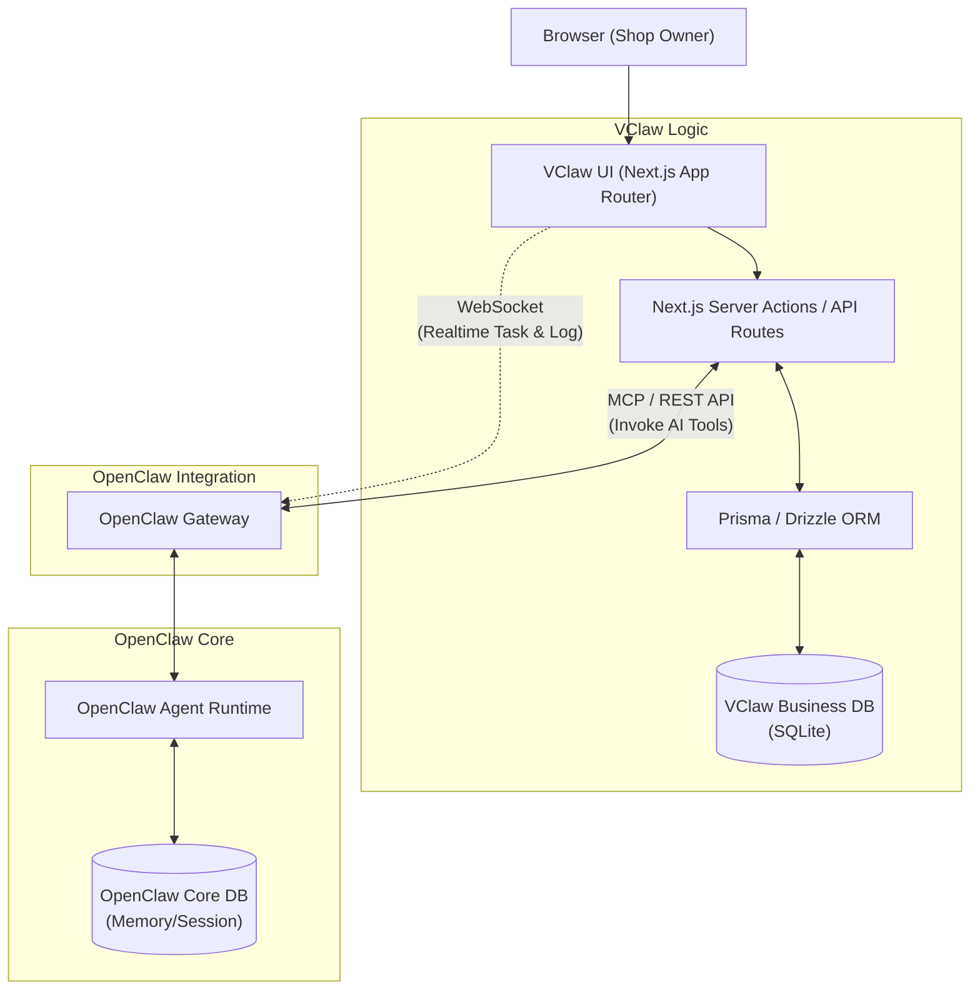

# VCLAW UI AND OPENCLAW CORE INTEGRATION STRATEGY

---

## 1. PURPOSE
This document provides a detailed analysis of the communication architecture between the **VClaw Admin (Operations Console - Next.js)** and the **OpenClaw Core**. It also outlines the database strategy to ensure the system maintains AI automation standards while remaining flexible for VClaw's specific business requirements.

---

## 2. COMMUNICATION PROTOCOLS ANALYSIS

The OpenClaw Core provides a powerful Gateway supporting multiple protocols. VClaw Admin (`vclaw-ui/app/admin`) interacts with the core through a combination of three standards, depending on the business context:

### 2.1. WebSocket / Socket.IO (Real-time Streaming & Events)
The OpenClaw Dashboard (`Control UI`) relies on WebSockets for log streaming and session lifecycle management.
- **Application in VClaw**: Used for tasks requiring real-time updates.
  - **Task Inbox Manager**: When a bill is pending approval or a new Zalo message triggers an Agent alert, the event must be pushed immediately to the UI for the user (shop owner) to act on.
  - **Agent Live Monitoring**: Real-time tracking of Agent activity (e.g., running Playwright to fetch orders from Shopee).
- **Recommendation**: Use as the primary protocol for the interaction loop between users and Agents (Human-in-the-loop).

### 2.2. REST API (CRUD & Command Execution)
The OpenClaw Gateway supports HTTP APIs (e.g., `/api/sessions`, `/api/config`).
- **Application in VClaw**: Dedicated to synchronous and static actions.
  - Fetching/updating system configurations, Payment, and Shipping settings.
  - Sending simple control commands.
  - Basic Audit Log tracking.
- **Recommendation**: Use for VClaw Admin to initialize the interface and perform traditional static data management.

### 2.3. MCP (Model Context Protocol) via HTTP/SSE
OpenClaw includes modules for communicating via the MCP standard (`src/gateway/mcp-http.protocol.ts`). MCP is a modern connectivity standard designed specifically for sharing Context, Tools, and Prompts between Agents and system resources.
- **Application in VClaw**: 
  - VClaw Admin acts as an **MCP Client** (or hosts an **MCP Server**). 
  - When a user clicks "Verify Bill," VClaw Admin sends an MCP request with Context (image, order info) to the OpenClaw Agent. The Agent processes this using Tools and returns a structured result.
- **Recommendation**: This is the future standard. Use MCP to call complex analysis capabilities of OpenClaw (like OCR, AI intent classification) naturally without designing dozens of custom API endpoints.

---

## 3. DATABASE MANAGEMENT STRATEGY

### 3.1 Status of OpenClaw DB
OpenClaw currently uses an internal database (SQLite or LevelDB engine) specialized for:
- **Agent State & Memory**: Conversation history, session data, context awareness.
- **System Config & Logs**: Gateway configurations, static API keys, Tool execution logs.

### 3.2 Should VClaw Add its Own Business Database?
**The answer is YES.** VClaw Admin must be equipped with its own **Separate Embedded Database** (SQLite with **Prisma / Drizzle ORM** is the recommended choice for a Next.js application).

### 3.3 Rationale for Separate Databases
Using the OpenClaw Core DB for business operations is a **significant architectural risk** for several reasons:

1. **Separation of Concerns:**
   - *OpenClaw DB*: Specialized for AI, Agent runtime, and pure conversation history.
   - *VClaw Business DB*: Manages strictly structured Business Entities such as `Order`, `Customer`, `Booking`, and `Invoice/Bill`. This data requires complex queries, multi-table JOINs, and financial reporting.

2. **Upgradability & Product-Fork Safety:**
   - OpenClaw is an upstream project with a high velocity of change. If they update the Core DB Schema and VClaw's sales data is stored there, the update could break the VClaw application.
   - Separate SQLite files allow us to easily rebase/update OpenClaw source code while keeping VClaw’s business data assets intact.

3. **Aligns with "Local-first" MVP Architecture:**
   - VClaw is designed for a 1-click installer (`.exe` or `.dmg`).
   - This installation will generate a `vclaw-business.sqlite` file located locally on the shop owner's machine. Data is highly secure, and backup is as simple as copying a single file. SMB customers prefer this "data on my own computer" model over Cloud-only solutions.

### 3.4 Data Interaction Diagram (Next.js App)

## 4. CONCLUSION AND IMPLEMENTATION ROADMAP
1. **Database Deployment**: Immediately initialize `business.sqlite` using Prisma within `/vclaw-ui`. Start defining schemas for `TaskInbox`, `Orders`, and `Config`.
2. **Real-time Channel Setup**: Configure a Socket.IO client within Admin Manager Components (e.g., `TaskInboxManager`) to connect to the OpenClaw default port upon application mount.
3. **AI via MCP/REST**: Design Server Actions in Next.js to wrap MCP/REST communication to the OpenClaw core, hiding AI Platform complexity from surface UI components.
