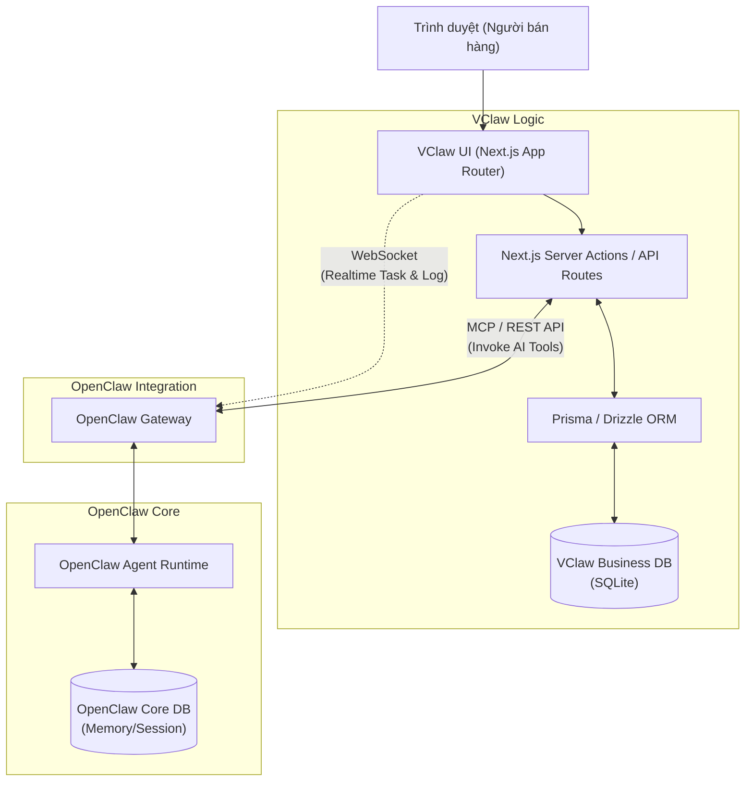

# CHIẾN LƯỢC TÍCH HỢP VCLAW UI VÀ OPENCLAW CORE

---

## 1. MỤC ĐÍCH TÀI LIỆU
Tài liệu này phân tích chi tiết về kiến trúc giao tiếp giữa bề mặt quản trị **VClaw Admin (Operations Console - Next.js)** và lõi xử lý **OpenClaw Core**. Đồng thời định hướng chiến lược sử dụng cơ sở dữ liệu (Database) nhằm đảm bảo hệ thống vừa giữ được các lợi thế về chuẩn tác vụ tự động của AI, vừa đáp ứng linh hoạt các nghiệp vụ kinh doanh riêng của VClaw.

---

## 2. PHÂN TÍCH GIAO THỨC GIAO TIẾP (COMMUNICATION PROTOCOLS)

Lõi OpenClaw cung cấp sẵn cơ chế Gateway mạnh mẽ hỗ trợ đa giao thức. VClaw Admin (`vclaw-ui/app/admin`) sẽ tương tác với lõi thông qua sự kết hợp của 3 chuẩn giao tiếp sau, tùy thuộc vào đặc thù nghiệp vụ:

### 2.1. WebSocket / Socket.IO (Real-time Streaming & Events)
Dashboard của OpenClaw (`Control UI`) chạy dựa trên nền tảng WebSocket để stream log và quản lý vòng đời của session.
- **Ứng dụng trong VClaw**: Sử dụng cho các tác vụ cần thời gian thực.
  - **Task Inbox Manager**: Khi có một bill chờ duyệt hoặc tin nhắn Zalo mới được Agent cảnh báo, hệ thống phải đẩy event ngay lập tức về UI để người dùng (chủ shop) thao tác.
  - **Agent Live Monitoring**: Theo dõi trực tiếp Agent đang làm gì (VD: đang chạy Playwright để lấy danh sách đơn từ Shopee).
- **Khuyến nghị**: Sử dụng làm giao thức chính cho vòng lặp tương tác giữa người dùng và Agent (Human-in-the-loop).

### 2.2. REST API (CRUD & Command Execution)
OpenClaw Gateway hỗ trợ các API HTTP (như `/api/sessions`, `/api/config`).
- **Ứng dụng trong VClaw**: Dành cho các hành động đồng bộ và tĩnh.
  - Lấy/cập nhật cấu hình hệ thống, cài đặt Payment, Shipping.
  - Gửi các lệnh (Commands) điều khiển đơn giản.
  - Truy vết Audit Log cơ bản.
- **Khuyến nghị**: Sử dụng để VClaw Admin khởi tạo giao diện và thực hiện các thao tác quản lý dữ liệu tĩnh truyền thống.

### 2.3. MCP (Model Context Protocol) qua HTTP/SSE
OpenClaw đã có sẵn các modules để giao tiếp theo chuẩn MCP (`src/gateway/mcp-http.protocol.ts`). MCP là chuẩn giao tiếp mới, sinh ra dành riêng cho việc chia sẻ Context, Tools và Prompts giữa các Agent và tài nguyên hệ thống.
- **Ứng dụng trong VClaw**: 
  - VClaw Admin không chỉ là một DB viewer thông thường, mà nó có thể biến thành một **MCP Client** (hoặc host một **MCP Server**). 
  - Khi người dùng click vào nút "Kiểm định Bill", VClaw Admin gửi một MCP request kèm Context (ảnh, thông tin đơn hàng) qua cho OpenClaw Agent. Agent xử lý bằng các công cụ (Tools) và trả về kết quả cấu trúc.
- **Khuyến nghị**: Đây là tiêu chuẩn tương lai. Áp dụng MCP để VClaw UI gọi các kỹ năng phân tích phức tạp của OpenClaw (như OCR, AI intent classification) một cách tự nhiên mà không cần thiết kế hàng tá endpoint API riêng lẻ.

---

## 3. CHIẾN LƯỢC QUẢN LÝ CƠ SỞ DỮ LIỆU (DATABASE STRATEGY)

### 3.1 Thực trạng DB của OpenClaw
OpenClaw hiện đang sở hữu hệ thống Database nội tại (có thể là SQLite hoặc LevelDB engine) chuyên dành cho:
- **Agent State & Memory**: Ghi nhớ hội thoại, session data, context awareness.
- **System Config & Logs**: Lưu trữ các cấu hình Gateway, API key tĩnh, nhật ký chạy Tools.

### 3.2 VClaw có nên thêm Database riêng cho nghiệp vụ không?
**Câu trả lời là CÓ.** VClaw Admin bắt buộc phải được trang bị một hệ thống **Embedded Database riêng biệt** (như SQLite hoặc HQL/H2 nếu viết bằng Java, nhưng với VClaw UI là ứng dụng Next.js thì **SQLite + Prisma / Drizzle ORM** là lựa chọn số 1).

### 3.3 Lý luận cho việc tách rời Database (Separation of Databases)
Việc sử dụng chung DB lõi của OpenClaw cho các nghiệp vụ bán hàng là một **rủi ro kiến trúc nghiêm trọng**, lý do:

1. **Phân tách mối quan tâm (Separation of Concerns):**
   - *OpenClaw DB*: Chuyên phục vụ AI, Agent runtime, lịch sử hội thoại thuần túy.
   - *VClaw Business DB*: Dùng quản lý Thực thể kinh doanh (Entities) có cấu trúc chặt chẽ như `Order` (Đơn hàng), `Customer` (Khách hàng), `Booking` (Lịch hẹn), `Invoice/Bill` (Hóa đơn). Dữ liệu này cần query phức tạp, JOIN nhiều bảng và tổng hợp báo cáo doanh thu tài chính.

2. **Dễ dàng cập nhật lõi (Upgradability & Product-Fork Safety):**
   - OpenClaw là dự án upstream có tốc độ thay đổi nhanh. Khi họ cập nhật Schema DB lõi, nếu dữ liệu bán hàng của VClaw nằm chung trong đó, bản cập nhật có thể phá vỡ ứng dụng VClaw.
   - Tách rời SQLite giúp chúng ta dễ dàng rebase/update mã nguồn OpenClaw mà tài sản dữ liệu bán hàng của VClaw vẫn được bảo vệ nguyên vẹn.

3. **Phù hợp kiến trúc MVP "Local-first":**
   - VClaw định hướng cài đặt 1-click installer (file `.exe` hoặc `.dmg`).
   - Gói cài đặt này sẽ sinh ra file `vclaw-business.sqlite` nằm tĩnh tại máy của chủ shop. Dữ liệu cực kỳ an toàn, backup (sao lưu) chỉ việc copy 1 file là xong. Khách hàng SMB (các cửa hàng nhỏ) rất thích mô hình "dữ liệu nằm trên máy tính của mình" này thay vì Cloud.

### 3.4 Sơ đồ Tương tác Dữ liệu VClaw UI (Next.js App)

## 4. KẾT LUẬN VÀ LỘ TRÌNH TRIỂN KHAI CHO ADMIN CONSOLE
1. **Triển khai Database**: Khởi tạo ngay một `business.sqlite` thông qua Prisma bên trong `/vclaw-ui`. Bắt đầu định nghĩa Schema cho `TaskInbox`, `Orders` và `Config`.
2. **Setup Kênh Realtime**: Cấu hình Socket.IO client bên trong các Admin Manager Component (như `TaskInboxManager`) để kết nối tới cổng mặc định của OpenClaw ngay khi ứng dụng mount (khởi chạy).
3. **Gọi AI thông qua MCP/REST**: Thiết kế các Server Actions trên Next.js nhằm bọc lại việc giao tiếp bằng MCP/REST tới lõi OpenClaw, giúp giấu nhẹm sự phức tạp của AI Platform đối với các UI Components trên bề mặt.
