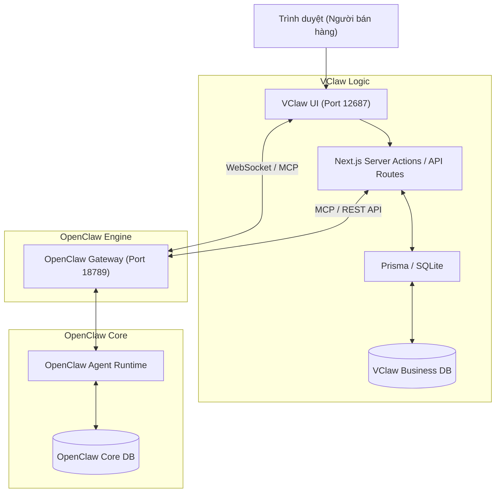

# CHIẾN LƯỢC TÍCH HỢP VCLAW UI VÀ OPENCLAW CORE

---

## 1. MỤC ĐÍCH TÀI LIỆU
Tài liệu này phân tích chi tiết về kiến trúc giao tiếp giữa bề mặt quản trị **VClaw Admin (Operations Console - Next.js)** và lõi xử lý **OpenClaw Core**. Đồng thời định hướng chiến lược sử dụng cơ sở dữ liệu (Database) nhằm đảm bảo hệ thống vừa giữ được các lợi thế về chuẩn tác vụ tự động của AI, vừa đáp ứng linh hoạt các nghiệp vụ kinh doanh riêng của VClaw.

---

## 2. PHÂN TÍCH GIAO THỨC GIAO TIẾP (COMMUNICATION PROTOCOLS)

Lõi OpenClaw cung cấp sẵn cơ chế Gateway mạnh mẽ hỗ trợ đa giao thức. VClaw Admin (`vclaw-ui/app/admin`) sẽ tương tác với lõi thông qua sự kết hợp của 3 chuẩn giao tiếp sau, tùy thuộc vào đặc thù nghiệp vụ:

### 2.1. Native WebSocket (Real-time Streaming & Events)
Lõi OpenClaw và VClaw Admin sử dụng các kết nối WebSocket chuẩn để truyền tải trạng thái thời gian thực và quản lý hội thoại.
- **Ứng dụng trong VClaw**: Sử dụng cho các tác vụ cần phản hồi ngay lập tức.
  - **Task Inbox Manager**: Khi có một bill chờ duyệt hoặc sự kiện mới, thông báo sẽ được đẩy qua sự kiện `chat` hoặc `agent` của WebSocket.
  - **Agent Live Monitoring**: Theo dõi trực tiếp quá trình suy nghĩ (thinking) và gọi công cụ (tool call) của Agent.
- **Trạng thái hiện tại**: Đã triển khai trong `lib/gateway-client.ts` thông qua `GatewayWsManager`.

### 2.2. REST API / Proxy (CRUD & Command Execution)
OpenClaw Gateway hỗ trợ các API HTTP. VClaw UI sử dụng một cơ chế Proxy trong Next.js để tương tác an toàn.
- **Ứng dụng trong VClaw**: Dành cho các hành động đồng bộ và tĩnh.
  - Lấy/cập nhật cấu hình hệ thống, cài đặt các module.
  - Kiểm tra trạng thái Health Check và danh sách Model.
- **Trạng thái hiện tại**: Được proxy qua `/api/gateway/*` trong `vclaw-ui`.

### 2.3. MCP (Model Context Protocol) qua JSON-RPC (Primary Controller)
OpenClaw làm việc theo chuẩn MCP. Đây là giao thức chủ đạo để VClaw UI điều khiển các kỹ năng của OpenClaw Core.
- **Ứng dụng trong VClaw**: 
  - VClaw UI đóng vai trò là một **MCP Client**.
  - Nó gọi các "Tools" thông qua endpoint `/mcp/v1/tools/call`.
  - Ví dụ: Gọi tool `vclaw.bill_verifier` để phân tích ảnh hóa đơn chuyển khoản.
- **Trạng thái hiện tại**: Hỗ trợ qua `gatewayClient.callTool` trong `lib/gateway-client.ts`.

---

## 3. CHIẾN LƯỢC QUẢN LÝ CƠ SỞ DỮ LIỆU (DATABASE STRATEGY)

### 3.1 Thực trạng DB của OpenClaw
OpenClaw hiện đang sở hữu hệ thống Database nội tại (có thể là SQLite hoặc LevelDB engine) chuyên dành cho:
- **Agent State & Memory**: Ghi nhớ hội thoại, session data, context awareness.
- **System Config & Logs**: Lưu trữ các cấu hình Gateway, API key tĩnh, nhật ký chạy Tools.

### 3.2 VClaw có nên thêm Database riêng cho nghiệp vụ không?
**Câu trả lời là CÓ.** VClaw Admin bắt buộc phải được trang bị một hệ thống **Embedded Database riêng biệt** (như SQLite hoặc HQL/H2 nếu viết bằng Java, nhưng với VClaw UI là ứng dụng Next.js thì **SQLite + Prisma / Drizzle ORM** là lựa chọn số 1).

### 3.3 Lý luận cho việc tách rời Database (Separation of Databases)
Việc sử dụng chung DB lõi của OpenClaw cho các nghiệp vụ bán hàng là một **rủi ro kiến trúc nghiêm trọng**, lý do:

1. **Phân tách mối quan tâm (Separation of Concerns):**
   - *OpenClaw Core DB*: Chuyên phục vụ AI, Agent runtime, lịch sử hội thoại thuần túy.
   - *VClaw Business DB (Prisma + SQLite)*: Dùng quản lý Thực thể kinh doanh (Entities) có cấu trúc chặt chẽ như `Order`, `Customer`, `Booking`.

2. **Dễ dàng cập nhật lõi (Upgradability & Product-Fork Safety):**
   - OpenClaw là dự án upstream có tốc độ thay đổi nhanh. Việc tách rời SQLite (đặt trong thư mục của VClaw UI và quản lý bởi Prisma) giúp bảo vệ tài sản dữ liệu kinh doanh khi nạp (pull/rebase) code mới từ OpenClaw Core.

3. **Phù hợp kiến trúc MVP "Local-first":**
   - Gói cài đặt 1-click sẽ khởi chạy song song hai server:
     - **VClaw UI Server**: Cổng **12687** (Next.js Standalone Server cung cấp đầy đủ Middleware/API Routes).
     - **OpenClaw Core Engine**: Cổng **18789** (Node.js daemon điều phối Agent và AI).
   - Dữ liệu `business.sqlite` nằm tĩnh tại máy của chủ shop, an toàn và dễ sao lưu.

### 3.4 Sơ đồ Tương tác Dữ liệu VClaw UI (Next.js App)

## 4. KẾT LUẬN VÀ TIẾN ĐỘ TRIỂN KHAI
1. **Triển khai Database**: [XONG] Đã khởi tạo `business.sqlite` thông qua Prisma bên trong `/vclaw-ui`.
2. **Setup Kênh Realtime**: [XONG] Kết nối WebSocket thuần đã được thiết lập trong `lib/gateway-client.ts` và tích hợp vào UI Admin.
3. **Điều khiển qua MCP**: [XONG] Giao diện gọi Tool đã được triển khai qua REST proxy, cho phép tự động hóa hoàn toàn các tác vụ Agentic.
